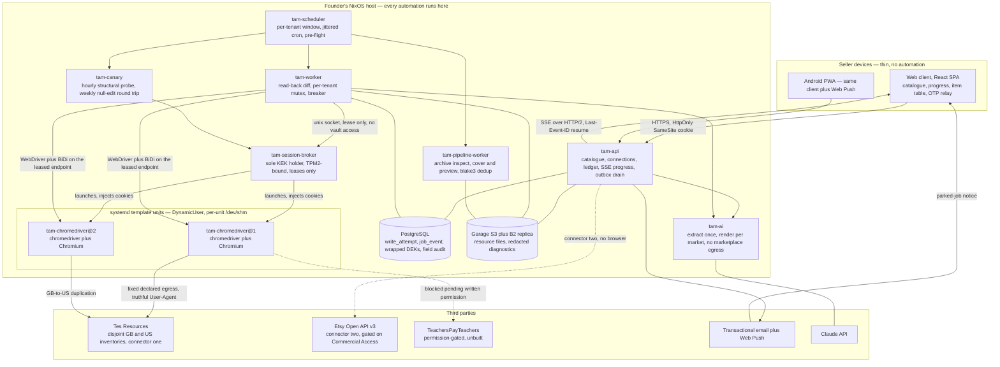

# Listing-sync design specification

The wedge reorientation recorded in [`decisions.md`](decisions.md) at lines 112 to 120 supersedes this document's GB-to-US wording, which is left in place rather than corrected because the arguments below are woven through it and hold unchanged: the duplication target inventory is `TesNz` throughout and the target markets are English (UK) and New Zealand.
That decision rests on M-1's finding that market targeting is a Curriculum field value on one account rather than a separate inventory, which leaves the US inventory's role an open question rather than the settled premise the body argues from.

## Purpose and scope

This document is the design specification for a commercial SaaS that bulk-uploads and cross-lists digital teaching resources for teacher-authors, schools and agencies.
It is assembled from three parallel drafts and supersedes them; those drafts are retained under `superseded/` and are no longer live documents.
Eight siblings are live and are linked rather than inlined, because the whole would otherwise exceed the length at which a document stops being read: [`milestones.md`](milestones.md), [`compliance-floor.md`](compliance-floor.md), [`sync-machine.md`](sync-machine.md), [`schema.md`](schema.md), [`taxonomy-projection.md`](taxonomy-projection.md), [`selector-packs.md`](selector-packs.md), [`client-stack.md`](client-stack.md) and [`commercial-model.md`](commercial-model.md).
The compiled type sketch at [`sketches/domain.rs`](sketches/domain.rs) is the artefact of record for the domain types, every Rust block in this document and its siblings is an excerpt from it, and it compiles clean under `rustc 1.97.1` with `-D warnings`.

The evidentiary basis is `decisions.md`, which is authoritative and overrides the research wherever they conflict, and four research documents in `../research/`, among which round two overturns round one wherever they disagree, with each supersession named in place.
Claims carry the source the research recorded for them, claims the research marked unverified stay marked, and judgements this specification makes that the research does not settle are labelled as judgements rather than presented as findings.
Scope is the whole product through the first chargeable milestone plus the connectors and surfaces that follow; sizing and sequencing live in the milestone sibling, and the statutory floor in the compliance sibling.

## The wedge and why

The first chargeable product is Tes GB-to-US inventory duplication, not cross-marketplace listing.
Tes runs disjoint GB and US inventories under one marketplace, so an author wanting both markets must upload the same resource twice, under two resource ids, at two prices, against two taxonomies.
Whether one author login reaches both inventories is an assumption rather than a research finding, and it is load-bearing because `Connection` scope and the write-rate budget both depend on it; the M-1 probe on the founder's own account settles it, and it is carried in the open questions until then.

The disjointness is measured rather than assumed: two independent measurements found the identifier spaces strictly disjoint, with zero intersection across 106,000 sampled ids, and within the shared recent id window 11,087,305 to 13,549,249 `latest-gb` holds 4,999 ids and `latest-us` holds 4,995 with an intersection of exactly zero, reproduced on the 48,000-entry bulk segments ([Tes sitemap index](https://www.tes.com/aws-sitemap-index-teaching-resources.xml)).
Currency follows the inventory rather than the viewer, since fetching two US-inventory resources from a New Zealand client with `geoCurrency=AUD` cookies still returned USD offers of `{"priceCurrency":"USD","price":8}`; the GB-cookie case specifically has not been tested, which is the test that would rule out viewer-scoped currency for the exact pair the wedge depends on.

The wedge is a bulk-tool job entirely inside one marketplace, with no cross-marketplace mapping, no TeachersPayTeachers exposure, no bot-management vendor, and no dependence on the small TPT-and-Tes intersection.
Every component it requires is reused verbatim when a second marketplace arrives: catalogue, file pipeline, taxonomy projection, listing-copy rewriting, job ledger and progress reporting.
Etsy is connector two, gated on a manual Commercial Access approval filed in week one and never placed on the critical path, because Etsy's API Terms grant the licence TPT and Tes both withhold.
TeachersPayTeachers is a gated, optional, premium third connector, and every screen must be complete and worth paying for without it.
The decision record's later candidates — Classful, Teach Simple and Made By Teachers — are unscheduled rather than dropped, and nothing in this design privileges them over any other fourth destination.

## Decisions and their provenance

| Decision | Settled by | Provenance |
|---|---|---|
| Automation runs server-side on infrastructure we operate | Founder, 2026-08-24 | Against round-one research, which favoured local-first execution on account-safety and custody grounds |
| Sellers supply credentials, stored encrypted under per-tenant keys | Founder, 2026-08-24, interim | Against the server-side research, which recommends a session courier so the password never reaches us |
| Tes GB-to-US duplication is the first chargeable product | Founder, 2026-08-25 | Adopts round two's build order; round one named it the sharpest first product but scheduled it fourth |
| Rust for the engine, all I/O, batch and automation; TypeScript for the interface only | Founder | Not contested by the research |
| Sync is deterministic and cron-scheduled, never agent-driven | Founder | Not contested; models are confined to listing copy and selector rediscovery |
| Web client first, Android second, both full clients | Founder | Follows from the client performing no automation |
| Self-hosted NixOS, home connection first, dedicated box later | Founder | Load-bearing rather than a cost preference, on the egress finding below |
| No marketplace permission enquiries yet; the Tes path is proved first | Founder | The compliance research argues for asking early; the decision record holds |
| Build the taxonomy hub during the wedge, where pairwise is cheaper | This specification | A judgement, not a finding; the argument is in the domain model |

Three of these are deliberate overrides of research advice and all three were taken by the founder with the risks stated.
The server-side decision moves the act of automation from the seller to the operator under both marketplaces' terms, which is why the automation-posture legal opinion moves earlier than round two placed it.
The credential decision is recorded as interim in the founder's own words — "until we find a better way to have their creds" — which is the reason the custody seam exists from the first commit.
The third override is holding the marketplace permission enquiries, which all three research documents place in week one at zero cost and which the decision record defers until the Tes path is proved.

The hosting decision rests on a measurement that must be re-run if the box moves: a probe on 2026-08-25 found TPT returning HTTP 200 to a plain `curl` from the founder's consumer-ISP host while earlier research measured HTTP 403 from AI-vendor datacentre infrastructure, and TPT's `robots.txt` names `GPTBot`, `meta-externalagent`, `CCBot` and `ImagesiftBot` in explicit stanzas, with the decision record adding `Applebot-Extended`.
The founder reads that as an AI-vendor block rather than a generic datacentre block, and the server-side research carries the same conclusion at medium confidence rather than as a finding: the consumer-ISP half is an unreproducible self-report, the comparison had two cells in which ASN, geography, TLS stack and client software all varied at once, and the mechanism by which `robots.txt` and a Zendesk JSON endpoint both returned 200 to datacentre egress is unknown.
If the eventual production box sits in a commercial datacentre, TPT reachability must be re-probed before it is relied on, and egress is fixed and declared in either case.
One naming decision is settled here because two drafts carried two names for one value: the tenant identifier is `OrgId` and the column is `org_id`, because the entity is an organisation, and where earlier drafts say `TenantId` they mean the same value.

## Architecture

Everything that touches a marketplace runs on the founder's NixOS host, and the client is a progress reporter and catalogue editor holding no automation, no marketplace session and no scheduling authority, which is what makes the Android client a full client rather than a read-only one.
The engine is a Rust workspace of library crates with thin binaries over them, taking its topology from `rust-lang/crates.io` — a production axum service built as 29 library crates under `crates/*` plus a binary and an admin CLI — rather than from a single-crate starter template, because the web client and the wire types must share a vocabulary that cannot carry a `sqlx` dependency.

The systemd unit boundary is drawn at three questions — does this process need a secret the others must not reach, does it load hostile third-party markup, and must it be stoppable without stopping the rest — and a component answering no to all three does not earn a unit.

| Unit | Binary crate | Runs | Why it is separate |
|---|---|---|---|
| `tam-api.service` | `tam-server` | axum router, catalogue, connections, ledger writes, progress stream, outbox drain | The only internet-facing process, and it holds no key-encryption key |
| `tam-scheduler.service` | `tam-scheduler` | deterministic cron, per-tenant windows, jitter, pre-flight | Revocation and the breaker must halt scheduling without killing in-flight work |
| `tam-session-broker.service` | `tam-session-broker` | sole holder of the key-encryption key, mints leases | Decryption must not be ambient in any process that drives a browser |
| `tam-worker@.service` | `tam-worker` | automation lane, read-back, diff, outbox writes | Per-job `RuntimeMaxSec=` needs a unit, and this process consumes marketplace markup |
| `tam-chromedriver@.service` | none, nixpkgs `chromedriver` | chromedriver plus Chromium, one per session | The cgroup, the `DynamicUser` UID and the per-unit `/dev/shm` are the isolation |
| `tam-pipeline-worker.service` | `tam-pipeline-worker` | archive inspection, cover and preview generation, malware scan | It carries the heaviest native closures and must never enter the API's closure |
| `tam-ai.service` | `tam-ai-worker` | listing-copy generation, selector rediscovery | It is reached by attacker-supplied document content and has no marketplace egress |
| `tam-canary.service` | `tam-canary` | scheduled structural probe against the founder's own account | Its value depends on being decoupled from customer work |

Unit names carry the `.service` suffix throughout and binary crate names never do, which is what stops the browser unit and the `tam-browser` library crate sharing a name; the unit is named for the process it supervises, which is chromedriver rather than our code.
The outbox is drained in `tam-api.service` and written in `tam-worker@.service`, because the API process is the only one holding egress to the mail relay, the push endpoint and the payment processor, and it holds no marketplace credential.

Giving `tam-ai` no route to any marketplace is a judgement this specification makes rather than a finding the research settles: attacker-supplied PDFs reach a model whose output reaches a live listing on a paying seller's storefront, which the charter critique identified as the one genuinely novel trust boundary in the system, and a process that cannot reach a marketplace cannot be the instrument of a prompt-injection write.
The job broker is deliberately not a unit but a PostgreSQL lease table, described in the data model.

Browser units are templated with `DynamicUser=yes` and their profile in `StateDirectory=browser/%i` rather than `ReadWritePaths=`, because systemd recycles `DynamicUser` UIDs from 61184-65519 and its own manual warns processes must not leave files owned by those users behind, so a leftover profile holding a seller's cookie is a cross-tenant credential leak waiting for a UID collision.
`PrivateTmp=` covers `/tmp` and `/var/tmp` only, so each unit mounts its own `/dev/shm` via `TemporaryFileSystem=/dev/shm:size=...`, because the shared default is not bounded predictably by `MemoryMax=` and exhausts as SIGBUS and tab crashes rather than a clean out-of-memory kill.
`MemoryDenyWriteExecute` stays unset because it is documented as incompatible with runtime code generation and V8 is such a program; the user, pid and net namespaces are left unrestricted because `DynamicUser` forces `NoNewPrivileges` and therefore forecloses Chromium's SUID sandbox helper; and `--no-sandbox` is never reached for to make a hardened unit work.



Three things the diagram makes explicit, beyond the broker being the only component that can decrypt.
The worker drives the browser directly over the endpoint the broker returns, which is the edge the product's actual work travels along: the broker launches and primes, and then gets out of the way holding the only path back to the vault.
The Etsy connector, when Commercial Access lands, hangs off `tam-api` and touches no browser at all, because Etsy's Open API v3 exposes `createDraftListing`, `uploadListingFile`, `uploadListingImage` and `getSellerTaxonomyNodes` directly ([Etsy OpenAPI 3.0.2 spec](https://www.etsy.com/openapi/generated/oas/3.0.0.json)).
And `tam-ai` has an edge to the Claude API and none to any marketplace, which is the judgement above drawn as a graph.

## The domain model

The canonical product is the system of record and every marketplace listing is a projection of it, derived by a pure function and never authored directly.
That single commitment decides most of what follows: a listing has no independent truth to defend, divergence between intent and what a marketplace holds is a measurable quantity rather than a judgement call, and a fourth destination costs one projection rather than three reconciliations.
Every type below is an excerpt from `sketches/domain.rs`, reproducible with `rustc --edition 2021 --crate-type lib -D warnings docs/design/sketches/domain.rs --out-dir <tmp>`; the file exists because an adversarial review found the first engineering charter's flagship artefact had never been compiled, and a design document quoting uncompiled Rust has the same defect.

A model keyed on `Marketplace` cannot express the first chargeable product at all, because both ends of a GB-to-US duplication are Tes, so the projection target is an `InventoryId` covering `TesGb`, `TesUs`, `Etsy` and `Tpt`, with `Marketplace` derived from it and each inventory carrying a `CurrencyRule` of either `Fixed(Currency)` or `SellerScoped`.
`SellerScoped` is not a hedge: the research establishes inventory-fixed currency for Tes and nothing about how Etsy or TPT decide a listing's currency, so encoding the unknown as a variant means neither connector can be built without someone answering the question, whereas a `Currency` constant would let it be guessed silently.
An account and an inventory are different scopes, so a `Connection` is per marketplace on the assumption that one Tes login reaches both inventories, while a `Mapping` is per inventory, because that is where a listing exists.
If the M-1 probe finds two logins, `Connection` becomes per inventory and everything keyed on it — the session lease, the write budget, the revocation scope — follows without a redesign, which is the reason those three are keyed on the connection rather than on the marketplace.

`CanonicalProduct` carries an id, an organisation, a title, listing copy, a payload set, an optional cover, previews, subjects, a grade declaration and a price intent, and three illegal states are removed rather than validated.
A product with no payload cannot be listed on a marketplace but may be kept here, so the payload is optional on the product and `PayloadSet` stays a non-empty structure holding a head and a tail wherever one exists -- the absence is expressed once, by the option, rather than by a `Vec` that could also be empty for a reason nobody meant (D32).
A price of zero is not a price, so `PriceIntent` is `Free | Paid(Money)` and `Money::new` rejects any amount at or below zero, which is load-bearing rather than tidy because TPT's Seller Guidelines forbid charging more on TPT for a resource "offered for free or less elsewhere", so free-elsewhere is a case the parity check must see ([TPT Seller Guidelines, article 360042626591](https://help.teacherspayteachers.com/hc/en-us/articles/360042626591-What-are-TPT-s-Seller-Guidelines)).
A title's per-inventory cap is applied at projection time and never at authoring time, because the caps differ and one counts in an unknown unit, carried in the type as `LengthUnit` over bytes, UTF-16 code units, codepoints and grapheme clusters, since TPT's 80-character cap was established from a 352-title sample containing no astral-plane characters and cannot distinguish them.
Files are content-addressed by blake3 hash with a role, a closed kind and a scan outcome, and the kind enumeration deliberately excludes `.rar`, because the `unrar` crate advertises `MIT/Apache` on crates.io while statically bundling RARLAB C++ under the non-OSI UnRAR licence, so a `cargo-deny` allow-list keyed on crates.io metadata passes it and ships a compliance problem.
Cover generation is a hard requirement on Tes rather than a nicety, because Tes generates neither a cover nor a preview for ZIP uploads, so a failed cover generation blocks the publish.

### The binding to a remote listing

A binding ties one canonical product to one remote listing through that marketplace's durable identifier, and `RemoteListingId` has one variant per marketplace so a TPT identifier cannot be stored where a Tes one belongs: `Tes { url }`, because Tes states that since 27 November 2025 the resource URL stays tied to the original title even after the author retitles it; `Tpt { product_id }`, because requesting a product path with a deliberately wrong slug returns HTTP 200 and serves the correct product, making the slug decorative; and `Etsy { listing_id }`.
A marketplace CDN image URL is never a sync key, because TPT's image paths embed a cache-busting epoch and change on every re-upload.

```rust
pub enum Binding {
    Unbound,
    /// A create is in flight. There is no durable identifier yet, which is
    /// exactly what makes an ambiguous create the hardest state in the system.
    Creating { attempt: AttemptId, marker: Option<CorrelationMarker> },
    Bound { id: RemoteListingId, first_seen: Timestamp, verified: Verification },
    /// A create may or may not have landed and reconciliation could not decide.
    /// Never retried; escalated, with this inventory halted for this tenant.
    AmbiguousCreate { attempt: AttemptId, candidates: Vec<RemoteListingId>, since: Timestamp },
    Severed { was: RemoteListingId, noticed: Timestamp, cause: SeverCause },
}
```

`Bound` carries a `Verification` of `Stale`, `Clean` or `Mismatched` rather than a boolean, because "a write landed" and "the right write landed" are different questions and only the second matters to a seller whose storefront is their livelihood; `Mismatched` is non-empty by construction, so the state cannot claim a mismatch it cannot name.
Each mismatch is classified and the response is a total function of the class rather than a runbook paragraph, so an agent adding a class cannot leave it without an action.

| Class | Response | Why |
|---|---|---|
| `Normalised` | Accept | Entity re-encoding, curly quotes and whitespace collapse are the marketplace behaving normally |
| `Truncated` | Degrade | The listing is live and shorter than intended; resending makes it worse |
| `Missing` | Halt inventory | A field we wrote is absent, so the form or the adapter has changed |
| `WrongField` | Halt and page | A value landed somewhere else, which is how a price reaches a quantity box |
| `Unexpected` | Halt and page | A value appeared that we never wrote |

Without a per-field normaliser handling entity re-encoding, Unicode normalisation, curly quotes, whitespace collapse, description truncation, tag reordering, slug generation and price rounding, this control emits mismatch alerts continuously, the founder learns to ignore them within a week, and the control becomes worse than absent because it is believed to exist; the normaliser carries a version recorded in the audit row, so a change to our own normalisation is distinguishable from a change at the marketplace.

### The mapping and its sync policy

A `Mapping` carries an inventory, a binding, per-field policies, a price rule, a publish mode and a remote lifecycle.
`FieldPolicies` is a struct with one field per `FieldKey` rather than a map, so a policy can be neither missing nor unknown and adding a syncable field is a compile error at every construction site rather than a silent default; each field is `Managed`, meaning we own it and a difference is a defect corrected next run, `Frozen`, meaning the seller edited it on the marketplace and we read it back but never write it, or `Propose`, meaning we compute a value and present it for a per-field accept.
`PublishMode` is `DryRun | Propose | Publish`, defaults to `DryRun`, because under TPT's Virtual Assistant terms the seller is liable for the platform's errors "as if those actions were taken by you directly" while TPT gives them no detailed change history, and because Tes routes its own indemnity onto exactly the target cohort of VAT-registered authors and authors earning over £10,000; auto-publish is earned per seller, per field, per inventory after a run of clean accepts, which is why the policy is per field rather than per mapping.
`RemoteLifecycle` is a state machine rather than a boolean, because Tes states that "due to security measures, your resource may not be published on Tes resources for up to 3 working days", so submitted, in review, live and rejected are four things a seller needs to see differently.
Its `Draft` variant is unconditional, and whether a given inventory can be driven into it is a separate per-inventory capability, `DraftSupport` of `Supported`, `Unsupported` or `Unprobed`, which the M-1 probe sets; a type whose variant set depends on an unresolved probe cannot be implemented, so the probe gates a configuration instead.
`PublishMode` and `FieldPolicy` are two gates rather than one and the stricter always wins: a field is written only when the mapping's publish mode permits a write and that field's policy permits a write, so `Publish` over a `Propose` field still yields a proposal and `Propose` over a `Managed` field still yields a proposal.
Price derivation and price parity are kept apart: `PriceRule` says how this inventory's price is computed, either converted from the canonical price at a rate recorded on the mapping or set explicitly by the seller, while parity is a cross-inventory invariant checked over the set of bound mappings, inert in the wedge because the research establishes a parity rule for TPT against other channels and none between Tes GB and Tes US.
Note the passive breach mode: any promotion, currency movement or price edit that puts one channel below TPT places the seller in breach with nobody taking an action, so parity is a scheduled evaluation and not only a write-time guard.

### Reads are a capability, not a permission

```rust
pub enum FetchReason {
    /// Tier one: the marketplace's own first-party export of the seller's data.
    FirstPartyExport { inventory: InventoryId },
    /// Tier two: one fetch of one listing by a durable identifier already held,
    /// caused by and immediately following an authorised write.
    VerifyWrite { receipt: WriteReceipt },
    /// Tier two, stretched: a listing whose moderation outcome is still pending
    /// is polled by the same durable identifier on a bounded schedule.
    PollLifecycle { receipt: WriteReceipt },
    /// The hourly read-only structural probe, which resolves the current
    /// selectors against a form and creates, submits and deletes nothing.
    StructuralProbe { grant: CanaryGrant },
}
```

`WriteReceipt` has private fields and a crate-scoped constructor called from exactly one place, the settle step of the write path, so link-following, listing pages, search and pagination are unrepresentable rather than merely forbidden.
`PollLifecycle` stretches the rule and the name says so, because a Tes resource under moderation must be polled for up to three working days, which is caused by an authorised write and addressed by a durable identifier but is not immediately consequent on it.
`CanaryGrant` is issued per marketplace from a recorded permission decision rather than being ambient, which keeps the structural probe available on Tes and unreachable on TPT until written permission exists.

This matters most on TPT and is why TPT is gated, because TPT's Community Guidelines prohibit using "any automated means such as bots, spiders, or crawlers to download or otherwise obtain data from our services", with no volume threshold, no ownership carve-out and no purpose limitation ([Guidelines for All TPT'ers, article 360043018571](https://help.teacherspayteachers.com/hc/en-us/articles/360043018571--Guidelines-for-All-TPT-ers)).
The correctness discipline this design rests on is itself automated means obtaining data, so on TPT compliance is in tension not only with access but with verification, and no engineering choice resolves that.
The defensible argument applies to tier one only: TPT itself provisions a Product Statistics CSV export, a Sales Details download and a Privacy Center access-request flow, which demonstrates the platform's own distinction between a seller obtaining their own data and a third party extracting marketplace data.

### The taxonomy problem

This is the hardest modelling work in the wedge and it cannot be deferred, because a GB-to-US duplication is a taxonomy remap with a file attached.
Tes GB and Tes US are not a relabelling of one tree: the research measured 2,450 subject and topic paths existing in US and not GB, 2,390 existing in GB and not US, a four-phase GB structure against a five-phase US structure, and US spelling running through the tree, where GB against AU by contrast is a pure top-segment relabel.
Those counts came from sitemap-derived path sets and measure the public catalogue's paths rather than the uploader's own selectable vocabulary, which is the thing the adapter must satisfy, so obtaining that vocabulary in machine-readable form is an M-1 probe and the numbers above are an upper bound rather than an estimate until it lands.

The model is one canonical internal taxonomy with a projection into and out of each vocabulary, rather than pairwise maps between vocabularies.
Pairwise directed maps between N vocabularies number N(N-1) and projections number 2N, so at four inventories that is 12 pairwise maps against 8 projections, and the fifth vocabulary costs 8 more against 2 more.
Consistency matters more than count, because pairwise maps admit incoherence that nothing detects — GB to US, GB to TPT and TPT to US need not compose and there is no place to notice they disagree — whereas through a hub composition is automatic and a disagreement becomes a single-term question rather than a triangle nobody owns.
The honest cost is that the canonical vocabulary is the product's own opinion and must be authored, that a hub is lossy wherever a source distinction has no canonical counterpart, and that at N equal to two — exactly the wedge — pairwise is cheaper at two maps against four projections.
Building the hub during the wedge anyway is a stated trade rather than a derived result: the wedge is where the tables and the reconciliation queue get exercised against real data at real volume, and retrofitting a hub after a pairwise map has shipped means re-deriving every edge from a map that never recorded why it existed.

A `CanonicalTerm` carries a kind of subject, topic, resource type or phase, an optional parent and a label; a `VocabularyId` pairs an `InventoryId` with a `TermKind`, because GB and US were measured as structurally different trees; and a `ProjectionEdge` points from a canonical term to a `VocabularyPath` with a kind of exact, broader or narrower, plus who decided it and when.
The inbound direction is the reverse of the `Exact` edge relation only, because a broadening is not invertible without inventing back the distinction it dropped, so a unique index on the target path among exact edges makes two canonical terms claiming one path an insert-time error rather than a read-time ambiguity.
`Decider` is `Imported { source } | Human { user, org }` and a model variant is deliberately absent, because a wrong edge is invisible, durable and applies to every future product carrying the term, which is a different risk profile from a wrong sentence the seller reads before accepting it.

```rust
pub enum TermProjection {
    Exact { to: VocabularyPath },
    Broadened { to: VocabularyPath, dropped: Vec<CanonicalTermId> },
    Ambiguous { candidates: Vec<VocabularyPath> },
    Absent,
}
```

`Ambiguous` and `Absent` both raise a reconciliation item and block the affected mapping's publish for that inventory without failing the job, so a five-hundred-product batch reports honestly rather than stopping, and items are deduplicated on the pair of canonical term and target vocabulary so a batch raises one item per gap rather than one per product.
`Broadened` proceeds instead of blocking, which is a decision rather than a hedge: a broader term is a correct category that is less precise than the seller asked for, so the dropped terms are recorded on `ListingProjection.loss` and shown in the field diff before publish rather than raising an item that has no question to answer.
There is no silent default and no default at all — no "Other", no "Miscellaneous", no nearest-neighbour write, no model proposal — because a wrong category is a listing that never gets found and the seller has no way to discover it.
Resolution writes a durable `ProjectionEdge` or records `NoCounterpart`, which is what makes the queue a drain rather than a treadmill, since the second product carrying the same term finds an edge waiting.
Taxonomy is not the only publish gate: `ProjectionBlocked` also carries `CurrencyUnknown`, `CoverMissing` and `ScanIncomplete`, so a blocked publish always names which of the four blocked it.
The projection algorithm in both directions, the reconciliation-queue ownership rule and the open question of who authors the canonical vocabulary and at what size are in [`taxonomy-projection.md`](taxonomy-projection.md).

`GradeDeclaration` holds a source, the raw vocabulary paths verbatim and an optional derived `AgeInterval`, because the declaration is the fact and the interval is derived from it.
Emitting back to the vocabulary a declaration came from uses the recorded declaration verbatim rather than round-tripping through the interval, which gives a law worth property-testing over the measured path corpus — for every vocabulary V and term t in V, `emit_V(ingest_V(t)) == t` — holding by construction rather than by proof about the map.
No corresponding law holds across vocabularies, which is exactly what the reconciliation queue exists to surface, because a four-phase and a five-phase structure are not in bijection and an age interval is a lossy bridge.
`AgeInterval::new` rejects an inverted interval, and the endpoints are data rather than constants: the research does not establish the age boundaries of either marketplace's phase or grade labels, so they are sourced from each marketplace's published vocabulary at M-1 and stored in `vocabulary_term`, never written into code from memory.

## The data model

PostgreSQL is the system of record for everything except file bytes, which live in object storage under keys the database owns.
The concrete data-definition language for every table named below, with its check constraints, its deferred constraint triggers and the outbox topic list, is in [`schema.md`](schema.md); this section holds the rules and the reasons.
Three rules govern the whole schema and each is here because it is expensive or impossible to retrofit: every table holding tenant data carries `org_id`; every parent table carries a compound key so a child's foreign key can name the tenant, making a cross-tenant reference unrepresentable rather than merely wrong; and every unique index is tenant-scoped, because referential-integrity checks bypass row security, so a unique constraint on a per-tenant natural key is an oracle for another tenant's rows ([PostgreSQL row security](https://www.postgresql.org/docs/current/ddl-rowsecurity.html)).
Identifiers are assigned by the application rather than the database, because a `write_attempt` row is the fencing token for a marketplace write and its identifier must exist before the transaction that inserts it commits.
Money is stored as a signed minor-unit integer beside a currency code, never as a floating-point type and never as a bare number, because a single Tes author holds GBP prices in the GB inventory and USD prices in the US inventory.

| Table | Scope | Holds |
|---|---|---|
| `organisation` | tenant root | the tenant itself; its `id` is the organisation identifier |
| `app_user` | global | login identity only, deliberately holding no tenant data |
| `membership` | tenant | which users may act for which organisation, and in what role |
| `marketplace_inventory` | global | reference rows for Tes GB, Tes US, Etsy and TPT |
| `canonical_term`, `vocabulary`, `vocabulary_term`, `projection_edge` | global | the product's own taxonomy, which is the asset rather than tenant data |
| `adapter_selector_pack`, `inventory_halt` | global | operational configuration and the fleet kill switch |
| everything else | tenant | `org_id NOT NULL` on every row |

The four global taxonomy tables are the exception that needs justifying, because a tenant's reconciliation decision would otherwise silently change every other tenant's projections.
The resolution is two tables rather than a nullable tenant column: `projection_edge_proposal` carries `org_id NOT NULL` and applies only to the tenant that raised it, and promotion to the global `projection_edge` is an explicit operator act.

`OrgId` is a mandatory positional parameter on every repository method and is never read from task-local state, which the charter critique named as one of the design decisions worth keeping unchanged.
A missing tenant is then a compile error rather than a runtime default, a reviewer reading a call site can see the tenant without reading the caller, and a background job with no inbound request to inherit from is forced to name the tenant it acts for.

```sql
ALTER TABLE product ENABLE ROW LEVEL SECURITY;
ALTER TABLE product FORCE ROW LEVEL SECURITY;

CREATE POLICY product_tenant ON product
    USING (org_id = current_setting('app.org_id')::uuid);
```

`FORCE` is load-bearing rather than decorative, because table owners normally bypass row security, so a policy without it silently does nothing under the obvious setup.
The application connects as a non-owner role without `BYPASSRLS`, and the session setting is written with `SET LOCAL` at the single point where a transaction opens, from the same positional parameter the repository method received.
The primary control is the parameter and the policy catches the query the parameter forgot to reach, proved by a two-tenant integration test against a real database; a `trybuild` compile-fail test was considered and rejected, because its output is brittle across toolchain bumps and the integration test gets most of the value for a fraction of the upkeep.

`product` carries a `price_kind` discriminant with a check constraint that is the SQL rendering of `PriceIntent`, ruling out a free product carrying a number and a paid product carrying zero or a null currency.
Two further domain invariants are non-empty by construction in Rust and stop at the database boundary unless something closes them, so both are closed by a `DEFERRABLE INITIALLY DEFERRED` constraint trigger rather than a check, because PostgreSQL cannot defer a check: a `mapping` may not commit onto a product with no payload-role `product_file`, and a `mapping` may not commit with `verify_state = 'mismatched'` and no `field_mismatch` row.
The first of those was a rule about the product until D32 moved it to the mapping; a product with no mapping may carry no payload, which is a resource kept on Teachouse before the seller has decided where it goes.
`FieldPolicies` is closed a third way, by storage shape rather than by a trigger: it becomes six `NOT NULL` `policy_*` columns and never a `jsonb` map, because a map reintroduces exactly the missing-or-unknown state the struct exists to prevent, and adding a syncable field is therefore a migration that adds a column and a compile error at every construction site.
`blob` is keyed on `(org_id, hash)` rather than on hash alone, and this is the least obvious decision in the schema: a global blob table is an existence oracle, because an upload returning instantly tells the uploader another tenant already holds that exact file, and it is unachievable in any case because resource files are encrypted under per-tenant keys so two tenants holding the same plaintext hold different ciphertext.
`product_file`, `product_term`, `grade_declaration` and `grade_declaration_path` hang off `product` by compound key, and the last holds the seller's declaration verbatim as an ordered list of vocabulary terms, which is what makes the round-trip law hold by construction.

`mapping` is where a domain sum type becomes a discriminant column, and two check constraints keep the translation honest.
`mapping_binding_total` is a `CASE` over `binding_state` naming, for each of the five variants, exactly which of `remote_id_kind`, `binding_attempt`, `first_seen_at`, `severed_at` and `sever_cause` must be null and which must not, with a final `ELSE false` arm.
That `ELSE false` arm closes the enumeration, so a new binding state added without a matching arm is rejected at insert rather than accepted with whatever columns the writer happened to fill, which is the behaviour a sum type gives for free in Rust and a discriminant column does not.
The second constraint, `remote_id_kind IS NULL OR remote_id_kind = marketplace`, earns the denormalised `marketplace` column by making the one invariant a mapping can violate unaided — holding a durable identifier minted by a different marketplace — a database constraint rather than a Rust method a background job might not call, and a compound foreign key into `marketplace_inventory` keeps the denormalisation honest.
`UNIQUE (org_id, product_id, inventory)` is the enforcement point for the duplicate-listing rules on both marketplaces: TPT states each resource may be listed only once, and the Tes Author Code asks authors not to upload duplicate copies.

`job_item` carries a per-item lease with a deadline rather than a per-worker heartbeat, and that is the reason the queue is a hand-written PostgreSQL lease table rather than an adopted crate.
`apalis` 0.7.4 re-enqueues orphaned jobs on worker heartbeat timeout with the SQL predicate entirely on the worker row and no per-job deadline column, which is structurally blind to the dominant failure mode here, where the browser hangs and the process is fine; `underway`'s main branch holds exactly the right primitives including a per-task lease but every one of them is unreleased, with the published 0.2.0 dating from 2025-07-16; `pgmq` 1.12.0, which nixpkgs packages with a true per-message visibility timeout and a SQL-only install, is the acceptable alternative to hand-writing it.
No Rust queue can cancel a running job, so cancellation is built from `pg_notify`, `sqlx`'s `PgListener` and a per-job `tokio_util::sync::CancellationToken`, and `lease_epoch` is the fencing token: a steal increments it, a worker's writes carry the epoch it leased at, and a resurrected worker's write is rejected rather than racing the new one.

`job_event` carries both a global BIGINT identity primary key and an `org_seq`, and the second exists to repair a hole in the streaming design, which is a judgement rather than a finding.
Resuming with `Last-Event-ID` and `WHERE id > $1` is unsound against an identity column, because identity values are allocated before commit, so a lower value can become visible after a higher one and a client that resumed at the higher value never sees the lower.
`org_seq` is allocated by locking a per-organisation counter row in the same transaction as the state change, which serialises event insertion per tenant and makes the cursor a scalar the client carries across every job it watches, at a cost of one row lock per event that is free here because per-tenant concurrency is one to two browser sessions by design.
`job_event.kind` holds the serde tag of the closed `JobEventKind` enum and nothing else, `payload` holds the matching variant body, and the pair is one tagged union split across two columns rather than a free-form document, because that vocabulary is the client's entire contract.
Retention is bounded at `JOB_EVENT_RETENTION_DAYS` with a per-organisation pruning watermark, and a client resuming below its watermark receives a resync event carrying the current snapshot cursor rather than a partial replay.

The `write_attempt` row is written before the click rather than after the response, and it carries the job item, the mapping, the lease epoch, the intent, the intent hash, an optional correlation marker, the state, and on settlement the durable identifier or the failure code, the ambiguity cause and the evidence reference.
A partial unique index on `(org_id, mapping_id) WHERE state = 'in_flight'` makes a duplicate-upload storm structurally impossible rather than merely unlikely, and `UNIQUE (org_id, idempotency_key)` on `job_item` is the database backstop to the per-tenant mutex rather than a duplicate of it.
The outbox is a separate table because it solves a different problem: `write_attempt` is a fencing token for a non-idempotent third-party write, and `outbox_message` is at-least-once delivery to a party that offers idempotency, sending its own row identifier as the downstream idempotency key.
No marketplace write travels through the outbox, Etsy included, because no marketplace in scope offers an idempotency key on a create; its seven topics are transactional email, Web Push and the payment processor, it is drained in `tam-api.service`, delivery is unordered so every consumer must be order-insensitive, and a dead-lettered `billing.usage_event` past the processor's backdating window raises an alert rather than a retry.

`field_audit` records intended value, observed value before and after, the mismatch class and the normaliser version that made the comparison, and it is append-only, with the application role holding insert and select and neither update nor delete and rows shipped off-box continuously.
`connection` holds one row per tenant per marketplace rather than per inventory, on the one-login assumption recorded in the open questions; `connection_secret` holds the wrapped data-encryption key, nonce, ciphertext and AAD context, and only the session broker's database role may select from it.
Billing keeps its own ledger as the source of truth rather than treating the processor's records as authoritative, because the processor's metering product is in flux and its own documentation now points new integrations elsewhere, so the push is a thin replaceable adapter and the ledger is not.
`rate_budget` holds the write ceiling as server-controlled configuration keyed on `(org_id, connection_id)` rather than on the inventory, because the budget it protects is the marketplace's own per-account fair-usage counter and a connection is exactly one marketplace account; under the one-login assumption a seller's daily ceiling is therefore shared across Tes GB and Tes US rather than granted twice.
Three halt scopes exist because the domain needs three and two would force a wrong answer: `inventory_halt` is one inventory across every tenant and is the fleet kill switch, `org_halt` is one tenant across every inventory, and `org_inventory_halt` is one tenant on one inventory, which is what an ambiguous create and a `Missing` field mismatch raise, and all three fail closed so that a worker unable to read them refuses to automate.

Migrations are forward-only, because a down migration is written once, never exercised, and then run under duress; backing out a bad change is a new forward migration written with the failure in front of you.
Every schema change that alters an existing shape is expand, backfill, switch and contract across four deploys rather than one, with the backfill running in bounded resumable batches outside any migration transaction, and a migration never ships with the code depending on it, because a row written by an older or newer deployment is a live case during every rollout.
Locking behaviour is checked against the deployed PostgreSQL major version rather than recalled, and migrations are tested against a production-shaped snapshot restored by the backup drill, which is close to free because that drill has to exist anyway.
Offline query metadata is checked into the repository with a flake check asserting it is current, so a schema change that breaks a query fails at build time rather than at the first request.

## The automation plane

Before any automation code is written, establish whether Tes needs a browser at all.
The detection evidence — bare Fastly with `fastly-drupal-html: YES`, Drupal, no challenge platform, no CAPTCHA vendor, no fingerprinting script — makes a plain multipart form POST plausible for the Tes uploader, and if it is one a `reqwest` driver costs roughly 30 MB resident, carries no version treadmill, and the entire Chromium dependency evaporates, whereas a JavaScript-mediated chunked uploader makes the browser mandatory and changes the memory budget, the concurrency ceiling, the systemd isolation design and the maintenance load by an order of magnitude.
The research calls this a thirtyfold difference in the dominant infrastructure cost line and the single highest-leverage hour in the plan; it is open as of 2026-08-25, is settled by one devtools session on the founder's own author account, and is M-1 probe two.
The design's response is to make the answer change a trait registration and nothing else, because both a `reqwest`-driven and a browser-driven Tes adapter satisfy the same `MarketplaceAdapter` trait.

`thirtyfour` 0.37.5, published 2026-08-12, driving nixpkgs `chromedriver` over WebDriver Classic with BiDi negotiated on the same session via the `webSocketUrl` capability, is the path, and the decisive property is the transport shape rather than any feature list.
WebDriver Classic is request-response over HTTP, so `thirtyfour` bounds every command at the `reqwest` client level (`src/session/http.rs:123`, with `WebDriverConfig::request_timeout` defaulting to 120 seconds at `src/common/config.rs:91`), whereas CDP is a persistent WebSocket where a command that never receives a response simply waits — and for an unattended fleet an unbounded wait is an ambiguous write that never resolves and a browser that is never reaped.
File upload also has three independent mechanisms — Classic `send_keys(path)` against an `<input type=file>`, BiDi `input.setFiles`, and raw CDP `DOM.setFileInputFiles` through `Cdp::send_raw` — which is three fallbacks for the highest-risk step in the product, and the nixpkgs integration is hermetic because `pkgs/development/tools/selenium/chromedriver/source.nix` is a `chromium.mkDerivation` with `buildTargets = [ "chromedriver.unstripped" ]`, so version skew cannot arise from a channel bump.
`chromiumoxide` is rejected on corrected grounds: the claimed 8h20m default from `TargetConfig::default()` has no callers and is a latent trap rather than operative behaviour, while the real defect is `src/handler/commandfuture.rs:51` hardcoding the crate constant and ignoring configured values, together with ten open hang and timeout issues running from #13 on 2020-12-28 to #333 on 2026-08-20.
`headless_chrome` leaks processes and threads across 142 open issues, `rustwright` is seven weeks old and self-described alpha with its own CI flaking on navigation timeouts, `playwright-rust` last shipped in 2022, and `fantoccini` 0.22.1 is healthy but has no BiDi module and therefore no network event stream.

Three defects found by reading the crate's source rather than its issue tracker each carry a wrapper obligation that must exist before any outcome logic is written.
BiDi commands are not bounded, since `grep -rn "timeout" thirtyfour/src/bidi/` returns nothing and `src/bidi/transport/ws.rs:135` awaits a oneshot with no deadline, so every BiDi call is wrapped in `tokio::time::timeout` at the call site, and because a caller timeout leaks the pending entry the wrapper counts leaked entries and poisons the session once the count is non-zero rather than reusing it.
The BiDi event fan-out drops events silently, being a `tokio::sync::broadcast` with a global 1024-slot buffer whose stream adapters discard `Lagged` without surfacing it (`src/bidi/stream.rs:109` and `:179`), so the `ResponseCompleted` for a submit can vanish with no error and the write scores ambiguous; the wrapper subscribes with an explicit lag counter and treats any observed lag during an in-flight write as `AmbiguityCause::ResponseEventLost`.
The error conversion erases the distinction the outcome logic depends on, because `impl From<reqwest::Error> for WebDriverError` at `src/error.rs:410` flattens the error into a string and destroys `is_timeout()` versus `is_connect()`, so the wrapper classifies at the `reqwest` layer before `thirtyfour` sees the error and no stringified `WebDriverError` is ever permitted to decide an outcome.
A fourth item is not a defect but is incompatible with the unit design: `thirtyfour`'s driver manager holds a single refcounted chromedriver shared across sessions at `src/manager/manager.rs:133`, so one manager runs per unit and N chromedrivers are accepted, because a shared driver would place every browser in one cgroup under one UID and dissolve the isolation the units exist to provide.
Maintenance posture is honest and not comfortable — bus factor one, 507 contributions from the maintainer against 79 from the next human, and the entire BiDi surface landed in self-authored, self-merged pull requests on a single day with #314 merged nine minutes after opening — so BiDi is treated as viable pending an M0 soak rather than production-proven, with `fantoccini` plus read-back-only verification as the fallback, which is cheap precisely because the outcome logic already treats network observation as ranked evidence rather than the deciding signal.

The fleet starts serialised at concurrency one to two rather than as a pool, and the arithmetic makes that comfortable rather than austere: at 50 listings per seller per month at roughly three minutes wall-clock one seller consumes 2.5 browser-hours a month, so a single serialised browser at a 20 percent duty cycle serves about 58 sellers and at 50 percent about 146.
Measured on the founder's own hardware — Intel i7-10700F, 8C/16T, 31 GiB — an isolated Chromium session costs roughly 400 MB marginal with a heavy single-page application loaded and about 4.3 CPU-seconds for launch plus one page load, putting the hardware ceiling near 30 concurrent sessions with CPU rather than RAM binding, and those figures matter only as an upper bound because marketplace pacing sets the operating point an order of magnitude below.
Serialising deletes problems rather than managing them — no `/dev/shm` contention, no broadcast-lag ambiguity, no pool health checking, and exactly one in-flight write to reconcile after a crash — and a durable per-tenant mutex is mandatory rather than a performance control, because two workers on one tenant will race session-bound form tokens and produce sporadic 403 responses that look exactly like bot detection and will trip the circuit breaker; parallelism is inter-tenant only, always.

Three independent deadlines exist with deliberately different roles, and collapsing them destroys the property that makes the third outcome legible.
`thirtyfour`'s `request_timeout` bounds each individual WebDriver command at `WEBDRIVER_COMMAND_TIMEOUT` and is fixed when the HTTP client is constructed; a `tokio_util::sync::CancellationToken` carrying `JOB_WALL_CLOCK_BUDGET` bounds the whole job in-process, so the normal path for an over-running job is a clean cancellation that records an outcome and tears down its browser; and `RuntimeMaxSec=` on the unit, held in `tam-limits` as `UNIT_RUNTIME_MAX` and set strictly longer than the tokio deadline, is the operating-system backstop that fires only when the process itself is wedged, at which point the outcome is `Ambiguous` by construction because nothing in the process survived to classify it.
The W3C `pageLoad` and `script` session timeouts are set to `PAGE_LOAD_TIMEOUT` and `SCRIPT_TIMEOUT`, both strictly shorter than `WEBDRIVER_COMMAND_TIMEOUT` so chromedriver returns a timeout response rather than the HTTP client abandoning a request that is still running, and the `implicit` timeout is never set, because `thirtyfour`'s own documentation warns it interferes with the `query()` polling framework.
Any `reqwest` timeout is treated as session-poisoning because chromedriver serialises commands per session and the next command will queue behind the abandoned one.

The nixpkgs chromium lockstep cuts both ways and its recurring cost belongs in the budget: version skew is impossible and equally the version cannot be pinned, because staying put means running known vulnerabilities in a process that loads hostile markup with seller session cookies resident.
That is roughly fifteen to twenty-five forced browser upgrades a year, each an unreviewed change to how someone else's form renders, so "never override chromium" is a hard rule, a flake check asserts both store paths are substitutable, and deploys are gated behind a staging re-verification run.
One host-level detail belongs here rather than in operations because it manufactures the outcome class this design exists to contain: if `system.autoUpgrade` with `allowReboot` is enabled the machine can reboot mid-upload on a schedule, so it is disabled or gated on a drained queue.
Document ingestion runs out-of-process under memory, CPU and wall-clock rlimits in `tam-pipeline-worker`, which is the charter critique's correction to the proposal to fuzz the parsers, since the product will depend on a ZIP, OOXML or PDF parser rather than write one so fuzzing produces findings that cannot be fixed while a reaped subprocess discharges the bomb and ratio limits at the layer where they hold.
The `zip` crate has no decompression-bomb protection, `decompressed_size()` reads spoofable headers, and a 2025 symlink-traversal advisory applies (GHSA-94vh-gphv-8pm8, CVSS 7.3), so extraction uses `enclosed_name()` and never `name()`, refuses symlink entries, and enforces a running byte counter during streamed extraction.

## The correctness design

A submit against a marketplace form has three outcomes and the third is not a kind of failure: it succeeded, it failed, or we do not know, and "we do not know" is the normal, expected result of a timeout, a lost response event, a killed process or a network reset.
The evidence most often cited — that the best fully-automated web agent on WebBench completes only 46.6 percent of non-read tasks with hallucinated success as the top failure mode — did not survive verification and must be re-sourced to the primary paper before it appears in any customer-facing material, but the design consequence stands from first principles, because a driver's own success signal is unverified and a marketplace form offers no idempotency key.
The governing axiom is that a stalled queue is recoverable and a duplicate-upload storm is not, so every ambiguous resolution biases toward stalling, and the Tes Author Code makes the cost of the other bias concrete since it says "Please do not upload duplicate copies of your resources" ([Tes Author Code](https://www.tes.com/teaching-resources/author-code)).
An ambiguous attempt is never retried; it is reconciled, and if reconciliation cannot decide it goes to human review with that tenant's inventory halted.

The commit boundary is intent recorded, not response received, so before the click the worker writes a `write_attempt` row inside the same transaction as the job state change, which makes a crash legible: a process dying between the row and the response leaves an `IN_FLIGHT` row reconciliation can find, whereas a process dying before the row leaves nothing to reconcile and nothing was sent.
The same transaction allocates the `job_event` row the progress stream reads, so correctness and progress reporting share one commit and neither consumer can observe a state the database has not committed.
The idempotency key is ours because the marketplace offers none, and it is keyed on the inventory rather than on the marketplace: both ends of a GB-to-US duplication share tenant, marketplace, product, intent version and content hash, so a marketplace-keyed tuple would collide on `UNIQUE (org_id, idempotency_key)` and the second half of the first chargeable product would silently never run.
The derivation is UUIDv5 over a fixed-width canonical encoding of tenant, inventory discriminant, product, intent version and intent hash, which is a judgement rather than a research finding and is written out in [`sync-machine.md`](sync-machine.md); a requeued item recomputes the same key it had before it was parked.
Updates are idempotent by durable identifier, since writing the same field set twice to a known listing id converges and both durable keys are stable, but creates are the hole and it is the largest one in the naive design, because both stable keys are assigned by the server at creation so on an ambiguous create the key is exactly what is missing — which is what ambiguity means — and reconciliation by title plus content fingerprint will frequently fail because marketplaces sanitise HTML, trim whitespace, transcode images and rewrite descriptions.

If either marketplace supports save-as-draft the create path stops being ambiguous by construction, because a draft create followed by a publish transition splits one dangerous write into a harmless one and an idempotent one and publishing an already-published draft is a no-op; the research is explicit that this is a larger correctness win than the entire network-observation design at a fraction of the cost, and whether Tes supports it is M-1 probe three and unresolved as of 2026-08-25.
Because the answer is unknown the create path is a configured strategy rather than a code path, so the probe result changes a value rather than a control flow.

```rust
pub enum CreateStrategy {
    /// Create as draft, then publish; an ambiguous publish is safely repeatable.
    /// Configurable only where `DraftSupport::Supported`.
    DraftThenPublish { draft_state: RemoteLifecycleKind },
    /// Embed a correlation marker in a named seller-visible field, then
    /// reconcile on it.
    CorrelationMarker { field: MarkerField, ttl: MarkerLifetime },
    /// No reconciliation is possible; record `Ambiguous` and halt this
    /// inventory for this tenant.
    HaltOnAmbiguity,
}
```

The correlation-marker fallback is a product decision about listing pollution rather than an engineering one and needs the founder's answer before it can be built, with two Tes constraints narrowing the field choice: the Author Code prohibits external URLs in descriptions, titles and previews so a marker must not be URL-shaped, and marker text sits in copy TPT's Seller Guidelines require to be truthful, accurate and free of mistakes, which argues against the title.
`MarkerField` is `DescriptionTail | InternalReference` rather than a free string, so the two Tes constraints above are enforced by the type rather than by a reviewer noticing, and `HaltOnAmbiguity` is the honest third option and is what ships if the founder declines the pollution, at the cost of halting that tenant's inventory on every ambiguous create.

Verification is a field-by-field diff against declared intent, never an existence check, and the mismatch-class-to-action table in the domain model is the whole of the response policy, because a three-valued outcome answers whether a write landed and never asks whether the right write landed — and after a markup change a 200 can mean the price was typed into the quantity field and the wrong licence radio selected, published to a real storefront.
Evidence is ranked and no rung is terminal on its own: an observed BiDi `ResponseCompleted` tells you what the server answered and no more, because a marketplace returning HTTP 200 with a JSON error body would score committed if the status line were authoritative, and Puppeteer documents that `HTTPResponse.buffer()`, `content()` and `text()` are unsupported over BiDi, so `thirtyfour`'s `network.getData` at `src/bidi/modules/network.rs:479` is used to fetch retained body data rather than trusting the status line.
A read-back by durable identifier is the only thing that settles genuine ambiguity, and DOM success banners are never terminal at any rung.
Two positive assertions are required rather than absence checks, because both failure classes parse as success otherwise: a seller enabling multi-factor authentication yields a login page where a dashboard was expected, and a session expiring mid-upload yields a 302 to sign-in whose landing page is a cached Fastly 200, so every post-authentication step asserts positively on an authenticated-only element and an interstitial is never interpreted as a successful write.
A pre-flight form-schema assertion is cheaper and more severe than any post-hoc diff, so it runs first: the worker enumerates the form's input names and hard-fails if the set differs from a pinned fixture, which fails closed before any write, costs one request, and catches the overnight-redeploy case a post-write diff only catches after N corrupted listings exist.

The sync and reconciliation logic is a pure, deterministic, total state machine performing no I/O, allocating no runtime, and banning `tokio`, `reqwest` and `sqlx` from its dependency tree — an arrangement the adversarial charter review singled out as substantively right and worth keeping unchanged — so everything the machine wants done is returned as data and something outside it decides how to do it.

```rust
pub enum Outcome {
    Committed { receipt: WriteReceipt, report: FieldDiffReport },
    Degraded { receipt: WriteReceipt, report: FieldDiffReport },
    Rejected { code: FailureCode, detail: FailureDetail },
    Ambiguous { attempt: AttemptId, cause: AmbiguityCause, evidence: EvidenceRef },
    Blocked { challenge: ChallengeKind },
    Skipped { code: FailureCode },
}
```

`Outcome` supersedes the three-variant `WriteOutcome` an earlier draft of the sketch carried, and the sketch is amended rather than contradicted, so the six variants are still the three answers a submit has — it landed, it did not land, we do not know — plus the three ways an item terminates without a completed submit, and `Committed` and `Degraded` both carry a `WriteReceipt` rather than a bare identifier because the receipt is the only thing that can construct the read-back in `FetchReason::VerifyWrite`.
There is one failure vocabulary and one name for it: the type is `FailureCode`, the free text beside it is `FailureDetail`, and the columns are `failure_code` and `failure_detail`, because a name that differs between the worker, the API, the client and the operator dashboard is a name that will drift.

`SyncMachine::step` consumes `self`, which makes acting on a superseded state a compile error rather than a test failure, and takes `now` as a parameter rather than reading a clock, which is what makes replay exact.
`Result` is used only for transitions that are genuinely impossible rather than merely unsuccessful, so every business outcome including ambiguity is a value in `Outcome` travelling the success channel.
The effect set is closed at ten: `AssertFormSchema`, `RecordIntent`, `Submit`, `ReadBack`, `Reconcile`, `ParkItem`, `RequeueBehindGate`, `CaptureDiagnostics`, `Halt` and `Notify`.
An earlier draft named seven and left parking, requeuing behind a `blocked_on=reauth` gate and reconciling an ambiguous attempt happening somewhere unnamed, which is the defect a closed set exists to prevent, and `Halt` carries a `HaltScope` of `OrgInventory`, `Org` or `FleetInventory`, so the halt an ambiguous create raises is per tenant per inventory rather than fleet-wide.
The state set, the input set, the full transition table and every identifier named here are in [`sync-machine.md`](sync-machine.md).

```rust
pub enum AdapterError {
    /// The write may have landed. Never retried; reconciled or escalated.
    Ambiguous(AmbiguityCause),
    Rejected { code: FailureCode, detail: FailureDetail },
    Challenge(ChallengeKind),
    SessionExpired,
    SchemaDrift(SchemaDrift),
    RateLimited { retry_after: Option<DurationSecs> },
    /// The request provably never left. The only class that is safe to retry.
    NotSent(ConnectFailure),
}

pub enum AmbiguityCause {
    SubmitTimedOut,
    ResponseEventLost,
    ProcessKilledByBackstop,
    ReadBackIndeterminate,
    NoDurableIdentifier,
}
```

`OrgId` is a mandatory positional parameter on every adapter method, `IdempotencyKey` is required on `submit` so a submit without one does not typecheck, `AdapterError::Ambiguous` carries no retry affordance of any kind so the only way to retry an ambiguous write is to construct a different error, and `NotSent` is constructible only from a `reqwest` connect failure classified below `thirtyfour`, which is the third wrapper obligation expressed as a type.
The immediate return on the seam is property testing measured in milliseconds rather than browser-minutes, asserting the five invariants that carry the whole correctness argument: no `Submit` effect is ever emitted twice for one `WriteAttemptId`, every terminal `Ambiguous` is preceded by a `RecordIntent`, no path leads from `Ambiguous` back to `Submit`, every `Committed` and every `Degraded` is preceded by a `ReadBack`, and a `BudgetExhausted` input always reaches a terminal state in one transition, with `cargo-mutants` 27.1.0 as the adequacy check on that suite, which the charter review endorsed over assertion-density metrics.
`BudgetExhausted` is an `Input` variant rather than a state or an outcome, which is why it appears in an invariant and in no other type.

The 429 handler will never execute in development and will first execute in production during the incident it exists to contain, so the error path is made reachable on purpose through a fault-injection seam at the transport boundary below the adapter and above the driver, wired as a `FaultPlan` trait rather than a `cfg(test)` switch because the same faults must be walked by a scheduled synthetic in production.
`InjectedFault` carries the six transport faults the research names — HTTP 429 with an optional `Retry-After`, HTTP 403, an HTML interstitial, a redirect to sign-in, a truncated body and a connection reset mid-body — plus the two ambiguity faults this design adds, `ResponseEventLost` and `ProcessKilledAfterSubmit`, because those two produce `Ambiguous` rather than `Rejected` and no external service will produce them on demand.
Deterministic simulation testing is deliberately deferred on the adversarial review's grounds that none of it gets harder by waiting, with `turmoil` 0.7.2 and `madsim` 0.2.34 as the verified candidates, and the trigger is stated as a judgement rather than a finding: either the day serialisation is relaxed, when a pool replaces the one-to-two lanes or the per-tenant mutex loosens and interleaving becomes a real state space, or the first production `Ambiguous` whose sequence cannot be reproduced from the recorded intent and event logs, because that is the moment the recorded evidence stops being sufficient to reason about the system.

## The credential seam

Sellers supply their marketplace credentials and we store them encrypted under per-tenant data-encryption keys, which the founder recorded as interim, so credential acquisition sits behind a seam from the first commit with room for two better models later.

```rust
// crates/tam-secrets/src/lib.rs

pub enum CustodyModel {
    /// Today. Seller supplies credentials; we hold ciphertext under a per-tenant DEK.
    StoredCredential,
    /// Seller authenticates themselves; we never see the password.
    SellerDrivenSession,
    /// A marketplace-sanctioned delegated grant, if one is ever obtained.
    PartnerGrant,
}

pub trait ConnectionProvider: Send + Sync {
    fn model(&self) -> CustodyModel;
    /// `lease` returns a driver endpoint for a browser the broker launched and primed.
    /// There is deliberately no `get_session`, and no accessor returns secret material.
    fn lease(
        &self,
        org: OrgId,
        connection: ConnectionId,
        purpose: LeasePurpose,
        grant: GrantId,
    ) -> impl std::future::Future<Output = Result<SessionLease, CustodyError>> + Send;
    // link, revoke and health take the same organisation-first shape.
}
```

`LinkOffer` carries a `Secret<String>` with a redacting `Debug`, `zeroize` on drop and a `disallowed-types` clippy entry against the raw string types, and it is consumed by value at `link` so it cannot be logged after use, while `SessionLease` exposes a driver endpoint, a grant and an expiry and nothing else, which is the type-level statement of the rule that a worker can use a connection and cannot read one.
The server-side research argues for a fourth model it calls a session courier — a small signed helper opening a system webview on the seller's own machine, extracting an enumerated allow-list of `tes.com` session cookies and posting them to us — on the ground that the Tes password then provably never reaches our infrastructure.
It is out of M0 scope and that is a decision rather than a hedge: M0 tests the stored-credential model only, its green conditions and its kill gate name no courier, and the courier is evaluated only if that kill gate fires, at which point it arrives as a further `CustodyModel` variant rather than as a redesign — which is the whole reason the seam exists on the first commit.
The same research is emphatic that an interactive server-hosted login is the worst of the models on exculpability grounds, because the plaintext provably transits our code and no log or policy can later demonstrate otherwise.

Each connection is encrypted under its own data-encryption key using XChaCha20-Poly1305 from `chacha20poly1305` 0.11.0, with the additional authenticated data bound to `org_id || marketplace || connection_id || key_version`, so a row replayed into another tenant fails authentication rather than decrypting into the wrong context.
The key-encryption key lives in a systemd credential encrypted with `systemd-creds encrypt --with-key=tpm2` and delivered to `tam-session-broker` through `LoadCredentialEncrypted=`.
OpenBao is not run on the same box, because a single self-hosted machine cannot auto-unseal without either storing the unseal key on the same disk, which makes it no better than full-disk encryption, or blocking every reboot until the founder is awake, so the arrangement is `sops-nix` for deploy-time secrets, systemd-creds with TPM2 for the key-encryption key, and OpenBao only once a second machine or a hosted key-management service exists to unseal against.
TPM binding ties the deployment to hardware, so a tested key-encryption-key escrow and recovery procedure must exist before any customer data does, or the first motherboard failure destroys every stored session.

An attacker holding only a `pg_dump` or a disk image, without that TPM, gets ciphertext for every stored credential and every session, because PostgreSQL has no native transparent data encryption and its own documentation describes storage encryption at the file-system or block level while warning it does not protect against attacks while the file system is mounted ([PostgreSQL](https://www.postgresql.org/docs/current/encryption-options.html)).
Be precise about what is not protected, because overstating it damages credibility: the dump still yields the catalogue, the mappings, the job ledger, the per-field audit log and the tenant graph in plaintext, and those describe what every seller sells and what we changed on their behalf.
The addendum's remedy is carried, reinstating per-tenant data-encryption keys for the object-store blobs holding customers' resource files specifically, because the files are the asset and, unlike a credential, cannot be rotated after disclosure.

Decryption is not ambient: `tam-session-broker` is the only component that can reach the key-encryption key, runs as its own user under `ProtectSystem=strict`, `NoNewPrivileges`, `PrivateTmp` and a syscall filter, and exposes exactly one narrow unix-socket call returning a driver endpoint for a browser the broker itself launched and injected cookies into, so a compromised automation worker can misuse the connections it has leased and cannot exfiltrate the vault.
The second bound is a navigation allow-list enforced in Rust at the driver layer with a test that fails on any route outside it rather than a code review that notices one.
It matters most on Tes, for the severity reason in the compliance section, so the allow-list is a first-milestone control and not a hardening pass, roster and account-administration routes are deny-listed alongside payout routes, and question-and-answer page content is not persisted at all.
The engine may never present a value about itself that it does not believe to be true, which is the design-rule form of TPT's identifier-disguise clause and applies fleet-wide.

A single global revocation command clears every session ciphertext, destroys every tenant data-encryption key, halts the scheduler, kills in-flight leases within seconds and notifies every seller; it is drilled and the wall-clock time recorded, because that number is the honest containment window and the only figure worth publishing about incident response.
Its scoped forms — per tenant, per marketplace, per connection — share the implementation, and the self-serve connections page exposes the per-connection form to the seller.
We never read a seller's mailbox and never request IMAP, Gmail OAuth or any mailbox scope under any custody model, because mailbox access confers password reset on every service the seller uses.
Be honest about the ceiling: root on the box, or a bug in the broker, gets everything currently unsealed, which is exactly why a custody model holding nothing beats any amount of cryptography and why the seam exists.

## Resource bounding

Every loop, queue, retry, buffer, request body, concurrent job, model token budget and file size gets an explicit named limit, and all of them live in one small crate.
The adversarial charter review is the reason it is small: it found a proposed limits module carrying sixty constants, none of which had a measurement behind them and only three of which said so, and called it a maintenance surface masquerading as discipline, and it found the module's own showcase did not compile, so this one avoids const assertions entirely and is covered by the same tests as any other crate.
Two rules attach and are as load-bearing as the contents: every constant names the module that enforces it and a constant with no enforcement point is deleted rather than kept for tidiness, and the crate is founder-gated shared state alongside the lint files and `Cargo.toml`, because an agent that hits a wall raises a limit for the same reason it edits a lint table.

| Constant | Value | Enforced by | Basis and status |
|---|---|---|---|
| `BROWSER_LANES` | 2 | `tam-worker` lane semaphore | Measured bound near 30 sessions, chosen operating point |
| `JOBS_PER_TENANT` | 1 | durable per-connection mutex in `tam-storage` | Design rule from the form-token race, not a tunable |

Amended 2026-09-03 by founder ruling: the mutex is scoped to the connection rather than to the organisation, because the form-token race it protects against is per marketplace session and D14 grants a seller several devices.
It was never a Rust constant; the rule lives in `crates/tam-storage/migrations/0044_lease_mutex_per_connection.sql` and its two behaviour tests in `crates/tam-storage/tests/leases.rs`.
| `WEBDRIVER_COMMAND_TIMEOUT` | 30s | the `reqwest` client at construction | Guess against `thirtyfour`'s 120s default, awaiting M0 soak |
| `JOB_WALL_CLOCK_BUDGET` | 600s | `CancellationToken` in `tam-worker` | Guess anchored on the three-minute per-listing observation |
| `MAX_ACTIONS_PER_JOB` | 120 | the action interpreter, at pack load and at run | Guess; the CrowdStrike lesson, awaiting the real form action count |
| `MAX_SELECTOR_MATCHES` | 1 | selector resolve time | Design rule; an ambiguous selector is a failure class |
| `WRITES_PER_CONNECTION_PER_DAY` | 25 | `tam-scheduler`, lowerable at runtime | Guess from the 20-to-30 proposal; Tes publishes no threshold |
| `AMBIGUOUS_BEFORE_INVENTORY_HALT` | 1 | `tam-worker` | Design rule from the stalled-queue axiom |
| `MAX_UPLOAD_FILE_BYTES` | 200 MB | `tam-pipeline` | Documented and region-contingent, not measured: the en-gb Tes FAQ states it, the en-au copy still says 1 GB |
| `UNIT_RUNTIME_MAX` | 900s | `RuntimeMaxSec=` on `tam-worker@.service` | Design rule: strictly longer than `JOB_WALL_CLOCK_BUDGET` |
| `PAGE_LOAD_TIMEOUT` | 20s | the W3C session timeouts at session open | Design rule: strictly inside `WEBDRIVER_COMMAND_TIMEOUT` |
| `SCRIPT_TIMEOUT` | 10s | the W3C session timeouts at session open | Design rule: strictly inside `PAGE_LOAD_TIMEOUT` |
| `JOB_EVENT_RETENTION_DAYS` | 90 | the `job_event` pruning job | Guess; no research basis and no measured client behaviour yet |
| `OUTBOX_BACKOFF_BASE` | 30s | the outbox drainer in `tam-server` | Design rule; doubling to the cap below |
| `OUTBOX_BACKOFF_MAX` | 3600s | the outbox drainer in `tam-server` | Guess, no research basis |
| `OUTBOX_MAX_ATTEMPTS` | 12 | the outbox drainer in `tam-server` | Design rule: dead-letter and page rather than retry forever |
| `USAGE_EVENT_BACKDATE_WINDOW` | unset | the outbox drainer's stuck-message alert | Unverified: the processor's window is not recorded in the research and must be confirmed in writing |
| `MAX_REQUEST_BODY_BYTES` | 2 MB | axum `DefaultBodyLimit` | Guess, no research basis |
| `AI_SPEND_PER_TENANT_PER_MONTH_CENTS` | 500 | `tam-ai` before dispatch | Guess anchored on 2.40¢ per new product and 0.84¢ per update |
| `PARKED_LIVE_TTL` | 720s | the park-and-notify state machine | Guess inside the proposed ten-to-fifteen-minute band, awaiting M1 |

Of the twenty constants, one carries measured bounds with a chosen operating point, one is documented but region-contingent and unmeasured, one is unset pending an answer from the payment processor, eight are design rules that follow from another constant or from a stated invariant, and nine are guesses — and saying which is which is the point, which is why the column exists.
Three limits deliberately do not live here: the BiDi broadcast buffer is 1024 slots upstream and is not ours to set, which is why lag is detected rather than configured away; the TPT file-size cap is contested between two live help articles at 4 GB in one and 200 MB for Basic with 1 GB for Premium in the other, with both gating feature flags currently false, so it is runtime configuration probed per seller tier defaulting to the more restrictive figures; and the 80-character TPT title cap is real but its counting unit is unverified, so the title budget is a probed value with a ten-minute experiment attached.
One thing no limit and no lint catches, and the charter review is emphatic that pretending otherwise is how the founder stops reading the diff: a panic replaced by a silent default.
Six agent-natural workarounds were written under a full deny table and every one produced zero diagnostics, so in a system doing price and quota arithmetic the panic lints convert loud contained failures into silent wrong numbers, and the only controls are full review of the core and the property suite over the pure state machine, both named as controls rather than assumed.

## The client

The founder's constraint is the design: all visuals to do with upload and syncing can simply be detailed progress bars.
The client performs no automation, so its entire job around sync is to report what the server did, accurately enough that a seller trusts it and specifically enough that a seller can act on it.
A plain bar is sufficient for the ordinary case and insufficient in exactly two places: the ambiguous outcome, because an item whose write may or may not have landed is a pending human decision and rendering it as progress or failure is a lie the seller will later discover in their own storefront; and the blocked-on-seller state, because a bar that stops moving reads as a hang.

Progress is a tree of job, item and interpreter action whose outcome type makes ambiguity a peer of failure, and job status is a computed roll-up over item states that never gates on the first bad item, following Shopify's bulk-import shape where the bulk operation fails entirely only for critical system errors and every row is reported independently.
The roll-up is a total function and is written down rather than left to an implementer: `Queued` before any item is leased, `Halted` when a halt covers the job's inventory, `BlockedOnSeller` when every unsettled item is parked or blocked, `Running` otherwise, and `Settled(OutcomeSummary)` when every item is settled.
`OutcomeSummary` is counts per `ItemOutcome` and there is deliberately no scalar verdict, so a job of a hundred succeeded, five failed and three ambiguous reports exactly that and the client renders it; inventing a single answer there is the green bar this whole design refuses.
The word step means `SyncMachine::step` and nothing else in this codebase: what the interpreter executes is an action, bounded by `MAX_ACTIONS_PER_JOB`, and the client surface is a per-item action timeline.
Every non-success node carries a closed-enum `failure_code` crosswalked to UI copy so a wording change is not a database migration, a free-text `failure_detail` from the adapter, an `attempt` count, and an `evidence_ref` into the redacted diagnostics; that enum lives in `tam-types`, is versioned, and is shared verbatim by the worker, the API, the client and the operator dashboard, following OpenTelemetry's discipline that an error type "SHOULD be predictable, and SHOULD have low cardinality" with an explicit other-case ([OpenTelemetry semantic conventions](https://opentelemetry.io/docs/specs/semconv/registry/attributes/error/)).
`FailureCode` has fifteen members and this is the one list: the addendum's `SelectorNotFound`, `SelectorAmbiguous`, `SelectorResolvedViaFallback`, `PreconditionElementAbsent`, `NavigationCancelled`, `UnexpectedOrigin`, `SubmitNoConfirmation`, `ChallengePresented`, `SessionExpired`, `UploadRejected`, `RateLimited` and `VerificationMismatch` survive unchanged, `FormSchemaDrift` and `Other` come from the sketch, and `AdapterVersionRejected` replaces `PackExpired` and `PackRejected`, which were authored for a signed pack pushed into a seller's browser and mean nothing under an architecture where the pack never leaves the founder's host.

The client is three surfaces and no more: a per-inventory stacked bar segmented by outcome with raw counts beside it, because a single fill reaching one hundred percent is indistinguishable from a run where twelve items failed; a virtualised item table defaulting to a non-success filter, so the default view is the work list rather than the celebration; and a per-item action timeline on row expand, where `failure_detail` and the evidence reference surface.
The bar's segments are exactly the six `ItemOutcome` members — succeeded, degraded, failed, ambiguous, skipped and blocked — and `Degraded` is one of them precisely so the client has no segment the ledger cannot store.
`Blocked` is two things and the distinction is deliberate: `ItemState::Blocked` is non-terminal while the challenge is live and gets a call to action, and `ItemOutcome::Blocked` is terminal and is reached only when the park expires unanswered.
`Ambiguous` gets a review queue rather than a row in the failure list because the action it demands is a decision rather than a retry, and a downloadable per-item result file ships from the first chargeable milestone because that is what a seller with twelve failures out of two hundred actually acts on.
The mapping surface is a virtualised product-by-inventory table rather than the node-graph canvas the decision record defers, headless TanStack Table with TanStack Virtual so the row model and the windowing are separable and the cell rendering stays shadcn's; in the wedge it is deliberately degenerate at two columns and absorbs Etsy as a third without a redesign.
A connections page sits beside those three, listing every held session, when it was last used, a health indicator reading fresh, expiring or needs attention, and seller-initiated revoke and delete; it is client work required by the compliance floor rather than by the sync experience.

The progress stream is a projection of durable state, never the state itself, which is what makes the client survive a server restart: each state change writes a `job_event` row in the same transaction as the change it records, and the browser replays that row's `org_seq` in a `Last-Event-ID` header on reconnect, so resumption is a bounded query rather than bespoke protocol code and a restart mid-batch costs a reconnect rather than a lost run.
The transport is Server-Sent Events over HTTP/2, one stream per tab, multiplexing every job the user is watching; axum 0.8.9 ships SSE first-party in `axum::response::sse` so this adds no crate, the client never sends anything on this channel so a WebSocket buys nothing and would require hand-rolling the resumption SSE gets from the specification, and a plain `GET /jobs/:id` snapshot endpoint is the non-stream fallback.
`LISTEN/NOTIFY` carries only `{job_id, max_event_id}` and is treated as a hint to read the table, because `sqlx`'s `PgListener` documents that notifications received while the connection was lost will not be returned, the payload caps at 8000 bytes, and identical payloads within one transaction fold to a single delivery, so a constant payload would silently lose wakeups.
One `PgListener` task feeds one `tokio::sync::broadcast` hub per process, and on `RecvError::Lagged` the handler re-reads the snapshot and resumes from the newest sequence, which is byte-for-byte the reconnect path, so backpressure and disconnection share one recovery routine and only one has to be tested carefully.
Four operational details are the difference between working and mysteriously not working: over HTTP/1.1 browsers cap at six connections per origin across all tabs, so terminate TLS with HTTP/2 and multiplex; a failed or wrong-content-type SSE response permanently stops the browser reconnecting, so authenticate before opening the stream, never return 401 as the stream response, and return 204 to tell a client to stop; set `X-Accel-Buffering: no` and keep axum's default fifteen-second keepalive inside nginx's sixty-second `proxy_read_timeout`, and if `CompressionLayer`'s default predicate is ever replaced re-add `NotForContentType::SSE` or every stream silently buffers; and use an HttpOnly SameSite cookie session, because the native `EventSource` cannot send an Authorization header.

### The interruption flow

A scheduled sync hits a re-authentication challenge with no human present, and the resolution is that the durable job is parked, never the browser, because Cloudflare's `__cf_bm` expires after 30 minutes of continuous inactivity and `cf_clearance` defaults to a thirty-minute lifetime, so holding a browser open past that window achieves nothing.
Two lifecycles run independently and are deliberately not collapsed: a connection moves `Unlinked -> Linking -> Linked -> NeedsReauth -> Revoked`, and a work item moves `Queued -> Leased -> Running -> Blocked(challenge) -> ParkedLive -> ParkedCold -> Verifying -> Settled`, where the settled outcome is one of the six `ItemOutcome` members.
On a challenge the worker classifies it, transitions the connection to `NeedsReauth`, requeues every item for that connection with its idempotency key intact behind a `blocked_on=reauth` gate, and notifies the seller.
`ParkedLive` holds the browser context only when the seller demonstrably pressed Sync themselves and their tab is open, showing an inline six-digit field with a visible countdown labelled with the exact challenge the marketplace presented; the seller reads the code from their own inbox and types it into that one field, one POST relays it into the parked form, and the event is written to the audit log as an explicit seller act with a timestamp.
`ParkedCold` is the default, so the browser is torn down, completed items stay completed and are kept explicitly visible on screen, and resuming requires a full re-link; every parked item carries a heartbeat expiry so nothing waits unbounded, following the AWS Step Functions callback-token pattern where `HeartbeatSeconds` exists to avoid stuck executions while a task waits for a human approval.
Resumption carries a single-use, short-TTL, tenant-bound token and drains from where the run stopped, with no completed work lost and none repeated, because every item carries a deterministic idempotency key and every write is preceded by reconciliation against the durable identifier the previous attempt bound.
One crash-recovery hazard is structural and must be stated rather than discovered: an `Ambiguous` item requires a live authenticated session to reconcile, so if that session died in the same crash the item cannot be resolved until the seller completes a re-link, which means one crash at three in the morning halts that seller until they read an email — the correct behaviour, and also the real ceiling on how unattended this product can honestly claim to be.

Notify by transactional email through a relay and by VAPID Web Push, sent together and deduplicated by resume token, because they have different latencies and different failure modes and the Push API has been Baseline widely available since March 2023, reaching Chrome for Android and Samsung Internet.
Do not send SMTP directly from the self-hosted box, because a small self-hosted mail transfer agent is the single most likely reason a parked-job notification never arrives and that failure is invisible from the operator's side.
The highest-leverage client work sits upstream of all of this: give the seller a nominated sync window and run an authentication pre-flight as step zero of every batch, so a challenge fires at a known moment with no items in flight rather than at item 137 of 200.
Schedule inside a per-tenant availability window expressed as timezone plus weekday hours rather than at 03:00 UTC, and jitter across it, which is simultaneously a usability decision and a detection decision because a synchronised fleet-wide burst is the most machine-shaped traffic profile obtainable against a host that publishes no backpressure signal.
Surface "sign in now" as a daytime nudge against the session-health indicator before the scheduled run, which converts most parked jobs into a five-second action the seller takes while awake and reserves unattended overnight windows for read-only reconciliation that can fail harmlessly.

Session longevity is undocumented on both marketplaces: TPT's help centre states only that a six-digit code is emailed when one-time-password verification is required, with no trigger, frequency or validity window, and Tes documents no step-up re-challenge at all.
So M1 runs an instrumented longevity probe on the founder's own Tes account logging every challenge with elapsed-since-login, source IP and user agent, and until that data exists the product describes sync as scheduled and supervised, never unattended — a marketing constraint as much as an engineering one, which should be written into customer-facing copy now, because retracting an unattended promise after a customer has relied on it is worse than never making it.
One contingency belongs beside it: passkeys or WebAuthn on either marketplace would break the interactive fallback outright with no workaround, because the platform authenticator lives on the seller's device.

### The web stack, and Android second

React and TypeScript are settled, the client is a Vite single-page application served from a runtime path by axum, and the full stack table, the reasoning against a Rust front end, the two type generators and the mobile analysis are in [`client-stack.md`](client-stack.md).
Three decisions from it are referenced elsewhere in this document and are stated here so they are not hidden behind a link.
The mobile client is an installable progressive web application with Web Push rather than a native binary, because Tauri v2 documents only local notifications with no FCM or APNs path and push is the entire reason a phone client exists here, and because Android builds under Nix are actively broken while iOS requires an unpackaged Xcode, so any native artifact needs a second non-Nix pipeline that breaks the self-hosted-NixOS-only premise.
`ts-rs` 12.0.1 emits TypeScript from `tam-types`, where `Outcome`, `FailureCode`, `ItemOutcome` and `JobEventKind` live, and `openapi-typescript` 7.13.0 over the `utoipa` 5.5.0 document covers what `ts-rs` cannot see; both generators' output is checked for freshness in `nix flake check` and fails the build when stale, because a generator whose committed output is allowed to drift manufactures the appearance of a shared vocabulary while the two sides diverge.
And iPhone users get the responsive web client with no reliable push, so the interruption flow degrades to email there, which is a product limitation to state in onboarding rather than an implementation detail.

## Operations

The founder runs this on their own machine and cannot see a customer's failure by looking over their shoulder, so every control below exists because the alternative is learning about a problem from the customer or from the marketplace, and both channels are slower than the damage.

Mint one correlation identifier at the API edge for every request that can start or affect work, write it into the job row, carry it onto each `write_attempt` row, stamp it on every worker span, and echo it in the progress event and the downloadable result file, so the chain holds end to end from request through job, item, `write_attempt` and browser session to diagnostic capture; a customer email quoting one line from a downloaded CSV must resolve to a trace without the founder guessing.
Span and field conventions are fixed once and enforced by review rather than discovered per crate, and the mandatory field set on every worker span is organisation, marketplace, job, item, attempt, adapter version and correlation id.
Credentials and tenant data are redacted by type through the `Secret<T>` newtype in the credential seam, and the diagnostics path is the second redaction surface and the one that will be got wrong at two in the morning, because BiDi's `BeforeRequestSent` and `ResponseStarted` carry `Cookie`, `Set-Cookie` and `Authorization`, so redact in the capture path from the first commit rather than in a scrubber afterwards and set retention in the same change, since a full network log per capture reaches single-digit gigabytes a month with no natural bound.

Three drafters took three positions on page capture and this specification picks one, as a judgement rather than a finding.
`server-side-architecture.md` prescribes capturing page HTML, a screenshot and the console log on every non-green outcome; `feasibility-addendum.md` section 6 says build no DOM snapshot capture at all, because a page snapshot uploaded to our server reproduces "user interfaces" and "computer code" onto a third-party computer for a commercial purpose under TPT Terms of Service section 4.A, with Tes's General Terms clause 4.3 prohibiting attempts to "copy, modify, duplicate, create derivative works from, frame, mirror, republish, download, display, transmit, or distribute all or any portion of a Product"; both are dated 2026-08-25 and neither supersedes the other.
The resolution is that the always-on default is the addendum's terms-safe structured payload — adapter and step identity, failure code, matched-node count bucketed to zero, one or many, a fixed vector of expected-anchor booleans, a structural digest over tag names and ARIA roles only with all text, attribute values and identifiers excluded, the page fingerprint already computed for selector caching, timings, and a URL reduced to origin plus route template — and full page capture is a separately gated, marketplace-scoped, short-retention switch, unconditionally off for TPT and defaulting off for Tes.
The switch, not the capture, is what counsel is asked about, and the digest's non-invertibility should be validated once in writing before either ships.

Liveness and readiness are distinct endpoints, and conflating them is what causes a deploy to be declared healthy while every job fails: readiness answers whether the database is reachable, the migration version matches the binary's expectation, the broker's unix socket answers, and the key-encryption key loaded from its systemd credential.
That last check is the one that will actually fire, because TPM binding means a TPM state change or a motherboard replacement produces a process that starts cleanly and cannot decrypt anything, and failing readiness at startup turns that into a deploy that does not take traffic rather than a first customer job failing with an opaque decryption error.

The per-adapter success-rate metric is the only thing that reveals a marketplace changed its form before customers do, and it is the single most important operational metric in the product: emit it labelled by marketplace, verb and adapter version over a rolling window, with the numerator separated by `failure_code` so a fall driven by `SessionExpired` reads differently from one driven by `SelectorNotFound`.
`SelectorResolvedViaFallback` share is the leading indicator and is available in week one rather than after two quarters, because a selector degraded to its fallback is a break that has not surfaced yet, and the written tripwire is evaluated per adapter against whichever adapters exist: fallback share exceeding twenty percent of that adapter's actions, or unplanned selector releases exceeding two per marketplace per month for three consecutive months, triggers immediate evaluation of the adapter-treadmill kill criterion.
For calibration rather than comfort, yt-dlp saw 708 issues labelled `site-bug` in the twelve months to 2026-08-24 out of 2,212 total, roughly 0.39 reported breaks per adapter per year across about 1,838 extractors, and that is against a technically sophisticated, self-selecting, unpaying userbase filing structured reports — so budget six to twelve unplanned selector releases per marketplace per year against actively-rewriting targets, and expect a third of the diagnostic information for a higher fraction of incidents, because teachers email.

Two canaries run on independent schedules against the founder's own real account rather than the customer fleet.
The hourly canary is a read-only structural probe that loads the upload and edit forms, resolves every selector in the current pack, emits the same failure taxonomy, and creates, submits or deletes nothing, which catches the dominant failure mode at near-zero marketplace footprint.
The weekly canary is a write round trip applying a semantically null description change to one real, genuinely-authored, low-traffic product the founder owns, verified by read-back and reverted.
It has no create leg, and that is a decision taken against an earlier draft that carried one: the phase-one non-goal removes destructive operations from the action vocabulary rather than disabling them, a create leg needs a delete to clean up after itself, and a delete reachable under any grant defeats the non-goal outright.
The create path is therefore exercised by the M0 spike and by real customer work rather than by a synthetic cycle, throwaway listings are never created because TPT's Seller Guidelines require titles and descriptions be truthful and accurate and duplicates are prohibited, and the M-1 deletion-semantics probe still runs because the blast-radius analysis and the seller-facing story about a listing the product created both need the answer.
The canary acts for the founder's own organisation, supplied to `tam-canary.service` as configuration and asserted at startup to exist and to hold the relevant `CanaryGrant`, which is the one place the organisation-first rule needs an answer because a canary has no inbound request to inherit from.
Use an account the founder holds in his own name, because TPT's identifier-disguise clause makes a fabricated persona the single worst available choice, and accept deliberately that the canary is the account most likely to be restricted, which makes the canary decision downstream of counsel's opinion on the automation posture.
The reason the marketplace's own correspondence cannot be the detection mechanism is the shape of each enforcement ladder: Tes counts fair usage silently, publishes no rate limit and no 429, applies an upload limit at its own discretion, then limits access at sole discretion without notice and finally terminates the account with amounts still due, while TPT computes a bot score per request, answers with an edge 403 or a JavaScript challenge, steps up in-application to reCAPTCHA v3 or an emailed one-time password, suspends the account pending investigation, and closes the store on repeated violation.
Tes's ladder has no gradient to descend, no HTTP error to react to, and a first signal that is an account restriction which has already reached a customer, while TPT publishes no bot-specific enforcement policy anywhere in its 415-article help corpus, with "automated means" and "bots, spiders" each appearing in exactly one article, so there is no rung between silence and a discretionary closure.

The circuit breaker is marketplace-scoped, durable, and has a named trip predicate, a half-open probe and a maximum hold, and the predicate must distinguish tenant-local failure from marketplace-wide failure, because letting one expired credential take the whole product offline is a worse outage than the failure it prevents.
The proposed predicate, whose shape is settled and whose constants are not: over a rolling window of the last twenty write attempts on one marketplace, sum a weighted error score in which `SelectorNotFound`, `PreconditionElementAbsent` and `SubmitNoConfirmation` weigh 1.0, `RateLimited` and `ChallengePresented` weigh 0.5, and `SessionExpired` weighs 0.0 because it is tenant-local by construction, then trip when that score exceeds 6.0 and the contributing failures span at least three distinct tenants.
The multi-tenant span requirement is the load-bearing half, since it separates one seller's dead session from a form that changed overnight, and the window, weights and threshold are unvalidated placeholders held as server-side configuration to be calibrated against the first weeks of canary and production data.
Durability is not optional, because a breaker held in process memory is re-armed by every crash-restart supervisor loop, which machine-guns a host that publishes no backpressure signal; the half-open probe is the read-only structural canary rather than a customer write so the cost of a wrong reset is a wasted page load; auto-reset requires two consecutive clean probes, never one; and after the maximum hold the breaker escalates to a paging alert and stays open rather than resetting silently.

The job lease is the kill switch, promoted to a first-class documented control with dimensions global, per-marketplace, per-verb, per-tenant and per-adapter-version, and it fails closed, so a worker that cannot reach the ledger or whose lease has expired refuses to automate rather than continuing on its last-known configuration — without that half, a network partition becomes an unkillable fleet.
Model the per-marketplace gate on Mozilla's blocking process, which is version-scoped and non-overridable: when Tes's upload form changes, disable create on Tes for affected adapter versions while leaving edit running, so the customer loses one capability for a day rather than the product.
The wider selector-pack threat model from round two was written for a channel pushing signed instruction packs into every seller's browser, and most of it dissolves under server-side execution because the pack never leaves the founder's host, which makes the signing, the TUF-shaped manifest, the Rekor monitoring and the offline signing key defences against an operator-host compromise that already has everything else.
What survives is the CrowdStrike lesson, since Rapid Response Content was explicitly not code but "a representation of fields and values", was server-validated, and still took down a global fleet because a bug in the Content Validator let problematic content through: so every pack is re-validated against its generated schema at load and on every load, the action vocabulary is a closed enum with no loops, no conditionals and no delete, action counts and selector match counts are bounded at load as well as at run, and the interpreter is fuzzed against malformed packs as a flake check from the first milestone.
The pack format, the ten-member action vocabulary, the interpreter, the validation rules and the staged rollout are in [`selector-packs.md`](selector-packs.md), because the operations requirements above are unbuildable from a prose summary.
Rate governance is a safety feature rather than a courtesy and ships in the first chargeable milestone: server-controlled rather than a compiled constant so it can be lowered fleet-wide without a release, starting new accounts at a conservative ceiling on the order of twenty to thirty writes per connection per day, rising with account age and clean history, and surfacing a queue with an estimated completion time rather than an error.
The scope is the connection rather than the inventory, so a Tes seller's daily allowance is shared across GB and US: the ceiling exists to stay inside the marketplace's own per-account fair-usage counter, and granting it twice for one account would defeat the control it implements.
Meter authenticated requests per author rather than uploads, because lifecycle polling and read-back verification generate read traffic exceeding write traffic by an order of magnitude against an unquantified fair-usage norm, so metering uploads produces a number the founder trusts that does not describe the exposure.

Ship audit events continuously off-box via `services.vector` to an append-only sink, because an attacker with root on the only box can rewrite any local log regardless of hash chaining; run CrowdSec and auditd with alerting routed to the founder's phone, and route by severity with batching, because a design that can generate a fleet-wide alert storm at three in the morning for a solo operator is a design whose notifications get muted in month two, which makes severity routing a compliance control rather than polish.
The NixOS default is not a backup for a product holding customers' income-producing inventory, since `services.postgresqlBackup` is a same-host daily `pg_dumpall` at 01:15 with no WAL archiving and no offsite target, so the recovery point objective is up to twenty-four hours, the recovery time objective is unmeasured, and a host loss destroys the backups with the database.
The fix is `services.pgbackrest`, with a limitation that shapes the rollout: the module hard-disables `cipher-pass`, `s3-key`, `s3-key-secret` and the SFTP passphrase as `readOnly` and `internal` to avoid storing secrets in the Nix store, so declarative point-in-time recovery to an SFTP repository on a second host works today while S3 or Backblaze offsite with repository encryption needs a sops-rendered configuration outside the module; budget half a day to two days and check pgbackrest issue 2621 first in case a supported secret mechanism has landed.

| Objective | Target | Mechanism |
|---|---|---|
| Database recovery point | 5 minutes | Continuous WAL archiving with `archive_timeout` |
| Database recovery time | 4 hours | pgbackrest restore to a scratch host |
| Object-store recovery point | Replication lag | Garage primary with Backblaze B2 replica |
| Full service recovery time | 24 hours | Database restore, then blob rehydration, then re-link |

Those targets are proposed rather than researched and are a founder decision to ratify.
The backup set is larger than PostgreSQL and this is the detail most likely to be missed: wrapped data-encryption keys live in PostgreSQL but the key-encryption key lives in a TPM-bound systemd credential, so a restore onto new hardware yields ciphertext and nothing else unless the escrow exists and has been tested.
The restore drill runs quarterly on a scratch host from the offsite repository only, never from the live host's local copy, and its pass criterion is four conditions that must all hold: the restore completes within the stated recovery time objective with the measured wall-clock time recorded; the restored database passes the cross-tenant row-level-security negative test; at least one wrapped data-encryption key decrypts under the escrowed key-encryption key and the session ciphertext it unwraps authenticates against its AAD binding; and the restored instance passes the readiness endpoint without manual intervention.
GDPR Article 32(1)(c) requires the ability to restore availability and access to personal data in a timely manner and 32(1)(d) requires regularly testing it, so an untested backup is documented non-compliance rather than merely a risk, and publishing the measured restore time is also a sales asset for a solo-founder product selling to people's livelihoods.
A per-marketplace public status page ships in the first chargeable milestone rather than later, because a customer who can see that Tes create is degraded with an estimated fix time does not open a ticket, and support labour is the largest new cost line in the revised model.

## The compliance floor

The full stage-gated checklist, the payment-acceptance analysis, the jurisdiction fork and the Australian-answer block live in [`compliance-floor.md`](compliance-floor.md), and four things from it are load-bearing enough to state here.
The severity ranking inverts the technical build order: Tes holds the seller's bank account details in-account, reachable from the same Author Dashboard the automation traverses, while a TPT Virtual Assistant session cannot reach earnings at all because banking identity sits in Hyperwallet behind a separate login — so Tes is the easier technical target, the higher-severity compliance target, and the marketplace the first chargeable product runs on.

Stage A is engineering-only and free, and none of it may slip: the navigation allow-list with its failing test, envelope encryption with AAD binding, tested key escrow, the drilled revocation command, the off-box audit log, forced row-level security with its negative test, and one measured restore.
Stage B is where money and lawyers arrive, before the first external customer rather than before TPT, because under server-side automation the operator rather than the seller performs the act; it is also where the marketplace enquiries the decision record currently holds are sent.
Stage C is the pre-general-availability operational floor and defers software escrow to roughly two hundred paying customers, carrying the obligation contractually until then.
Payment acceptance is a kill risk rather than a fee question, because two default merchant-of-record candidates prohibit this product by name in their published policies, so the processor is approached in writing before any billing code exists and a second processor stays onboarded and dormant.
Operating entity and jurisdiction remain undecided, which forks the privacy regime, the consumer-law regime, the insurance market and the customer terms, so the checklist names the obligation rather than the statute wherever the statute depends on the fork.

## The workspace and crate layout

A crate earns its existence when it either breaks on someone else's schedule, needs a test environment the rest of the workspace does not, or holds a privilege the rest of the workspace must not; everything else is a module.

| Crate | Owns |
|---|---|
| `tam-types` | pure serde ADTs for the wire and the domain vocabulary, generated into TypeScript; the closed failure-code enumeration |
| `tam-domain` | projection, per-field normalisers, diff classification, invariants, smart constructors, the sync state machine |
| `tam-taxonomy` | canonical terms, vocabularies, projection edges, reconciliation |
| `tam-storage` | sqlx repositories, migrations, checked-in offline query metadata, organisation-first signatures |
| `tam-marketplace` | the adapter seam, the error taxonomy, receipts and fetch reasons, the cassette harness |
| `tam-marketplace-tes`, `-etsy`, `-tpt` | one adapter each; Etsy has no browser in its tree, TPT is gated on written permission |
| `tam-browser` | the WebDriver and BiDi driver, per-call deadlines, per-session unit lifecycle |
| `tam-secrets` | the key-encryption key, envelope encryption, the custody seam; linked only by the broker |
| `tam-limits` | every named bound, founder-gated alongside the lint files |
| `tam-pipeline` | archive and document inspection, cover and preview generation, malware scanning, object storage |
| `tam-ai` | provider abstraction, per-inventory prompts, per-tenant token accounting, output validation |
| `tam-api` | the axum router, extractors, middleware, error mapping, versioned routes, the progress stream, the outbox drainer, as a library |
| `tam-server`, `tam-scheduler`, `tam-worker`, `tam-session-broker`, `tam-pipeline-worker`, `tam-ai-worker`, `tam-canary`, `tam-admin` | thin binaries holding argument parsing, configuration and wiring, and nothing else |

Every binary above is the sole occupant of a systemd unit named in the architecture section, with the exception of `tam-admin`, which is an operator command-line tool and runs under no unit.
The mapping is one to one in both directions and the two tables are read together: a unit names its binary, and a binary names the library crates it links.

`tam-types` is separate because of what it must not depend on rather than what it does, since a database or HTTP dependency reaching it would propagate into the generated type surface and every build that touches it, and dependency removal is far more expensive than dependency addition.
`tam-domain` is separate because it has no I/O and therefore runs property tests in milliseconds, and the ban on `tokio`, `tokio-util`, `reqwest` and `sqlx` is asserted mechanically against the dependency graph rather than left as a convention, because a convention about dependencies is one `cargo add` away from being false.
`tokio-util` is named explicitly alongside `tokio` because `CancellationToken` lives in `tokio_util::sync` rather than in `tokio::sync`, so a ban listing only `tokio` would let the cancellation type into the pure crate through a second door.
`tam-marketplace` holds the seam, defined without an async runtime dependency, because `async fn` in a public trait fires `async_fn_in_trait` under a deny-warnings build on the pinned toolchain while the compiler's own suggested desugaring is also what a multi-threaded runtime requires, so every public trait in this specification is written as `fn f(..) -> impl Future<Output = ..> + Send`, verified to compile clean with `-D warnings` and no dependencies on `rustc 1.97.1`.
It is also where `WriteReceipt` and `FetchReason` live, and that placement was forced by compiling the domain sketch rather than chosen for tidiness, because Rust's finest visibility control is crate-scoped so the read capability is airtight only when the private constructor and its sole caller share a crate.
One crate per marketplace rather than enum variants in one adapter, because each breaks on someone else's release schedule, each needs its own fixture corpus, and each must be feature-gated off during an outage without disturbing the others; Tes GB and Tes US are deliberately one crate, because they share markup, a login and an upload flow and differ only in vocabulary and currency, which are data.
`tam-browser` is separate because it is the only crate whose test closure needs a real Chromium and the only one carrying a forced upgrade cadence, and it is the crate most likely to be deleted outright if the M-1 probe finds the Tes upload is a plain multipart form POST.

Five boundaries are expensive to retrofit and are drawn immediately: `tam-types`; `tam-marketplace` with the three-valued outcome, because adding a third result to a call site that assumed two touches every caller, every stored state and every test, and doing it after listings exist means backfilling a state that was never recorded; the organisation-first repository signature in `tam-storage`, the single most expensive item in the whole design to add later; the broker as a separate process, because a privilege boundary cannot be introduced without redesigning every call site that holds plaintext session material; and `tam-api` as a library, so integration tests drive the router in-process with no bound port, which is nearly free now and annoying later.
Everything else can be merged for the first few months and split when it hurts: `tam-domain`, `tam-taxonomy`, `tam-storage` and the job ledger can start as one crate, `tam-ai` and `tam-pipeline` can start as modules, `tam-browser` can start inside `tam-marketplace-tes`, and `tam-marketplace-tpt` does not exist until a written reply arrives.

Four patterns from the founder's reference repository, `sheroz/axum-rest-api-sample`, are worth adopting close to verbatim: the structured API error type with its builder and its split between what a debug build discloses and what a release build discloses; the API-version extractor implemented as a request-parts extractor, which puts versioning in the type system rather than in string handling inside each handler; the refresh-token rotation scheme in which a refresh token references its paired access token, so a single logout revokes both; and the three-tier revocation model, which needs a substitution rather than a copy, because the reference implements it against Redis and this stack has no Redis anywhere, so what transfers is the tiering implemented against PostgreSQL — a judgement made here rather than a finding carried from the research.
Five defects the round-one research names in the same repository must not be copied: the login handler compares a client-supplied `password_hash` field against a stored single-round SHA-256 with no argon2, bcrypt or scrypt anywhere in the tree, which means the stored hash is the password; `.env` files containing the JWT secret and the database password are committed to git; raw tokens and full claims are logged at info level; the user struct carrying the password hash and salt is serialised directly to API clients; and there is no tenancy anywhere in the model.
The last two are the ones an agent is most likely to reproduce because both come from taking the obvious shortcut, and both are addressed structurally rather than by review: wire types stay in `tam-types` and are never derived on storage rows, and the tenant is a positional parameter.

## The milestone plan and kill gates

The full plan, with sizes, probe methods, ship lists and reasoning, lives in [`milestones.md`](milestones.md).
Total to first revenue from software is 11 to 15 founder-weeks, and revenue from the commercial track starts in week one with done-for-you catalogue migrations performed by hand in the founder's own Tes session.

| Milestone | Founder-weeks | Elapsed | Proves | Kill gate |
|---|---|---|---|---|
| M-1 probes | 1 | several weeks, session longevity is observational | large decisions become cheap | two forms, below |
| M0 spike | 2–3 | as effort | one listing, by the server, verified by read-back | a server-established session is always challenged, or an interrupted write cannot classify as ambiguous |
| M1 Tes GB-to-US | 8–11 | as effort | a bulk job with per-item honesty, and that somebody pays | four gates, below |
| M2 analytics from seller-owned data | 2 | as effort | the renewal mechanism exists | none |
| M3 Etsy connector, cloud plane only | 3–4 | gated on Commercial Access approval | the model survives a sanctioned API | Commercial Access refused |
| M4 AI listing copy | 2–3 | as effort | copy is table stakes, not the product | none |
| M5 billing, tiers, self-serve signup | 2–3 | as effort | the business runs without the founder | none |
| M6 drift reconciliation via first-party exports | 2 | as effort | divergence is visible without enumeration | none |
| M7 TPT connector, gated and premium | 5–7 | gated on written permission | nothing the product depends on | any written objection from TPT or IXL |

The sizes are founder-effort and M-1 is the one row where effort and elapsed time diverge sharply, because the session-longevity probe is weeks of observation against one week of work and M0 cannot simply start in week two.
M1 at eight to eleven weeks is derived rather than carried: no research document gives that figure, and the arithmetic combining the server-side plan's six-to-eight-week catalogue and bulk-create estimate with its three-to-four-week duplication feature, less one to two weeks of overlap, is in the milestone sibling.

M-1's kill gate has two forms and the first is a deliberate strengthening of the research criterion.
Round one made it conjunctive — Tes adds an express anti-automation clause to the Additional Terms and begins enforcing its fair-usage upload limit against the product's traffic pattern — and this specification splits the conjunction, because the clause alone removes the drafting-gap defence the whole posture rests on and waiting for enforcement means waiting for a customer's store to be restricted.
The second form is a written objection naming third-party automation, once the held enquiries are sent at the Stage B gate.

M1 carries four kill gates, three carried from the research and one proposed by the domain drafter.
More than roughly one in two hundred connected seller stores experiencing a suspension, payout hold or listing removal attributable to the product during beta, where the tolerance is near zero rather than merely low because the seller's store is their livelihood.
Selector fallback share exceeding twenty percent of steps on the Tes adapter, or unplanned selector changes exceeding two per month for three consecutive months.
Adapter maintenance plus correctness plumbing consuming more than about a third of engineering time by the end of the milestone.
And the reconciliation queue failing to drain: if the share of canonical terms raising a new reconciliation item does not fall materially between the first customer catalogue and the tenth, the canonical taxonomy is not converging, the hub is a treadmill rather than an asset, and the N-projection argument is wrong in practice whatever it is in principle.

## Non-goals

A deferral is about timing and a non-goal is a commitment, and these are written down so they cannot return as a growth idea in month nine, when the pressure to add one more feature is highest and the person who understood why it was excluded is the same person under the pressure.
There is no node-graph mapping canvas, because two thousand products across five destinations is roughly two thousand nodes and ten thousand edges converging on five points where the leading library's own stress test tops out at 625 nodes and a maintainer has said it is not intended for that scale, because commercial pricing could not be established since the vendor's page returns 404, and because it is unusable on a phone.
There is no public developer API until a real third-party consumer asks for one, though the internal one is built properly regardless — nested versioned router, OpenAPI document, idempotency keys on every request that starts a sync, long-running work modelled as an operation resource, cursor pagination — because what is deferred is publishing, metering, per-tier rate limiting and SDK generation, none of which gets harder by waiting.
There are no desktop clients, because the server-side architecture removes the need and shipping one would reintroduce an annual developer-programme membership, a code-signing certificate whose private key cannot be copied into a build secret, paid native runners for two operating systems, and a Mac the founder must own to debug one of three webview engines.

The product never enumerates or bulk-extracts marketplace data, enforced in types rather than in a policy document, so there is no competitor intelligence, no category-wide analytics, no keyword or search-volume research derived from marketplace data, no price monitoring of other sellers, and no ranking of anything; analytics exists and is built strictly from data the seller already owns and can export themselves.
The product never touches another seller's or another buyer's assets, reading, ranking, messaging, following, reviewing and scraping nothing belonging to anyone but the account holder whose session it is acting in — that line, rather than visibility or volume, is what predicts which tools in adjacent markets were killed by platform attention, and it belongs in the public product description.
The product never manipulates an identifier to disguise its origin, so no spoofed user agent, no residential proxying, no fingerprint masking, no datacentre-IP concealment and no shared identity fronting for software, because the engine may never present a value about itself that it does not believe to be true; there is no CAPTCHA-solving integration under any circumstances, which also rules out the managed browser providers that meter solves as a billable feature; the product never requests mailbox access, so relaying a one-time password is always a human step; and destructive operations are absent from the action vocabulary in phase one rather than disabled, so no configuration, valid or forged, can express a delete, which is why the weekly canary is a null-edit round trip with no create leg rather than a create-and-delete cycle.
Page content is never captured as a default diagnostic and never for TPT under any setting, which is the one refusal the third draft stated absolutely and this specification states conditionally: the always-on diagnostic is the structural digest described in operations, and full page capture on Tes exists only as an operator-enabled, counsel-gated, marketplace-scoped, short-retention switch that is off by default, written down here because it will be proposed again by whoever is debugging at two in the morning.
Sync is never agent-driven; it is deterministic and cron-scheduled, models are confined to generating listing copy and rediscovering a selector, and no model decides what to sync, whether a sync succeeded, how to recover, or what a taxonomy edge should be.
Nothing publishes without a diff the seller can see, dry run is the default publish mode, and auto-publish is earned per seller, per field, per inventory after a run of clean accepts.
It is not a marketplace and never holds a buyer relationship, not a payment intermediary for the seller's own sales, not an accounting or tax product, and not a content generator sold on the strength of its generation, because that capability is already sold to this persona as a one-time purchase.
One go-to-market commitment belongs here rather than in a marketing plan, because breaking it is a violation by the account holder who breaks it: the product is never promoted inside a marketplace's own seller forum, never marketed to sellers using contact details obtained through a marketplace, and never sold against a seller list assembled by scraping one.

## Commercial reality

The full pool measurements, the churn and pricing analysis, the competitive picture and the cost model are in [`commercial-model.md`](commercial-model.md), and five things from it shape engineering decisions in this document.

The wedge is bounded by Tes's whole author base — 23,266 American-oriented resources in a 1,039,401-resource catalogue — rather than by the 4,000-seller TPT-and-Tes intersection that bounds the cross-marketplace product, and that denominator has never been measured as a seller count, so the modelled ceiling is computed on the conservative pool and understates the wedge.
Round one's "$200k–250k ARR at a thousand paying customers" is replaced by $60–220k ARR at 150–650 subscribers, because a thousand simultaneous subscribers at zero churn is not a scenario, and the kill criteria re-anchor to subscriber count against pool share rather than raw revenue.
Support labour is the widest error bar in the model and one of the two largest cost lines at every scale, which is why the per-marketplace status page and the downloadable per-item result file ship in the first chargeable milestone rather than later.
AI listing rewriting is not a paid differentiator, since it is already sold to this persona at $79.99 one time, which is why M4 is descoped to table stakes.
And the measured behaviour of ten confirmed dual-listers — 173 Tes listings against 7,644 TPT listings, 2.3 percent of their combined catalogue — is ambiguous rather than adverse, because it measures behaviour under manual friction and cannot distinguish a market that does not exist from a friction worth removing; both sources round that ratio to 2.3 percent and it is carried here at that precision rather than recomputed.

## Open questions

Each of these is open, each has a named way to close it, and none is closed by more desk research.
Six are settled by the M-1 probes on the founder's own account: whether the Tes upload is a plain multipart form POST or a JavaScript-mediated chunked uploader, which decides whether the browser fleet exists at all and moves the dominant infrastructure cost line by roughly thirtyfold; whether Tes supports save-as-draft, which sets `DraftSupport` and decides whether ambiguous creates exist at all; whether one Tes author login reaches both the GB and US inventories, which this specification assumes and no research document establishes, and which sets the scope of `Connection`, of the session lease, of the write-rate budget and of revocation; whether Tes permits an author to delete their own resource, which feeds the blast-radius analysis and the seller-facing account of what happens to a listing the product created; the uploader's own selectable vocabulary for GB and US, and with it the age boundaries of every phase and grade label, which the research does not establish anywhere and which must never be written into code from memory; and session longevity with the real one-time-password validity window, which sets the parking TTL, the pre-flight cadence and whether the product may ever describe sync as unattended.
Four are settled by a decision or a short experiment rather than a probe: whether the founder accepts a correlation marker in a seller-visible field as the ambiguous-create mitigation or prefers `HaltOnAmbiguity` and a tenant halt on every ambiguous create, which is a product decision and not an engineering one; whether Etsy and TPT scope currency to the listing or the shop, encoded as `CurrencyRule::SellerScoped` so neither connector can be built without answering it; whether the TPT 80-character title cap counts bytes, UTF-16 code units, codepoints or grapheme clusters, since the 352-title sample contains no astral-plane characters; and the real TPT file-size cap, contested between two live help articles with both gating feature flags currently false and therefore treated as runtime configuration until measured.
Two are open questions this specification raises and cannot answer, both stated as assumptions in the text rather than as findings: who authors the canonical taxonomy and how large it is, where the assumption is incremental authoring through the reconciliation queue seeded from the GB uploader vocabulary, tested by the M1 kill gate on whether the queue drains; and the payment processor's usage-event backdating window, which sets `USAGE_EVENT_BACKDATE_WINDOW` and must be confirmed in writing before billing code ships.
Five are commercial or legal: whether 25 buyers exist for done-for-you GB-to-US duplication specifically, which is the most important untested commercial question in the plan since the addendum's gate figure was set against a different job; whether a Play Store listing is required at all, closed by asking three Tes authors; the operating entity and jurisdiction, which fork the privacy regime, the consumer-law regime, the insurance market and the customer terms; whether wrapping a third-party model under the founder's brand makes them a provider under EU AI Act Article 50(2), which is in force now and unresolved; and the 46.6 percent WebBench figure, which must be re-sourced to the primary paper before it appears in any customer-facing material even though the design consequence stands from first principles regardless.

## Risks

| Risk | Why it bites | The control that exists |
|---|---|---|
| A seller's store is restricted and attributed to the product | Tes's enforcement ladder has no gradient and the first signal is a restriction that already reached a customer | Rate governance, the per-tenant mutex, the canary, and near-zero tolerance as an M1 kill gate |
| The adapter treadmill consumes the founder | Six to twelve unplanned selector releases per marketplace per year against actively-rewriting targets | Fallback share as a week-one leading indicator, with a written tripwire and a kill criterion |
| An ambiguous create produces a duplicate listing | Both durable keys are minted at creation, so the key is exactly what is missing | Never retry, reconcile or halt that tenant's inventory; `CreateStrategy` configured from the draft probe |
| A crash strands an ambiguous item behind a dead session | Ambiguity needs a live session to reconcile and needs-reauth pauses the connection | Accepted and stated: it is the real ceiling on unattended operation |
| Hardware-bound key material is lost | TPM binding means a motherboard failure yields ciphertext and nothing else | Tested key escrow before any customer data exists, checked in the quarterly restore drill |
| The payment processor refuses or terminates | Two merchant-of-record candidates prohibit this product by name | Written pre-approval before billing code, a dormant second processor, a month of costs off-balance |
| Demand does not exist at this price | Measured dual-lister behaviour is 2.3 percent of combined catalogue under manual friction | Concierge migrations from week one; the gate is paid migrations, not opinions |
| A prompt injection reaches a live listing | Attacker-supplied documents reach a model whose output reaches a seller's storefront | `tam-ai` has no marketplace egress, and every generated field is a proposal with a diff |
| A silent wrong number replaces a loud panic | No lint catches a panic replaced by a default, verified across six agent-natural workarounds | Full review of the core plus the property suite over the pure state machine |
| The solo operator is the ceiling | The security floor scales and the single human on call does not | A connected-seller cap decided and enforced before general availability |
