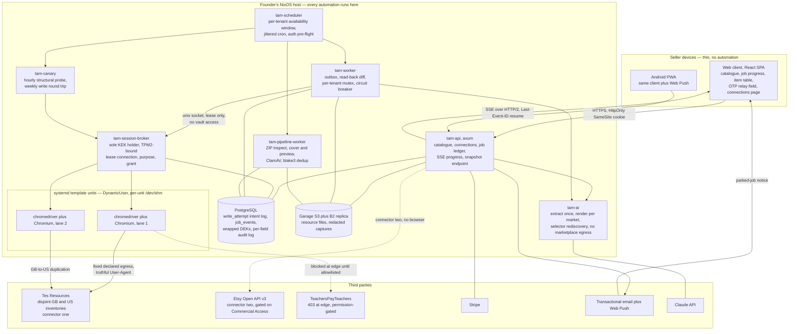

# Architecture and correctness

Superseded on 2026-08-25 by [`2026-08-25-listing-sync-design.md`](2026-08-25-listing-sync-design.md), with the state machine, the adapter seam and the fault-injection seam now specified in [`sync-machine.md`](sync-machine.md) and the selector-pack interpreter in [`selector-packs.md`](selector-packs.md).
This document is retained for its reasoning and is not live; do not implement from it.

These sections describe the system as settled by the founder on 2026-08-24 and 2026-08-25: server-side automation on infrastructure we operate, a thin client, Rust for the engine and every I/O path, and Tes GB-to-US inventory duplication as the first chargeable product.
Where the research documents describe the superseded local-first or browser-extension designs, this specification follows `docs/design/decisions.md` and `docs/research/server-side-architecture.md` instead, and names the supersession in place.
Claims carry the source the research recorded for them; claims the research marked unverified stay marked; judgements this specification makes that the research does not settle are labelled as judgements.

## System architecture

### The shape of the cloud plane

Everything that touches a marketplace runs on the founder's NixOS host.
The client is a progress reporter and a catalogue editor, and it holds no automation, no marketplace session and no scheduling authority, which is what makes the Android client a full client rather than a read-only one.
The engine is a Rust workspace of library crates with thin binaries over them, taking the topology from `rust-lang/crates.io` — a real production axum service built as 29 library crates under `crates/*` plus a binary and an admin CLI — rather than from a single-crate starter template, because the web client and the wire types must share a vocabulary that cannot carry a `sqlx` dependency.

Three crate boundaries must exist from the first commit because they are expensive to retrofit and cheap to create: `tam-types`, the pure serde algebraic data types for the wire and domain vocabulary, with no `sqlx`, no `reqwest` and no full `tokio`; `tam-marketplace`, holding the adapter trait and the recorded-fixture harness; and `tam-api` as a library rather than a binary, so integration tests drive the `Router` in-process with no bound port.
The fourth boundary this specification adds to that list is `tam-domain`, the sans-IO sync core described below, because its value comes entirely from what is absent from its dependency tree and that absence is impossible to reconstruct after the fact.
Merging `tam-domain`, `tam-storage` and job handling into one crate for the first months was judged defensible by round one; this specification declines that merge for `tam-domain` specifically and accepts it for the other two.

### Which services exist and which run as separate systemd units

The unit boundary is drawn at three questions: does this process need a secret the others must not reach, does it load hostile third-party markup, and must it be stoppable without stopping the rest.
A component that answers no to all three does not earn a unit.

| Unit | Runs | Why it is separate |
|---|---|---|
| `tam-api` | axum router, catalogue, connections, job ledger writes, SSE | It is the only internet-facing process and holds no key-encryption key. |
| `tam-scheduler` | deterministic cron, per-tenant windows, jitter, pre-flight | The revocation command and the circuit breaker must halt scheduling without killing in-flight work. |
| `tam-session-broker` | sole holder of the key-encryption key, mints leases | Decryption must not be ambient in any process that drives a browser. |
| `tam-worker@` | automation lane, outbox, read-back, diff | Per-job `RuntimeMaxSec=` needs a unit to attach to, and this is the process that consumes marketplace markup. |
| `tam-browser@` | chromedriver plus Chromium, one per session | The cgroup, the `DynamicUser` UID and the per-unit `/dev/shm` are the isolation mechanism. |
| `tam-pipeline-worker` | ZIP inspection, cover and preview generation, ClamAV | It carries the heaviest native closures and must never enter the API's closure. |
| `tam-ai` | listing-copy generation, selector rediscovery | It is the one process reached by attacker-supplied document content, and it is given no marketplace egress at all. |
| `tam-canary` | scheduled structural probe and write round trip | Its value depends on being decoupled from customer work, so it must not share a scheduler with it. |

The job broker is not a unit, and that is deliberate.
It is a PostgreSQL lease table with a per-job deadline column, hand-written or built on `pgmq` 1.12.0, which nixpkgs packages with a true per-message visibility timeout and a SQL-only install requiring no extension.
`apalis` 0.7.4 is rejected on a single structural fact: its Postgres backend re-enqueues orphaned jobs on worker heartbeat timeout rather than on a per-job lease, the SQL predicate sits entirely on the worker row, and there is no per-job deadline column — which makes it blind to the dominant failure mode here, where the browser hangs and the process is fine.
`underway`'s main branch holds exactly the right primitives, including a per-task lease and an enforced fifteen-minute per-task timeout, but every one of them is unreleased; the published 0.2.0 dates from 2025-07-16.
No Rust queue can cancel a running job, so cancellation is built here from `pg_notify`, `sqlx`'s `PgListener` and a per-job `tokio::sync::CancellationToken`.

`tam-ai` being a separate unit with no route to `tes.com` is a judgement this specification makes rather than a finding the research settles.
The reasoning is that attacker-supplied PDFs reach a model whose output reaches a live marketplace listing on a paying seller's storefront, which the charter critique identified as the one genuinely novel trust boundary in the system, and a process that cannot reach a marketplace cannot be the instrument of a prompt-injection write.
The cost is one more unit and one more socket; the alternative is a library boundary that a future refactor erases silently.

The browser units are templated with `DynamicUser=yes` and the profile in `StateDirectory=browser/%i`, never `ReadWritePaths=`, because systemd recycles `DynamicUser` UIDs from 61184-65519 and its own manual warns that processes must not leave files owned by those users behind — so a leftover profile holding a seller's marketplace cookie is a cross-tenant credential leak waiting for a UID collision.
`PrivateTmp=` covers `/tmp` and `/var/tmp` only, so each unit mounts its own `/dev/shm` via `TemporaryFileSystem=/dev/shm:size=...`; the shared default is not bounded predictably by `MemoryMax=` and exhausts as SIGBUS and tab crashes rather than a clean out-of-memory kill.
`MemoryDenyWriteExecute` stays unset because it is documented as incompatible with programs that generate code at runtime and V8 is one, and the user, pid and net namespaces are not restricted, because `DynamicUser` forces `NoNewPrivileges` and therefore forecloses Chromium's SUID sandbox helper, leaving the unprivileged user-namespace sandbox as the only remaining layer-one isolation.
`--no-sandbox` is never reached for to make a hardened unit work.

### The system as designed for the Tes-first wedge



Four things the diagram makes explicit.
The broker is the only component that can decrypt, and the worker drives a browser it was handed rather than holding session material.
The Etsy connector, when Commercial Access lands, hangs off `tam-api` and touches no browser at all, because Etsy's Open API v3 exposes `createDraftListing`, `uploadListingFile`, `uploadListingImage` and `getSellerTaxonomyNodes` directly ([Etsy OpenAPI 3.0.2 spec](https://www.etsy.com/openapi/generated/oas/3.0.0.json)).
The TPT edge is drawn dashed and blocked because that is the current measured state and no code path in this design changes it.
And `tam-ai` has an edge to the Claude API and none to any marketplace.

## The automation plane

### The prior question that decides the cost line

Before any automation code is written, establish whether Tes needs a browser at all.
The detection evidence — bare Fastly with `fastly-drupal-html: YES`, Drupal, no challenge platform, no CAPTCHA vendor, no fingerprinting script — makes a plain multipart form POST plausible for the Tes uploader.
If the upload is a classic form POST, a `reqwest` driver costs roughly 30 MB resident, carries no version treadmill, and the entire Chromium dependency evaporates; if it is a JavaScript-mediated chunked or XHR uploader, the browser is mandatory and the memory budget, the concurrency ceiling, the systemd isolation design and the maintenance load all change by an order of magnitude.
The research calls this a 30x difference in the dominant infrastructure cost line and the single highest-leverage hour in the plan, and it is settled by one devtools session on the founder's own Tes author account: record whether the submit is a plain multipart POST or a JavaScript-mediated chunked upload, and whether a real `<input type=file>` exists in the DOM.
This remains open as of 2026-08-25 and is M-1 probe two.

The design's response is to make the answer change a registration and nothing else.
Both a `reqwest`-driven and a browser-driven Tes adapter satisfy the same `MarketplaceAdapter` trait, so the sync state machine, the intent log, the read-back diff, the job ledger and every limit are identical under either answer.
That is the concrete payoff of the sans-IO seam described below, and it is why the seam is worth building before the probe rather than after it.

### Crate choice, and why the transport shape decides it

`thirtyfour` 0.37.5, published 2026-08-12, driving nixpkgs `chromedriver` over WebDriver Classic, with WebDriver BiDi negotiated on the same session via the `webSocketUrl` capability, is the path.

The decisive structural property is the transport shape rather than any feature list.
WebDriver Classic is request-response over HTTP, so `thirtyfour` bounds every command at the `reqwest` client level (`src/session/http.rs:123`, with `WebDriverConfig::request_timeout` defaulting to 120 seconds at `src/common/config.rs:91`), whereas CDP is a persistent WebSocket where a command that never receives a response simply waits.
For an unattended fleet the difference is not stylistic: an unbounded wait is an ambiguous write that never resolves and a browser that is never reaped.
File upload also has three independent mechanisms — Classic `send_keys(path)` against an `<input type=file>`, BiDi `input.setFiles`, and raw CDP `DOM.setFileInputFiles` through `Cdp::send_raw` — which is three fallbacks for the highest-risk step in the product.
The nixpkgs integration is hermetic: `chromedriver` is built from the chromium source tree, with `pkgs/development/tools/selenium/chromedriver/source.nix` being a `chromium.mkDerivation` with `buildTargets = [ "chromedriver.unstripped" ]`, so version skew cannot arise from a channel bump, and `WebDriverManagerBuilder::driver_binary(BrowserKind::Chrome, path)` accepts the Nix-pinned binary with no runtime download path.

`chromiumoxide` is rejected, but not on the grounds first proposed.
The claim of an 8h20m default timeout from `TargetConfig::default()` did not survive verification — that default has no callers, so it is a latent trap in a public struct rather than operative behaviour.
The real defect is `src/handler/commandfuture.rs:51`, which hardcodes the crate constant and ignores configured values, together with a cluster of ten open hang and timeout issues running from #13 on 2020-12-28 to #333 on 2026-08-20.
The corrected grounds are weaker than the original headline and still sufficient, because a six-year unresolved hang class is precisely what wedges an unattended fleet.
`headless_chrome` leaks processes and threads across 142 open issues; `rustwright` is seven weeks old, self-described alpha, and its own continuous integration flakes on navigation timeouts; `playwright-rust` last shipped in 2022; `fantoccini` 0.22.1 is healthy but has no BiDi module and therefore no network event stream.

### The three defects that must be wrapped

Each of these was found by reading the crate's source rather than its issue tracker, and each has a specific wrapper obligation that must exist before any outcome logic is written.

BiDi commands are not bounded.
`grep -rn "timeout" thirtyfour/src/bidi/` returns nothing, and `src/bidi/transport/ws.rs:135` awaits a oneshot with no deadline, so a wedged browser that keeps its socket open hangs `network.addIntercept` or `input.setFiles` forever.
Every BiDi call is wrapped in `tokio::time::timeout` at the call site, and because a caller timeout leaks the pending entry, the wrapper counts leaked entries and poisons the session once the count is non-zero rather than reusing it.

The BiDi event fan-out drops events silently.
It is a `tokio::sync::broadcast` with a global 1024-slot buffer whose stream adapters discard `Lagged` without surfacing it (`src/bidi/stream.rs:109` and `:179`), so under load the `ResponseCompleted` for a submit can vanish with no error and the write scores ambiguous.
This is the sharpest argument for low concurrency in the whole design: concurrency here does not degrade throughput, it manufactures ambiguity, and ambiguity is the outcome class that costs a human.
The wrapper subscribes with an explicit lag counter and treats any observed lag during an in-flight write as `AmbiguityCause::ResponseEventLost` rather than as a recoverable stream hiccup.

The error conversion erases the distinction the outcome logic depends on.
`impl From<reqwest::Error> for WebDriverError` at `src/error.rs:410` flattens the error into a string, destroying `is_timeout()` versus `is_connect()` — the two classes that decide whether a write is ambiguous or safe to retry.
A connect failure means the request never left and retry is safe; a timeout means the command was not cancelled server-side and the write may have landed.
The wrapper therefore classifies at the `reqwest` layer before `thirtyfour` sees the error, and no stringified `WebDriverError` is ever permitted to decide an outcome.

A fourth item is not a defect but is incompatible with the unit design: `thirtyfour`'s driver manager holds a single refcounted chromedriver shared across sessions at `src/manager/manager.rs:133`, so one manager runs per unit and N chromedrivers are accepted, because a shared driver would place every browser in one cgroup under one UID and dissolve the isolation the units exist to provide.

Maintenance posture is honest and not comfortable.
`thirtyfour` is bus factor one, with 507 contributions from the maintainer against 79 from the next human, and the entire BiDi surface landed in self-authored, self-merged pull requests on a single day — #314 merged nine minutes after opening, #318 twenty-one minutes.
A green continuous-integration matrix authored in the same twenty-one minutes as the code it tests is weak maturity evidence, so BiDi is treated as viable pending an M0 soak against a real marketplace rather than as production-proven.
If it stalls, the fallback is `fantoccini` plus read-back-only verification, losing the network event stream; that fallback is cheap here precisely because the outcome logic already treats network observation as ranked evidence rather than as the deciding signal.

### Fleet sizing, and why concurrency starts at one to two

The fleet starts serialised at concurrency one to two rather than as a pool, and the arithmetic makes that comfortable rather than austere.
At the feasibility parameters of 50 listings per seller per month at roughly three minutes wall-clock, one seller consumes 2.5 browser-hours a month, so a single serialised browser at a 20 percent duty cycle serves about 58 sellers and at 50 percent about 146.
Measured on the founder's own hardware — Intel i7-10700F, 8C/16T, 31 GiB — an isolated Chromium session costs roughly 400 MB marginal with a heavy single-page application loaded and about 4.3 CPU-seconds for launch plus one page load, which puts the hardware ceiling near 30 concurrent sessions and makes CPU rather than RAM the binding constraint.
Those figures matter only as an upper bound to design against, because the practical operating point is set by marketplace pacing, which is an order of magnitude below the hardware ceiling.

Serialising deletes problems rather than managing them: no `/dev/shm` contention, no broadcast-lag ambiguity, no pool health checking, and exactly one in-flight write to reconcile after a crash.
The last of those is the one that matters most, because crash recovery is where the ambiguous path is exercised and a single in-flight write is a bounded reconciliation problem while a pool of them is not.

A durable per-tenant mutex is mandatory and is not a performance control.
Two workers on one tenant will race session-bound form tokens and produce sporadic 403 responses that look exactly like bot detection and will trip the circuit breaker.
Parallelism is inter-tenant only, always.

The nixpkgs chromium lockstep cuts both ways and its recurring cost belongs in the budget.
Version skew is impossible, and equally the version cannot be pinned, because Chromium moves on a security cadence and staying put means running known vulnerabilities in a process that loads hostile third-party markup with seller session cookies resident.
That is roughly fifteen to twenty-five forced browser upgrades a year, each an unreviewed change to how someone else's form renders and each requiring re-verification against the marketplace before it reaches production, so "never override chromium" is a hard rule, a flake check asserts that both store paths are substitutable, and deploys are gated behind a staging re-verification run.
`fonts.packages` includes DejaVu, Liberation, Noto, Noto CJK and colour emoji; the claim that Latin text would otherwise render as tofu is wrong, because nixpkgs' `make-fonts-conf.nix:49` unconditionally appends `dejavu_fonts.minimal`, but element interactability checks depend on layout and a post-write screenshot of a CJK or emoji-bearing title is worthless as an audit record without them.

### Per-job resource limits at the operating-system layer

Three independent deadlines exist with deliberately different roles, and collapsing them into one destroys the property that makes the third outcome legible.

`thirtyfour`'s `request_timeout` bounds each individual WebDriver command and is fixed when the HTTP client is constructed, so it is set at construction and never mutated afterwards.
A `tokio::sync::CancellationToken` carrying a wall-clock budget bounds the whole job in-process, so the normal path for an over-running job is a clean cancellation that records an outcome and tears down its browser.
`RuntimeMaxSec=` on the systemd unit, set strictly longer than the tokio deadline, is the operating-system backstop that fires only when the process itself is wedged — and when it fires the outcome is `Ambiguous` by construction, because nothing in the process survived to classify it.
That ordering is the design: an in-process deadline produces a known outcome, and the operating-system deadline produces the honest absence of one.

The W3C `pageLoad` and `script` session timeouts are set explicitly, and the `implicit` timeout is never set, because `thirtyfour`'s own documentation warns it interferes with the `query()` polling framework.
`MemoryHigh=`, `MemoryMax=`, `CPUQuota=` and `TasksMax=` are set per unit, and the cgroup provides orphan reaping that process bookkeeping cannot, since killing chromedriver does not reliably reap Chromium's zygote and renderers while stopping the unit does.
Any `reqwest` timeout is treated as session-poisoning: the command was not cancelled server-side, chromedriver serialises commands per session, and the next command will queue behind the abandoned one.

Document ingestion runs out-of-process under memory, CPU and wall-clock rlimits in `tam-pipeline-worker`, which is the charter critique's correction to the proposal to fuzz the parsers: the product will depend on a ZIP, OOXML or PDF parser rather than write one, so fuzzing produces findings that cannot be fixed, while a reaped subprocess discharges the zip-bomb and decompression-ratio limits at the layer where they actually hold.
The `zip` crate has no decompression-bomb protection, `decompressed_size()` reads spoofable headers, and a 2025 symlink-traversal advisory applies (GHSA-94vh-gphv-8pm8, CVSS 7.3), so extraction uses `enclosed_name()` and never `name()`, refuses symlink entries, and enforces a running byte counter during streamed extraction.

One host-level detail belongs here rather than in operations, because it manufactures the outcome class this design exists to contain: if `system.autoUpgrade` with `allowReboot` is enabled, the machine can reboot mid-upload on a schedule and produce ambiguous writes indefinitely, so it is disabled or gated on a drained queue.

## The correctness design

### Three outcomes, not two

A submit against a marketplace form has three outcomes, and the third is not a kind of failure.
It succeeded, it failed, or we do not know — and "we do not know" is the normal, expected result of a timeout, a lost response event, a killed process or a network reset, not an exceptional one.

The evidence most often cited for this is that the best fully-automated web agent on WebBench completes only 46.6 percent of non-read tasks with hallucinated success as the top failure mode.
That figure did not survive verification: the source verifier could not find 46.6 at the cited Skyvern page and found the two named failure modes presented as co-equal rather than ranked, so the number must be re-sourced to the primary paper before it appears in any customer-facing material.
The design consequence stands regardless, because it also follows from first principles — a driver's own success signal is unverified, and a marketplace form offers no idempotency key.

The governing axiom is written into the design record verbatim: a stalled queue is recoverable, a duplicate-upload storm is not.
Every ambiguous resolution therefore biases toward stalling, and the Tes Author Code makes the cost of the other bias concrete, since it says "Please do not upload duplicate copies of your resources" ([Tes Author Code](https://www.tes.com/teaching-resources/author-code)).
An ambiguous attempt is never retried; it is reconciled, and if reconciliation cannot decide, it goes to human review with the tenant halted.

### The transactional outbox

The commit boundary is intent recorded, not response received.

Before the click, the worker writes a `write_attempt` row in PostgreSQL inside the same transaction as the job state change: a UUID, the job id, the tenant, the marketplace, the intent, the canonical content hash, and `state = IN_FLIGHT`.
That row is simultaneously a fencing token and an intent log, and it is what makes a crash legible: a process that dies between the row and the response leaves an `IN_FLIGHT` row that reconciliation can find, whereas a process that dies before the row leaves nothing to reconcile and nothing was sent.
A `UNIQUE` index on `(tenant_id, idempotency_key)` makes a second concurrent `IN_FLIGHT` row for the same intent unrepresentable at the database, which is the backstop for the per-tenant mutex rather than a duplicate of it.

The same transaction allocates a `job_events` row whose BIGINT primary key is the SSE event id, so progress reporting and correctness share one commit.
The browser replays that id in a `Last-Event-ID` header on reconnect and resumption becomes `SELECT ... WHERE id > $1` rather than bespoke protocol code.
`LISTEN/NOTIFY` carries only `{job_id, max_event_id}` and is treated as a hint to read the table, because `sqlx`'s `PgListener` documents that notifications received while the connection was lost will not be returned, the payload caps at 8000 bytes, and identical payloads within one transaction fold to a single delivery — so a constant payload would silently lose wakeups.
On `RecvError::Lagged` the handler re-reads the snapshot and resumes from the newest id, which is byte-for-byte the reconnect path, so backpressure and disconnection share one recovery routine.

Two tables, one transaction, two consumers: the marketplace write reads the intent log, and the client reads the event log.
Neither consumer can observe a state the database has not committed.

### The idempotency model

The idempotency key is ours, because the marketplace offers none.
It is deterministic over the tuple of tenant, marketplace, product, intent version and canonical content hash, so a requeued item carries the same key it had before it was parked — which is what allows a connection that transitions to `NeedsReauth` to requeue every item behind a `blocked_on=reauth` gate without any of them losing identity.

Updates are idempotent by durable identifier: writing the same field set twice to a known listing id converges, and both durable keys are stable — on TPT the numeric product id is authoritative, since requesting `/Product/zzz-wrong-slug-entirely-6939232` returns HTTP 200 and serves the correct product, and on Tes, since 27 November 2025, the URL remains tied to the original resource title even after a title change.
A marketplace CDN image URL is never a sync key, because TPT's image paths embed a cache-busting epoch and change on every re-upload.

Creates are the hole, and it is the largest one in the naive design.
Both stable keys are assigned by the server at creation, so on an ambiguous create the key is exactly what is missing — which is what ambiguity means.
Reconciliation then means listing the author's recent resources and matching on title plus content fingerprint, and the fingerprint will not match, because marketplaces sanitise HTML, trim whitespace, transcode images and rewrite descriptions.

### Draft-then-publish, and what happens if it does not exist

If either marketplace supports save-as-draft, the create path stops being ambiguous by construction.
A draft create followed by a publish transition splits one dangerous write into a harmless one and an idempotent one, because publishing an already-published draft is a no-op, so an ambiguous publish is resolved by publishing again rather than by reconciling.
The research is explicit that this is a larger correctness win than the entire network-observation design at a fraction of the cost, and it is M-1 probe three.
Whether Tes supports it is unresolved as of 2026-08-25.

Because the answer is unknown, the create path is a configured strategy rather than a code path, so the probe result changes a value rather than a control flow:

```rust
// crates/tam-domain/src/create.rs
pub enum CreateStrategy {
    /// Create as draft, then publish; an ambiguous publish is safely repeatable.
    DraftThenPublish { draft_state: ListingLifecycle },
    /// Embed a correlation marker in a named seller-visible field, then reconcile on it.
    CorrelationMarker { field: MarkerField, ttl: MarkerLifetime },
    /// No reconciliation is possible; record Ambiguous and halt the tenant.
    HaltOnAmbiguity,
}
```

The correlation-marker fallback embeds a short token in a seller-visible field, reconciles an ambiguous create by searching the author's own recent resources for it, and then removes it.
It is a product decision about listing pollution rather than an engineering one, and it needs the founder's answer before it can be built.
Two Tes constraints narrow the field choice and should be settled with the same answer: the Author Code prohibits external URLs in descriptions, titles and previews, so a marker must not be URL-shaped; and marker text sits in copy that TPT's Seller Guidelines require to be truthful, accurate and free of mistakes, which argues against the title.
`HaltOnAmbiguity` is the honest third option and it is what ships if the founder declines the pollution, at the cost of a tenant halt on every ambiguous create.

### Read-back verification with a field-level diff

Verification is a field-by-field diff against declared intent, never an existence check.
A three-valued outcome answers whether a write landed; it never asks whether the right write landed, and after a markup change a 200 can mean the price was typed into the quantity field and the wrong licence radio selected, published to a real storefront.

Evidence is ranked and no rung is terminal on its own.
An observed BiDi `ResponseCompleted` tells you what the server answered and no more, because a marketplace returning HTTP 200 with a JSON error body would score committed if the status line were treated as authoritative — and Puppeteer documents that `HTTPResponse.buffer()`, `content()` and `text()` are unsupported over BiDi, so the body is not readable through the ordinary response API.
`thirtyfour` exposes `network.getData` at `src/bidi/modules/network.rs:479` to fetch retained body data, and the design uses it rather than trusting the status line.
A read-back of the listing by durable identifier is the only thing that settles genuine ambiguity, and DOM success banners are never terminal at any rung.

The read-back compares each intended field against the observed value through an explicit per-field normaliser handling entity re-encoding, Unicode normalisation, curly quotes, whitespace collapse, description truncation, tag reordering, slug generation and price rounding.
Without that normaliser the control emits mismatch alerts continuously, the founder learns to ignore them within a week, and the control is then worse than absent because it is believed to exist.
Each mismatch class maps to a fixed action rather than to an operator judgement:

| Mismatch class | Action |
|---|---|
| Truncated | Record degraded, do not resend. |
| Transformed by a known normaliser | Accept as equal. |
| Field missing entirely | Halt the marketplace for this tenant. |
| Value landed in the wrong field | Halt immediately and page. |
| Unexpected field present | Halt the marketplace and capture forensics. |

Two positive assertions are required rather than absence checks, because both failure classes parse as success otherwise.
A seller enabling multi-factor authentication yields a login page where a dashboard was expected, and a session that expires mid-upload yields a 302 to sign-in whose landing page is a cached Fastly 200.
So every post-authentication step asserts positively on an authenticated-only element, and an interstitial is never interpreted as a successful write.

A pre-flight form-schema assertion is cheaper and more severe than any post-hoc diff, so it runs first: before filling, the worker enumerates the form's input names and hard-fails if the set differs from a pinned fixture.
That fails closed before any write, costs one request, and catches the overnight-redeploy case that a post-write diff only catches after N corrupted listings exist.

The independently scheduled canary is the detection mechanism, because Tes publishes no gradient to descend — no rate limit, no 429, and a first signal that is an account restriction which has already reached a customer.
Following the addendum's split, the canary runs a read-only structural probe hourly that resolves every selector and creates nothing, a write round trip weekly as a semantically null description edit on one real low-traffic product the founder authored, and the create path at most monthly.
Throwaway listings are not created and deleted, because deletion irreversibility and duplicate prohibitions make that the worst available choice, and the account is one the founder holds in his own name.
Whether Tes permits an author to delete their own resource is unresolved and must be confirmed before the monthly create leg is enabled, because if it does not, the canary permanently pollutes the store and consumes the author's own fair-usage budget on every run.

Forensic capture on any non-green outcome writes the BiDi network log, the page HTML, a screenshot and the console log to object storage keyed by `write_attempt` UUID, with credential headers redacted in the capture path from the first commit, since `BeforeRequestSent` and `ResponseStarted` carry `Cookie`, `Set-Cookie` and `Authorization` and an unredacted artefact store is a persistent credential dump that also contradicts the custody argument for self-hosting.
Two research documents conflict here and the conflict is recorded rather than smoothed over.
`server-side-architecture.md` prescribes capturing page HTML; `feasibility-addendum.md` section 6 says not to build DOM snapshot capture at all, on the contractual ground that a DOM snapshot uploaded to our server reproduces "user interfaces" and "computer code" onto a third-party computer for a commercial purpose under TPT Terms of Service section 4.A.
Both are dated 2026-08-25.
This specification resolves it by scope, as a judgement: the 4.A clause is TPT's, no counterpart was found in the Tes Author Code or the en-gb General Terms of Business, and TPT is permission-gated and unbuilt, so HTML capture is enabled for Tes and the capture path is disabled for TPT unless written permission arrives.
Retention is bounded from the first commit, because HTML plus a full network log per capture reaches single-digit gigabytes a month otherwise.

### The fault-injection seam

The 429 handler will never execute in development and will first execute in production during the incident it exists to contain, so the error path is made reachable on purpose.

The seam sits at the transport boundary, below the adapter and above the driver, and it is a wired implementation rather than a `cfg(test)` switch — because the same faults must be walked by a scheduled synthetic in production, not only by continuous integration.

```rust
// crates/tam-marketplace/src/fault.rs
pub enum InjectedFault {
    Status429 { retry_after: Option<Duration> },
    Status403,
    HtmlInterstitial,
    RedirectToSignIn,
    TruncatedBody { bytes_delivered: usize },
    ConnectionResetMidBody,
    /// The BiDi broadcast dropped ResponseCompleted; the submit outcome is unobserved.
    ResponseEventLost,
    /// RuntimeMaxSec fired after the submit left; nothing survived to classify it.
    ProcessKilledAfterSubmit,
}

pub trait FaultPlan: Send + Sync {
    fn next_fault(&self, step: StepId) -> Option<InjectedFault>;
}
```

The first six are the transport faults the research names; the last two are the ambiguity faults this design adds, because they are the two that produce `Ambiguous` rather than `Rejected` and they are the two that no external service will produce on demand.
The acceptance criterion for M0 is that a deliberately interrupted write is classified as ambiguous rather than as success or failure, so this seam is built at M0 and not later.

## The sans-IO seam

### The shape

The sync and reconciliation logic is a pure, deterministic, total state machine.
It performs no I/O, allocates no runtime, and its crate bans `tokio`, `reqwest` and `sqlx` from its dependency tree — an arrangement the adversarial charter review singled out as substantively right and worth keeping unchanged.
Everything the machine wants done is returned as data, and something outside it decides how to do it.

```rust
// crates/tam-domain/src/sync/machine.rs
// This crate's dependency tree contains no tokio, no reqwest and no sqlx.

pub struct SyncMachine {
    tenant: TenantId,
    marketplace: Marketplace,
    intent: WriteIntent,
    attempt: WriteAttemptId,
    strategy: CreateStrategy,
    state: SyncState,
    budget: StepBudget,
}

pub enum SyncState {
    AwaitingPreflight,
    PreflightAsserted { schema: FormSchemaFingerprint },
    IntentRecorded,
    Submitted { evidence: SubmitEvidence },
    AwaitingReadBack { locator: ListingLocator },
    Terminal(Outcome),
}

pub enum Outcome {
    Committed { listing: ListingId, report: FieldDiffReport },
    Degraded { listing: ListingId, report: FieldDiffReport },
    Rejected { code: ReasonCode, detail: ReasonDetail },
    Ambiguous { attempt: WriteAttemptId, cause: AmbiguityCause },
    Blocked { challenge: ChallengeKind },
    Skipped { code: ReasonCode },
}

pub enum Input {
    PreflightResult(Result<FormSchemaFingerprint, SchemaDrift>),
    IntentRecorded(WriteAttemptId),
    SubmitResult(Result<SubmitEvidence, AdapterError>),
    ReadBackResult(Result<ObservedListing, AdapterError>),
    BudgetExhausted,
}

pub enum Effect {
    AssertFormSchema { form: FormId },
    RecordIntent { attempt: WriteAttemptId, intent_hash: ContentHash },
    Submit { attempt: WriteAttemptId, key: IdempotencyKey, fields: FieldSet },
    ReadBack { locator: ListingLocator, reason: FetchReason },
    CaptureForensics { attempt: WriteAttemptId, cause: CaptureCause },
    HaltTenant { tenant: TenantId, scope: HaltScope },
    Notify { tenant: TenantId, event: SellerEvent },
}

pub struct Transition {
    pub next: SyncMachine,
    pub effects: EffectList,
}

impl SyncMachine {
    /// Consumes the machine so a stale state cannot be stepped twice.
    pub fn step(self, input: Input, now: LogicalInstant) -> Result<Transition, MachineError> { .. }
}
```

`step` takes `self` by value, which makes acting on a superseded state a compile error rather than a test failure, and it takes `now` as a parameter rather than reading a clock, which is what makes replay exact.
`Result` is used only for transitions that are genuinely impossible rather than merely unsuccessful; every business outcome, including ambiguity, is a value in `Outcome` and travels the success channel.

### The adapter trait and the error taxonomy

```rust
// crates/tam-marketplace/src/adapter.rs

pub trait MarketplaceAdapter: Send + Sync {
    fn marketplace(&self) -> Marketplace;

    async fn assert_form_schema(
        &self, tenant: TenantId, form: FormId,
    ) -> Result<FormSchemaFingerprint, AdapterError>;

    async fn submit(
        &self, tenant: TenantId, key: IdempotencyKey, fields: FieldSet,
    ) -> Result<SubmitEvidence, AdapterError>;

    async fn read_back(
        &self, tenant: TenantId, locator: ListingLocator, reason: FetchReason,
    ) -> Result<ObservedListing, AdapterError>;
}

pub enum AdapterError {
    /// The write may have landed. Never retried; reconciled or escalated.
    Ambiguous(AmbiguityCause),
    Rejected { code: ReasonCode, detail: ReasonDetail },
    Challenge(ChallengeKind),
    SessionExpired,
    SchemaDrift(SchemaDrift),
    RateLimited { retry_after: Option<Duration> },
    /// The request provably never left. The only class that is safe to retry.
    NotSent(ConnectFailure),
}

pub enum AmbiguityCause {
    SubmitTimedOut,
    ResponseEventLost,
    ProcessKilledByBackstop,
    ReadBackIndeterminate,
    NoDurableIdentifier,
}
```

`TenantId` is a mandatory positional parameter on every method rather than task-local state, which the charter review named as substantively right, and it makes a cross-tenant call a missing-argument error rather than an ambient-context bug.
`IdempotencyKey` is required on `submit`, so a submit without one does not typecheck.
`AdapterError::Ambiguous` carries no retry affordance of any kind, so the only way to retry an ambiguous write is to construct a different error, which review catches.
`NotSent` is the only retryable class, and it is constructible only from a `reqwest` connect failure classified below `thirtyfour`, which is the wrapper obligation from the third named defect expressed as a type.

`FetchReason` is constructible only from evidence that the read is permitted, which encodes the addendum's three-tier read posture — first-party export, one id-addressed fetch caused by an authorised write, and nothing else — as unrepresentability rather than as a rule:

```rust
pub enum FetchReason {
    FirstPartyExport(ExportGrant),
    WriteReceipt(WriteReceipt),
    StructuralProbe(CanaryGrant),
}
```

Link-following, listing pages, search and pagination have no constructor, so competitor and category-wide reads are unrepresentable rather than merely forbidden.
`CanaryGrant` is issued per marketplace from a recorded permission decision, which keeps the structural probe available on Tes and unreachable on TPT until written permission exists — the point on which the research is clearest that TPT's automated-means clause reaches verification itself and no engineering choice resolves it.

### What the seam buys, and when the simulator arrives

The immediate return is property testing measured in milliseconds rather than in browser-minutes.
Because `step` is pure and total, a property test can generate arbitrary `Input` sequences and assert the invariants that actually matter: no `Submit` effect is ever emitted twice for one `WriteAttemptId`; every terminal `Ambiguous` is preceded by a `RecordIntent`; no path leads from `Ambiguous` back to `Submit`; every `Committed` is preceded by a `ReadBack`; and `BudgetExhausted` always reaches a terminal state.
Those five properties are the entire correctness argument of section three, and they run without a database, a browser or a network.
`cargo-mutants` 27.1.0 is the adequacy check on that suite, which the charter review endorsed over assertion-density metrics.

The deferred return is deterministic simulation testing, and it is deliberately deferred: the adversarial charter review lists the simulator among the things to defer explicitly, on the grounds that none of it gets harder by waiting.
The verified candidates are `turmoil` 0.7.2 and `madsim` 0.2.34.

The trigger for adding it, stated as a judgement rather than as a finding, is either of two observable events.
The first is the day serialisation is relaxed — when a pool replaces the one-to-two lanes, or the per-tenant mutex is loosened, more than one write is in flight against one marketplace and interleaving becomes a real state space rather than a hypothetical one.
The second is the first production `Ambiguous` outcome whose sequence cannot be reproduced from the recorded intent log and event log, because that is the moment the recorded evidence stops being sufficient to reason about the system and a simulator is the cheapest way to get the evidence back.
Neither is a date, both are cheap to detect, and until one of them fires the property suite over a pure state machine is the higher-yield spend.

## The credential seam

### One implementation today, room for two more

Sellers supply their marketplace credentials and we store them encrypted with per-tenant data-encryption keys.
The founder recorded this as interim — "until we find a better way to have their creds" — so credential acquisition sits behind a seam from the first commit, with room for an interactive remote browser the seller logs into themselves, and an official partner integration if either marketplace grants one.
The seam is cheap now and expensive to retrofit, which is the reason it exists.

```rust
// crates/tam-credentials/src/lib.rs

pub enum CustodyModel {
    /// Today. Seller supplies credentials; we hold ciphertext under a per-tenant DEK.
    StoredCredential,
    /// Seller authenticates themselves; we never see the password.
    SellerDrivenSession,
    /// A marketplace-sanctioned delegated grant, if one is ever obtained.
    PartnerGrant,
}

pub trait ConnectionProvider: Send + Sync {
    fn model(&self) -> CustodyModel;

    async fn link(
        &self, tenant: TenantId, marketplace: Marketplace, offer: LinkOffer,
    ) -> Result<ConnectionId, CustodyError>;

    /// Returns a driver endpoint for a browser the broker launched and primed.
    /// There is deliberately no `get_session`, and no accessor returns secret material.
    async fn lease(
        &self, tenant: TenantId, connection: ConnectionId,
        purpose: LeasePurpose, grant: GrantId,
    ) -> Result<SessionLease, CustodyError>;

    async fn revoke(
        &self, tenant: TenantId, scope: RevocationScope,
    ) -> Result<RevocationReceipt, CustodyError>;

    async fn health(
        &self, tenant: TenantId, connection: ConnectionId,
    ) -> Result<ConnectionHealth, CustodyError>;
}

pub struct SessionLease {
    endpoint: DriverEndpoint,
    grant: GrantId,
    expires: LogicalInstant,
}
```

`LinkOffer` carries a `Secret<String>` with a redacting `Debug`, `zeroize` on drop and a `disallowed-types` entry against the raw string types, and it is consumed by value at `link` so it cannot be logged after use.
`SessionLease` exposes an endpoint and nothing else, which is the type-level statement of the architectural rule below: a worker can use a connection and cannot read one.

The server-side research argues for a fourth model it calls a session courier — a small signed helper that opens a system webview on the seller's own machine, extracts an enumerated allow-list of `tes.com` session cookies and posts them to us — on the ground that the Tes password then provably never reaches our infrastructure.
That is a research recommendation and not a settled decision, and it is recorded here because it fits this seam without changing it, arriving as a further `CustodyModel` variant rather than as a redesign.
The same research is emphatic that the interactive server-hosted login is the worst of the models on exculpability grounds, because the plaintext provably transits our code and no log or policy can later demonstrate otherwise.

### Where the key-encryption key lives

Each connection is encrypted under its own data-encryption key using XChaCha20-Poly1305 from `chacha20poly1305` 0.11.0, with the additional authenticated data bound to `tenant_id || marketplace || connection_id || key_version`, so a row replayed into another tenant fails authentication rather than decrypting into the wrong context.
Ciphertext, AAD context, key id and version live in PostgreSQL through `sqlx` 0.9.0, and the data-encryption key exists in the database only wrapped.

The key-encryption key lives in a systemd credential encrypted with `systemd-creds encrypt --with-key=tpm2` and delivered to `tam-session-broker` through `LoadCredentialEncrypted=`.
OpenBao is not run on the same box: a single self-hosted machine cannot auto-unseal without either storing the unseal key on the same disk, which makes it no better than full-disk encryption, or blocking every reboot until the founder is awake.
The arrangement is therefore `sops-nix` for deploy-time secrets, systemd-creds with TPM2 for the key-encryption key, and OpenBao only once a second machine or a hosted key-management service exists to unseal against.
TPM binding ties the deployment to hardware, so a tested key-encryption-key escrow and recovery procedure must exist before any customer data does, or the first motherboard failure destroys every stored session.

### What a database dump alone yields

An attacker holding only a `pg_dump` or a disk image, without that TPM, gets ciphertext for every stored credential and every session.
PostgreSQL has no native transparent data encryption — its own documentation describes storage encryption at the file-system or block level and warns it does not protect against attacks while the file system is mounted ([PostgreSQL](https://www.postgresql.org/docs/current/encryption-options.html)) — so this is application-level envelope encryption doing the work, not the database.

Be precise about what is not protected, because overstating it damages credibility.
The dump still yields the catalogue, the mappings, the job ledger, the per-field audit log and the tenant graph in plaintext, and those describe what every seller sells and what we changed on their behalf.
The addendum's remedy is carried: reinstate per-tenant data-encryption keys for the object-store blobs holding customers' resource files specifically, because the files are the asset and, unlike a credential, they cannot be rotated after disclosure.
The encryption is also a statutory off-ramp — GDPR Article 34(3)(a) removes the individual-notification duty where measures render the data unintelligible ([Article 32 for the surrounding duties](https://gdpr-info.eu/art-32-gdpr/)) — and it helps only for the stolen-dump case and not for a compromised running process.

Row-level security is forced rather than assumed, because table owners normally bypass row security and `ALTER TABLE ... FORCE ROW LEVEL SECURITY` is what stops them ([PostgreSQL](https://www.postgresql.org/docs/current/ddl-rowsecurity.html)).
The application connects as a non-owner role without `BYPASSRLS`, every tenant table forces row-level security, and a continuous-integration negative test asserts that a cross-tenant select under the application role returns zero rows.
Every unique index is tenant-scoped, because referential-integrity checks bypass row security and a unique constraint on a per-tenant natural key leaks the existence of another tenant's row.

### What limits the blast radius of a compromised process

Decryption is not ambient.
`tam-session-broker` is the only component that can reach the key-encryption key, it runs as its own user under `ProtectSystem=strict`, `NoNewPrivileges`, `PrivateTmp` and a syscall filter, and it exposes exactly one narrow unix-socket call — `lease(connection_id, purpose, grant_id)` returns a driver endpoint for a browser the broker itself launched and injected cookies into.
It never exposes `get_session()`, and the `SessionLease` type above is the compile-time expression of that.
A compromised automation worker can misuse the connections it has leased and cannot exfiltrate the vault.

The second bound is a navigation allow-list enforced in Rust at the driver layer, with a test that fails on any route outside it rather than a code review that notices one.
This matters most on Tes and is the inversion the compliance research called its sharpest finding: a TPT Virtual Assistant session cannot reach earnings and all banking identity sits in Hyperwallet behind a separate login, while Tes holds the seller's bank account details in-account, reachable from the same Author Dashboard the automation traverses via the Withdraw flow.
Tes is the easier technical target and the higher-severity compliance target, so the allow-list is a first-milestone control and not a hardening pass.
Roster and account-administration routes are deny-listed alongside payout routes, and page content from question-and-answer surfaces is not persisted at all.
The engine may never present a value about itself that it does not believe to be true, which is the design-rule form of TPT's identifier-disguise clause and applies fleet-wide regardless of marketplace.

Be honest about the ceiling: root on the box, or a bug in the broker, gets everything currently unsealed.
That is exactly why a custody model holding nothing beats any amount of cryptography, and why the seam exists.

### Revocation and the audit log

A single global revocation command clears every session ciphertext, destroys every tenant data-encryption key, halts the scheduler, kills in-flight leases within seconds and notifies every seller.
It is drilled and the wall-clock time is recorded, because that number is the honest containment window and it is the only figure worth publishing about incident response.
Its scoped forms — per tenant, per marketplace, per connection — share the implementation, and the self-serve connections page exposes the per-connection form to the seller, showing every held session and when it was last used.
That portal is built before the complaint rather than after it, following the closest regulated precedent, where the relief included retention limits, deletion, and a portal where consumers manage linked accounts.

The audit log records the intended mutation, the observed post-write state and the diff — which is the same read-back the correctness design already requires, so the marginal cost is storage.
It matters because TPT gives the seller no usable record of delegated edits, stating that a seller can see when the latest edit by a Virtual Assistant was made but cannot see detailed changes, which makes our log the only record either party will hold.
Audit events ship continuously off-box through `services.vector` to an append-only sink, because an attacker with root on the only box can rewrite any local log regardless of hash chaining.
Every action taken as a seller carries the tenant, the connection, the grant, the `write_attempt` UUID, the intended field set, the observed field set and the diff, and the seller-supplied one-time-password relay is written as an explicit seller act with a timestamp.
We never read a seller's mailbox and never request IMAP, Gmail OAuth or any mailbox scope under any custody model, because mailbox access confers password reset on every service the seller uses.

## Resource bounding

### One module, named enforcement points, founder-gated

Every loop, queue, retry, buffer, request body, concurrent job, model token budget and file size gets an explicit named limit, and all of them live in one crate.
The adversarial charter review is the reason that crate is small: it found a proposed limits module carrying sixty constants of which fifty-seven had no measurement behind them, and called it a maintenance surface masquerading as discipline.
It also found that the module's own showcase did not compile, so this one avoids const assertions entirely, defines every type it names, and is covered by the same tests as any other crate.

Two rules attach to the module and are as load-bearing as its contents.
Every constant names the module that enforces it, and a constant with no enforcement point is deleted rather than kept for tidiness — the charter review's finding that a per-tier request-rate constant existed with no named enforcement point anywhere is the failure this prevents.
And the module is founder-gated shared state alongside the lint files and `Cargo.toml`, because an agent that hits a wall raises a limit for exactly the same reason it edits a lint table.

```rust
// crates/tam-limits/src/lib.rs

use core::num::{NonZeroU16, NonZeroU32, NonZeroU8};
use core::time::Duration;

/// Concurrent browser sessions across the whole host. Enforced by tam-worker's lane semaphore.
pub const BROWSER_LANES: NonZeroU8 = NonZeroU8::new(2).unwrap();

/// Concurrent jobs per tenant. Enforced by the durable per-tenant mutex in tam-storage.
pub const JOBS_PER_TENANT: NonZeroU8 = NonZeroU8::new(1).unwrap();

/// Per WebDriver command. Set once when the reqwest client is constructed, never mutated.
pub const WEBDRIVER_COMMAND_TIMEOUT: Duration = Duration::from_secs(30);

/// Whole-job in-process budget. Enforced by the CancellationToken in tam-worker.
/// RuntimeMaxSec on the unit is set strictly longer than this.
pub const JOB_WALL_CLOCK_BUDGET: Duration = Duration::from_secs(600);

/// Steps a single job may execute before it fails closed. Enforced by the step interpreter.
pub const MAX_STEPS_PER_JOB: NonZeroU16 = NonZeroU16::new(120).unwrap();

/// Nodes a selector may match before the step is SelectorAmbiguous. Enforced at resolve time.
pub const MAX_SELECTOR_MATCHES: NonZeroU8 = NonZeroU8::new(1).unwrap();

/// Marketplace writes per tenant per marketplace per day. Enforced by tam-scheduler,
/// overridable downward at runtime without a release.
pub const WRITES_PER_TENANT_PER_DAY: NonZeroU16 = NonZeroU16::new(25).unwrap();

/// Ambiguous outcomes tolerated before the tenant is halted. Enforced by tam-worker.
pub const AMBIGUOUS_BEFORE_TENANT_HALT: NonZeroU8 = NonZeroU8::new(1).unwrap();

/// Hard ceiling on an uploaded resource file. The per-tier limit is probed at runtime
/// and may be lower; this is the value the pipeline refuses above. Enforced by tam-pipeline.
pub const MAX_UPLOAD_FILE_BYTES: NonZeroU32 = NonZeroU32::new(200 * 1024 * 1024).unwrap();

/// Largest accepted API request body. Enforced by the axum DefaultBodyLimit layer.
pub const MAX_REQUEST_BODY_BYTES: NonZeroU32 = NonZeroU32::new(2 * 1024 * 1024).unwrap();

/// Model spend per tenant per calendar month, in cents. Enforced by tam-ai before dispatch.
pub const AI_SPEND_PER_TENANT_PER_MONTH_CENTS: NonZeroU32 = NonZeroU32::new(500).unwrap();

/// How long a live parked item holds its browser while the seller fetches a code.
/// Enforced by the park-and-notify state machine.
pub const PARKED_LIVE_TTL: Duration = Duration::from_secs(720);
```

### Which numbers are measured and which are guesses

Most of these are guesses, and saying so is the point.
Only two carry a measurement, one carries measured bounds with a chosen operating point, and the rest await M-1 and M0 data.

| Constant | Basis | Status |
|---|---|---|
| `BROWSER_LANES` | Bounded by 400 MB marginal and 4.3 CPU-seconds per session on the founder's i7-10700F, a ceiling near 30. | Measured bound, chosen operating point. |
| `JOBS_PER_TENANT` | Follows from the session-bound form-token race, not from capacity. | Design rule, not a tunable. |
| `WEBDRIVER_COMMAND_TIMEOUT` | Chosen against `thirtyfour`'s measured 120-second default. | Guess awaiting M0 soak. |
| `JOB_WALL_CLOCK_BUDGET` | Anchored on the roughly three-minute per-listing observation. | Guess awaiting M0. |
| `MAX_STEPS_PER_JOB` | The CrowdStrike lesson that a data channel needs a bounded interpreter. | Guess awaiting the real form step count. |
| `MAX_SELECTOR_MATCHES` | An ambiguous selector is a failure class, not a degradation. | Design rule, not a tunable. |
| `WRITES_PER_TENANT_PER_DAY` | The addendum's 20-to-30 conservative-ceiling proposal for new accounts. | Guess; Tes publishes no threshold. |
| `AMBIGUOUS_BEFORE_TENANT_HALT` | The stalled-queue-versus-duplicate-storm axiom. | Design rule, not a tunable. |
| `MAX_UPLOAD_FILE_BYTES` | The en-gb Tes FAQ states 200 MB per file; the en-au copy still says 1 GB and is stale. | Measured, region-qualified. |
| `MAX_REQUEST_BODY_BYTES` | No research basis. | Guess. |
| `AI_SPEND_PER_TENANT_PER_MONTH_CENTS` | Anchored on roughly 2.40 cents per new product across two marketplaces and 0.84 cents per update. | Guess awaiting real usage. |
| `PARKED_LIVE_TTL` | Within the ten-to-fifteen-minute band the research proposes, pending measurement of the real one-time-password validity window. | Guess awaiting M1. |

Three limits deliberately do not live here.
The BiDi broadcast buffer is 1024 slots upstream and is not ours to set, which is why lag is detected rather than configured away.
The TPT file-size cap is contested between two live help articles — 4 GB in one, 200 MB for Basic and 1 GB for Premium in the other — with both gating feature flags currently false, so it is treated as runtime configuration probed per seller tier and never as a compile-time constant, defaulting to the more restrictive figures until measured.
And the 80-character TPT title cap is real but its counting unit is unverified — bytes, UTF-16 code units, codepoints or grapheme clusters are all consistent with the 352-title sample, which contains no astral-plane characters — so the title budget is a probed value with a ten-minute experiment attached rather than a constant.

One thing no limit and no lint catches, and the charter review is emphatic that pretending otherwise is how the founder stops reading the diff: a panic replaced by a silent default.
Six agent-natural workarounds were written under a full deny table and every one produced zero diagnostics, so in a system doing price and quota arithmetic the panic lints convert loud contained failures into silent wrong numbers.
The only controls are full review of the core and the property suite over the pure state machine, and both are named as controls rather than assumed.
