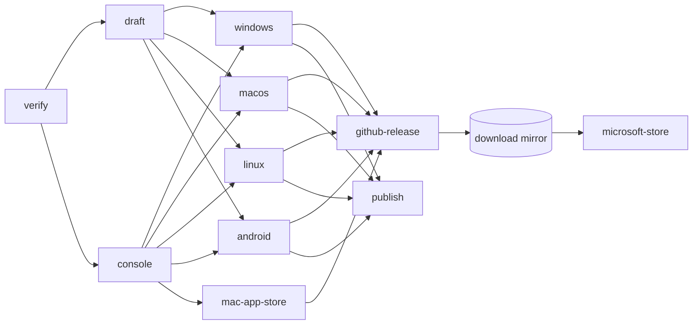

# Releasing Teachouse to every platform

One tag builds, signs and publishes every platform: Windows, macOS, Linux and Android, plus the Microsoft Store, the Mac App Store and Google Play.
This page is the job matrix, every secret and variable the release reads and where each comes from, the one-time setup each store needs, and what happens when a secret is missing.
The design and its sources are in `docs/notes/design/desktop-distribution.md`.

- date: 2026-10-05
- applies to: `.github/workflows/desktop-release.yml` from 0.21.0
- secrets page: <https://github.com/sernl/listing-sync/settings/secrets/actions>
- variables page: <https://github.com/sernl/listing-sync/settings/variables/actions>

## What one tag does



| Job | Runner | Builds | Publishes to | Runs when |
| --- | --- | --- | --- | --- |
| `verify` | ubuntu | nothing; checks the tag and decides the plan | the run summary ("Release plan") | always |
| `draft` | ubuntu | a CrabNebula draft | CrabNebula Cloud | always |
| `console` | ubuntu | the console the apps embed | a workflow artefact | always |
| `windows` (`release-windows.yml`) | windows-latest | NSIS `.exe` + `.msi`, each with `.sig`; the Store's offline installer | GitHub, Cloud (`windows-x86_64` update, `nsis-x86_64`, `wix-x86_64`) | always; signed by Azure Artifact Signing, else the PFX, else unsigned |
| `macos` (`release-macos.yml`) | macos-latest | universal `.app` (signed, notarized, stapled), `.dmg` (signed, notarized, stapled), `.app.tar.gz` + `.sig` | GitHub, Cloud (`darwin-aarch64`, `darwin-x86_64` updates; `dmg-aarch64`, `dmg-x86_64`) | Developer ID certificate **and** notarization credentials |
| `mac-app-store` (`release-mac-app-store.yml`) | macos-latest | sandboxed universal `.app` without the updater, signed `.pkg` | App Store Connect (TestFlight) | App Store certificates, profile, team **and** the App Store Connect API key |
| `linux` (`release-linux.yml`) | ubuntu-22.04 | `.AppImage` + `.deb`, each with `.sig` | GitHub, Cloud (`linux-x86_64-appimage`, `linux-x86_64-deb` updates; `appimage-x86_64`, `deb-x86_64`) | always |
| `android` (`release-android.yml`) | ubuntu | universal `.apk` and `.aab`, signed with the upload key | GitHub and Cloud (APK); Google Play `internal` track (AAB) | upload key; Play upload also needs the service account |
| `github-release` | ubuntu | `SHA256SUMS.txt` over every asset, `latest.json` | the GitHub release the mirror reads | the Windows job succeeded |
| `microsoft-store` | ubuntu | nothing; waits for the mirror to serve the Store installer, then submits it | Partner Center | Partner Center secrets **and** a Store installer was built |
| `publish` | ubuntu | nothing; publishes the Cloud draft | CrabNebula Cloud | the Windows job succeeded |

Windows is the one platform a release requires, because the installed base updates from it.
Every other platform is additive: when its job is skipped or fails, the release still goes out with the rest, and the summary says which platform is missing and why.

The download mirror (`teachouse-downloads-refresh`, every 15 minutes) reads the newest GitHub release, verifies every file against `SHA256SUMS.txt`, and publishes it at `https://teachouse.io/downloads/` with `downloads.json` beside it.
The console's download cards and the landing page's platform chips both read that manifest.

## Secrets and variables

Every name below is exact.
"Secret" means Settings → Secrets and variables → Actions → Secrets; "variable" means the Variables tab of the same page.

### Every release

| Name | Kind | What it is | Where it comes from | If missing |
| --- | --- | --- | --- | --- |
| `TAURI_SIGNING_PRIVATE_KEY` | secret | the updater's minisign private key, the file's contents | `cargo tauri signer generate -w ~/.tauri/teachouse.key` (done; the public half is in `tauri.conf.json`) | the Windows, macOS and Linux builds fail: no update can be signed |
| `TAURI_SIGNING_PRIVATE_KEY_PASSWORD` | secret | its password | chosen at generation | as above |
| `CN_API_KEY` | secret | CrabNebula Cloud API key with write access | <https://web.crabnebula.cloud/> → organisation → API keys | every Cloud step fails |
| `CN_APPLICATION` | variable | `teachouse/teachouse` | the Cloud's org and app slugs | `draft` fails |
| `CN_CHANNEL` | variable | `beta`, or unset for production | your choice | releases go to production |
| `TAM_ENTITLEMENT_PUBLIC_KEY` | variable | the entitlement public key (64 hex, or two comma-separated during a rotation) | `just entitlement-key` | `verify` refuses the tag |
| `UPDATER_BASE_URL` | variable | optional base URL for `latest.json`'s `url` fields | your static host, if you ever leave the Cloud | `latest.json` carries bare file names and says so |

### Windows signing (one of two)

Azure Artifact Signing is the one to use: it is Microsoft's recommended service for non-Store distribution, it is open to New Zealand organisations, and it needs no hardware token.
Tauri's own guide documents both; it recommends neither.

| Name | Kind | What it is | Where it comes from |
| --- | --- | --- | --- |
| `AZURE_CLIENT_ID` | secret | service principal `appId` | `az ad sp create-for-rbac --name teachouse-release --years 1` |
| `AZURE_CLIENT_SECRET` | secret | its `password` | the same command |
| `AZURE_TENANT_ID` | secret | its `tenant` | the same command |
| `AZURE_SIGNING_ENDPOINT` | variable | the region's endpoint, e.g. `https://wus2.codesigning.azure.net` | Microsoft's region table, for the region the account is in |
| `AZURE_SIGNING_ACCOUNT` | variable | the Artifact Signing account name | Azure portal |
| `AZURE_SIGNING_PROFILE` | variable | the certificate profile name | Azure portal |
| `WINDOWS_CERTIFICATE` | secret | **alternative**: a code-signing `.pfx`, base64 (`base64 -w0 certificate.pfx`) | your certificate authority |
| `WINDOWS_CERTIFICATE_PASSWORD` | secret | the `.pfx` password | your export |
| `WINDOWS_TIMESTAMP_URL` | variable | optional; the PFX path's RFC 3161 server, default `http://timestamp.digicert.com` | your certificate authority |

Where all three `AZURE_*` secrets exist, Artifact Signing is used even if a PFX is also set.
Neither set: the installers ship **unsigned** — SmartScreen says "Windows protected your PC" with no publisher name — and the summary says so; the Store installer and the Store submission are skipped, because the Store refuses an unsigned installer.

A PFX is only possible for a certificate whose key can leave hardware: since June 2023 the CA/Browser Forum requires new OV and EV code-signing keys to be generated on a hardware token or HSM, so a certificate bought today normally cannot be exported to a `.pfx` at all.

### macOS, outside the App Store

| Name | Kind | What it is | Where it comes from |
| --- | --- | --- | --- |
| `APPLE_CERTIFICATE` | secret | the **Developer ID Application** certificate and key as `.p12`, base64 | Apple Developer → Certificates (see setup below) |
| `APPLE_CERTIFICATE_PASSWORD` | secret | the `.p12` export password | your export |
| `APPLE_API_ISSUER` | secret | App Store Connect API Issuer ID (a UUID) | App Store Connect → Users and Access → Integrations → App Store Connect API |
| `APPLE_API_KEY` | secret | that key's Key ID (10 characters) | the same page |
| `APPLE_API_KEY_P8` | secret | the downloaded `AuthKey_<KeyID>.p8`, its text contents | downloaded once when the key is created |
| `APPLE_ID` | secret | **alternative** to the API key: the Apple Account email | your Apple Account |
| `APPLE_PASSWORD` | secret | an app-specific password for it | <https://account.apple.com> → Sign-In and Security → App-Specific Passwords |
| `APPLE_TEAM_ID` | secret | the 10-character Team ID | Apple Developer → Membership details |

Notarization uses `APPLE_ID` + `APPLE_PASSWORD` + `APPLE_TEAM_ID` when all three exist, else the API key trio.
The API key is the better choice: it does not expire with a password change, and the Mac App Store job needs it anyway.
Without the certificate, or without either set of notarization credentials, the macOS job is **skipped**: Gatekeeper refuses an unsigned or un-notarized download on every Mac, so there is nothing worth publishing.

### Mac App Store

| Name | Kind | What it is | Where it comes from |
| --- | --- | --- | --- |
| `APPLE_APP_STORE_CERTIFICATE` | secret | one `.p12` holding **Apple Distribution** and **Mac Installer Distribution** (shown by `security` as "3rd Party Mac Developer Installer"), base64 | Apple Developer → Certificates |
| `APPLE_APP_STORE_CERTIFICATE_PASSWORD` | secret | its export password | your export |
| `APPLE_APP_STORE_PROVISIONING_PROFILE` | secret | the **Mac App Store Connect** provisioning profile for `io.teachouse.desktop`, base64 | Apple Developer → Profiles |
| `APPLE_TEAM_ID` | secret | as above | as above |
| `APPLE_API_ISSUER`, `APPLE_API_KEY`, `APPLE_API_KEY_P8` | secret | as above; `altool` uploads with them | as above |

Any of these missing: the job is **skipped** and the summary names what is missing.

### Android and Google Play

| Name | Kind | What it is | Where it comes from |
| --- | --- | --- | --- |
| `ANDROID_KEY_BASE64` | secret | the upload keystore (`.jks`), base64 | `keytool -genkey -v -keystore upload-keystore.jks -keyalg RSA -keysize 2048 -validity 10000 -alias upload` (done) |
| `ANDROID_KEY_ALIAS` | secret | its alias | as above |
| `ANDROID_KEY_PASSWORD` | secret | its password | as above |
| `GOOGLE_PLAY_SERVICE_ACCOUNT_JSON` | secret | a Google Cloud service account's JSON key, pasted whole | Google Cloud console (see setup below) |
| `PLAY_TRACK` | variable | optional; `internal` by default, or `alpha`, `beta`, `production` | your choice |
| `PLAY_RELEASE_STATUS` | variable | optional; `completed` by default; `draft` until the app has passed its first review | your choice |

Any of the three `ANDROID_KEY_*` missing: the Android job is **skipped** and there is no APK or AAB.
`GOOGLE_PLAY_SERVICE_ACCOUNT_JSON` missing: the APK and AAB are built and the Play upload is **skipped**.

### Microsoft Store

| Name | Kind | What it is | Where it comes from |
| --- | --- | --- | --- |
| `MSSTORE_PUBLISHER` | variable | the publisher display name Partner Center shows; it must differ from "Teachouse" | Partner Center → Account settings |
| `MSSTORE_TENANT_ID` | secret | the Entra tenant ID | Partner Center → Account settings → User management → Microsoft Entra applications |
| `MSSTORE_CLIENT_ID` | secret | the Entra application's client ID | the same page |
| `MSSTORE_CLIENT_SECRET` | secret | a client secret for it (at most 24 months; Microsoft recommends under 12) | the same page → Add new key, or Azure portal → App registrations → Certificates & secrets |
| `MSSTORE_SELLER_ID` | secret | the Seller ID | Partner Center → Account settings → Legal info |
| `MSSTORE_PRODUCT_ID` | secret | the product's Partner Center ID | the product's overview page |
| `MSSTORE_PACKAGE_BASE_URL` | variable | optional; where the mirror serves files, default `https://teachouse.io/downloads` | your mirror |
| `MSSTORE_GENERIC_DOC_URL` | variable | optional; the page documenting the installer's exit codes, default NSIS's own | — |

The Store installer is built whenever Windows signing exists and `MSSTORE_PUBLISHER` is set, with or without the five secrets, so the first manual submission has a URL to point at.
The submission runs only when all five secrets exist too; otherwise it is **skipped** and the summary says so.

## One-time setup

### Apple (macOS and the Mac App Store)

1. Enrol in the Apple Developer Program as an organisation at <https://developer.apple.com/programs/enroll/> (US$99 a year). Enrolling as an organisation needs a D-U-N-S number for the company; Apple looks it up or has one issued, which can take a couple of weeks.
2. Note the Team ID from Membership details: it is `APPLE_TEAM_ID`.
3. Register the App ID: Certificates, Identifiers & Profiles → Identifiers → + → App IDs → App, Bundle ID **explicit** `io.teachouse.desktop`.
4. Make the certificates. A Mac is not needed: create each signing request with OpenSSL, then pack the downloaded certificate with its key.
   ```
   openssl req -new -newkey rsa:2048 -nodes -keyout devid.key -out devid.csr -subj "/CN=Teachouse/C=NZ"
   # upload devid.csr: Certificates → + → Developer ID Application (G2 Sub-CA); download developerID_application.cer
   openssl x509 -inform DER -in developerID_application.cer -out devid.pem
   openssl pkcs12 -export -legacy -inkey devid.key -in devid.pem -out devid.p12   # choose a password
   base64 -w0 devid.p12   # → APPLE_CERTIFICATE; the password → APPLE_CERTIFICATE_PASSWORD
   ```
   `-legacy` matters: macOS's `security import` cannot read OpenSSL 3's default `.p12` encryption.
   Only the Account Holder can create a Developer ID certificate.
5. Create the App Store Connect API key: App Store Connect → Users and Access → Integrations → App Store Connect API → Team Keys → +, access **App Manager**. Download `AuthKey_<KeyID>.p8` (it can be downloaded once). Issuer ID → `APPLE_API_ISSUER`, Key ID → `APPLE_API_KEY`, the file's text → `APPLE_API_KEY_P8`.
6. Tag a release. The first notarization can take hours; later ones take minutes.

For the Mac App Store as well:

7. App Store Connect → Apps → + → New App: platform macOS, name Teachouse, bundle ID `io.teachouse.desktop`, any SKU. Fill in the privacy policy URL (`https://teachouse.io/privacy/`), category (Business), and the age rating.
8. Make two more certificates the same way as step 4: **Apple Distribution** and **Mac Installer Distribution**. Pack both into one `.p12`:
   ```
   openssl pkcs12 -export -legacy -inkey dist.key -in dist.pem -certfile installer.pem -out appstore.p12
   ```
   If the two have different keys, export them together from Keychain Access on a Mac instead (select both → Export Items).
   `base64 -w0 appstore.p12` → `APPLE_APP_STORE_CERTIFICATE`; its password → `APPLE_APP_STORE_CERTIFICATE_PASSWORD`.
9. Profiles → + → Distribution → **Mac App Store Connect** → App ID `io.teachouse.desktop` → the Apple Distribution certificate → download. `base64 -w0 Teachouse.provisionprofile` → `APPLE_APP_STORE_PROVISIONING_PROFILE`.
10. Tag a release; the build appears in TestFlight once Apple has processed it, and from there you submit it for review in App Store Connect.

The App Store build runs in Apple's sandbox, which the Developer ID build does not. Before the first submission, install it from TestFlight on a Mac and check sign-in to a marketplace, importing a file the seller picks, and the library sync: those are the paths the sandbox can stop, and none has been exercised sandboxed yet. The entitlements are in `apps/desktop/src-tauri/Entitlements.appstore.plist`.

### Google Play

1. Create a developer account at <https://play.google.com/console/signup> (US$25 once). Choose an organisation account: a personal account created after November 2023 must run a closed test with at least 12 testers for 14 days before it can publish to production.
2. Create the app: Play Console → Create app, name Teachouse, app, free. Leave Play App Signing on (the default): Google keeps the app signing key and our keystore is the upload key.
3. Make the first upload by hand, which Play requires before any API upload. Take `Teachouse_<version>_universal.aab` from the `android-universal` artefact of a tagged run (the AAB is built whenever the upload key exists), and upload it in Testing → Internal testing → Create new release. Play reads the package name from it.
4. Create the service account: <https://console.cloud.google.com/> → a project → APIs & Services → enable **Google Play Android Developer API** → IAM & Admin → Service accounts → Create → Keys → Add key → JSON. The downloaded file's contents → `GOOGLE_PLAY_SERVICE_ACCOUNT_JSON`.
5. Play Console → Users and permissions → Invite new users → the service account's email → App permissions → Teachouse → **Release apps to testing tracks** (and **Release to production** if `PLAY_TRACK` will be `production`).
6. Until the app has passed its first review, set `PLAY_RELEASE_STATUS` to `draft`: Play refuses a completed release of an app that has never been published. Remove it afterwards.
7. Once the app is on a public track, set the mirror's `services.teachouse.downloads.stores.googlePlay` to `https://play.google.com/store/apps/details?id=io.teachouse.desktop`, and the console and the landing link it.

### Microsoft Store

Tauri cannot build MSIX (tauri-apps/tauri#4818 is open), so Teachouse is a Store "EXE or MSI app": Partner Center installs our signed NSIS installer from a URL we host, and the Store installer bundles WebView2 so it runs offline, which the Store requires.

1. Windows signing first (above): the Store refuses an unsigned installer.
2. Open a Partner Center developer account at <https://partner.microsoft.com/dashboard/registration> as a company. Note the publisher display name; set it as the `MSSTORE_PUBLISHER` variable. It must not be "Teachouse" itself (Tauri's Microsoft Store guide: the publisher and the product name must differ).
3. Tag a release. With signing and `MSSTORE_PUBLISHER` set, it builds `Teachouse_<version>_x64_store-setup.exe`, and the mirror serves it at `https://teachouse.io/downloads/Teachouse_<version>_x64_store-setup.exe` within 15 minutes.
4. Apps and games → New product → **EXE or MSI app** → reserve the name Teachouse.
5. Make the first submission by hand, which the API requires: pricing (free), properties, age ratings, store listing, and under Packages the URL from step 3, architecture x64, installer parameters `/S` (NSIS's silent switch). Submit it.
6. Account settings → User management → Microsoft Entra applications → create one with the **Manager** role. Its tenant ID, client ID and a new key → `MSSTORE_TENANT_ID`, `MSSTORE_CLIENT_ID`, `MSSTORE_CLIENT_SECRET`. Legal info → Seller ID → `MSSTORE_SELLER_ID`. The product's overview → Partner Center ID → `MSSTORE_PRODUCT_ID`.
7. From the next tag, the `microsoft-store` job waits for the mirror to serve that release's Store installer, checks it is the exact file the Windows job built, replaces the package URL on the draft submission and submits it.
8. Once the listing is live, set `services.teachouse.downloads.stores.microsoftStore` to `https://apps.microsoft.com/detail/<Store ID>` (the Store ID is on the product's overview).

The client secret expires; put its expiry date in the calendar. An expired secret fails the `microsoft-store` job and nothing else.

### The download mirror

On the host that serves `teachouse.io`, in the NixOS configuration:

```nix
services.teachouse.downloads = {
  enable = true;
  githubReleaseTokenFile = "/run/secrets/teachouse-github-release-token"; # read access to releases
  # prerelease = true;  # the default, while releases go to the beta channel
  stores = {
    googlePlay = null;     # once the app is on a public Play track
    microsoftStore = null; # once the Store listing is live
    macAppStore = null;    # once the Mac App Store listing is live
  };
};
```

`updateUrl` is removed: every platform now comes from the GitHub release. A configuration still setting it fails to evaluate with a message saying so.

## Cutting a release

1. Write `docs/releases/<version>.md` for a seller.
2. Set the same version in `apps/desktop/src-tauri/tauri.conf.json` and `apps/desktop/src-tauri/Cargo.toml`.
3. `just release-check v<version>` until it passes; commit; push the tag.
4. Read the run summary. The **Release plan** table at the top says which platforms this tag builds and, for each one skipped, the secret that was missing. The **What this release carries** table at the end says how each platform job finished.
5. Check by hand what no workflow can:
   - Windows: right-click the `.exe` → Properties → Digital Signatures shows the publisher.
   - macOS: on a Mac, open the `.dmg` downloaded from the mirror; it opens without a warning. `spctl --assess --type open --context context:primary-signature -v Teachouse_<version>_universal.dmg` answers "accepted, source=Notarized Developer ID".
   - The update path, on each platform whose updater configuration changed: install the previous version, launch it, and confirm it offers and installs the new one. Linux builds from 0.21.0 ask for an update by bundle type (`linux-x86_64-appimage` or `linux-x86_64-deb`); Linux builds before 0.21.0 were never published an update and are not offered one.

## When something is missing or fails

- A platform's secrets are missing: that platform's job is skipped, the release goes out without it, and both summary tables say so. Setting the secrets is the only change needed for the next tag to carry it.
- A platform's job fails: the release still goes out with Windows and whatever else succeeded, and the summary names the job and its result. The download mirror keeps serving that platform's previous build, labelled with its own version.
- The Windows job fails: there is no release. The Cloud draft stays unpublished; `cn release purge` removes it.
- A Store submission fails: the GitHub release, the Cloud and the mirror are unaffected. Fix the cause and resubmit by hand in Partner Center, Play Console or App Store Connect, or cut the next patch release.
- An APK missing from a release can be added without a new tag with the `android-build` workflow's `attach_to` input.
