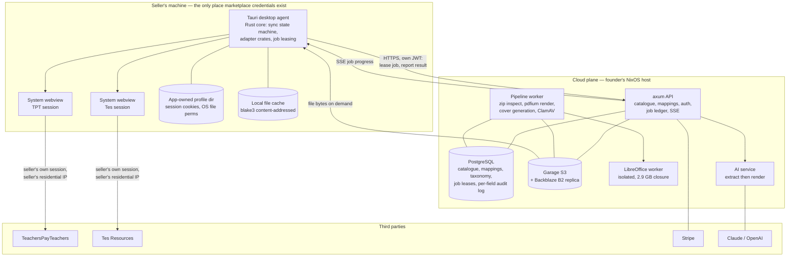

# Multi-marketplace listing sync for teacher-authors: feasibility report

Prepared 2026-08-24 from fourteen research lanes, three of which were adversarially reviewed.
Where a skeptic marked a lane claim refuted or weakened, the skeptic's reading is carried here.

## 1. Bottom line up front

Build it, but not as specified, and not as a venture-scale bet.
The core premise holds: neither TeachersPayTeachers nor Tes imposes exclusivity, TPT's Content Guidelines explicitly permit selling the same resource elsewhere, neither marketplace offers any bulk path for *creating* listings, and no product exists today that cross-lists between them — so the pain is real, unserved, and legal to address.
The only automation posture that survives scrutiny is local-first: the seller's own authenticated session, driven on the seller's own machine and residential IP by a desktop agent, with the cloud plane holding the catalogue, mappings and AI but never authenticating to a marketplace and never storing a marketplace credential.
Four planned surfaces should be cut from the first year outright — the node-graph canvas, the public versioned REST API, mobile clients, and Leptos as the front-end framework — because each costs months and none is load-bearing for the value proposition.
The single biggest risk is that the product's value is concentrated in one connector the founder cannot own, defend, or renew: TPT is roughly seven times Tes by catalogue size, has no sanctioned write path, is owned by IXL Learning, sits behind Cloudflare Bot Management with an email one-time-password re-challenge, is actively rewriting the exact upload page the adapter must drive, has a Terms-of-Service clause that reaches commercial software driving its user interface regardless of read-versus-write, and has published in its own help centre that it is "working on a bulk edit tool as a next enhancement."
Realistic ceiling on current evidence is a bootstrapped lifestyle business of roughly $200k–250k ARR at a thousand paying customers, against a marketplace where only about 185,000 sellers made any sale in a trailing year and average seller income is "low single-digit thousands annually" — so the build should be sized to that, and gated on a hard six-month proof of paying demand.

## 2. The gating question: integration legality and durability

This section carries the most weight in the report, because every architectural and commercial decision downstream is conditioned on it.

### What TPT actually permits

TPT publishes no public, partner, or documented API of any kind for seller products.
DNS resolution fails outright for `api.`, `developers.`, `partners.` and `status.teacherspayteachers.com`; `/affiliates`, `/partners`, `/developers` and `/api` all return 404; `github.com/TeachersPayTeachers` redirects to an IXL enterprise SSO gate; and `/careers` 301-redirects to `ixl.com/company/careers` ([help centre corpus, 415 articles](https://help.teacherspayteachers.com/api/v2/help_center/en-us/articles.json)).
A skeptic re-derived the help-centre sweep and found the true count of "API" mentions across all 415 article bodies is zero — the lane's cited grep hits were a source-conflation error, and the corrected finding is stronger than the original.
One correction to the negative: `graph.teacherspayteachers.com` does resolve, as a CNAME to Cloudflare's CDN, so TPT has provisioned a dedicated hostname for its internal GraphQL gateway — the endpoint at `/graph/graphql` is real and is explicitly disallowed in [robots.txt](https://www.teacherspayteachers.com/robots.txt).

There is no bulk path for creating listings.
The documented flow in article 360042864711 is strictly one listing at a time through a form with a file upload.
But the categorical claim that TPT has no batch surface at all is refuted.
Article 47530264334868, updated 2026-08-23, documents a shipped "Edit Product Tax Codes" page where a seller can "Select up to 100 products that you want to edit" and apply a field change in one action; the sale tool lets a seller "choose a single resource, multiple resources, or your entire store"; and a first-party CSV export of product statistics exists ([tax codes article](https://help.teacherspayteachers.com/hc/en-us/articles/47530264334868-What-are-Tax-Codes-and-how-do-I-apply-them-to-my-resources)).
The same article states, in parentheses, "We're working on a bulk edit tool as a next enhancement."
That is TPT publicly committing to build part of the founder's core value proposition, and it should be read alongside two other first-party moves: **Keyword Finder**, a Seller Dashboard tool giving marketplace-wide 30-day search volume, related keywords, competition counts and an "Opportunity Score", created 2026-08-18 and tier-gated as a Premium upsell; and TPT's existing standards crosswalking, built with a third-party vendor, which automatically translates Common Core tags to state-specific equivalents.
Those occupy the same ground as the planned AI rewrite and standards-mapping layers.

### The clause that actually bites

The research lanes initially framed TPT's only relevant restriction as an extraction clause: the Community Guidelines say "Don't use any automated means such as bots, spiders, or crawlers to download or otherwise obtain data from our services" ([Guidelines for All TPT'ers, article 360043018571](https://help.teacherspayteachers.com/hc/en-us/articles/360043018571--Guidelines-for-All-TPT-ers)).
The Terms of Service incorporate the Community Guidelines by reference, and a full-text sweep of the 103k-character ToS confirms it contains no robot, spider, crawler, or scraper language of its own.
On that reading, reads are prohibited and writes are uncovered.
Both skeptics refuted the sufficiency of that reading, independently, and their objections should be treated as the operative legal picture.

Three clauses were missed and each is more dangerous than the extraction sentence.

**ToS Section 4.A, "Site Assets."**
The definition expressly includes "user interfaces" and "computer code" alongside "the design, structure, coordination, arrangement, expression, and the 'look and feel'", and the operative restriction reads: "You may not use, reproduce, copy, modify, republish, perform, display, disassemble, reverse engineer, translate, or distribute Site Assets in any way to any person, computer, server, website, or other entity for any commercial purpose without our explicit permission. By commercial purpose we mean that you can't sell, license, rent, use in your own business or website, incorporate into marketing materials or presentations, or make other commercial use of our Site Assets" ([Terms of Service](https://www.teacherspayteachers.com/Terms-of-Service), last updated 12/08/2025).
A commercial SaaS whose function is to drive TPT's uploader UI is squarely within the contemplated territory of that clause, and it does not care whether the traffic is reading or writing.
This is the clause a TPT lawyer reaches for, and the read/write asymmetry the product's architecture was going to rest on does not survive it intact.

**The performance catch-all in the same Community Guidelines bullet.**
Immediately before the automated-means sentence: "Don't attempt to gain unauthorized access to our computer systems or engage in any activity that disrupts, diminishes the quality, interferes with the performance, or impairs the functionality of our Services."
That is not extraction-scoped and is the natural clause to invoke against high-volume automated writes.

**The identifier-disguise clause, which governs the write path directly.**
Under "Be truthful": "Don't use a misleading email address or IP address or otherwise manipulate identifiers in order to disguise your location or the origin of information you're providing to us or posting on TPT."
This is aimed precisely at automation presenting itself as a human browser — spoofed user agents, residential proxying, datacentre-IP masking, or a single shared identity fronting for software.
It is the strongest single contractual argument against the SaaS-side headless-browser posture, and it applies whether or not any bot-detection system ever fires.

### Cross-listing is separately regulated

Three TPT rules constrain the product's data model, not merely its transport, and none appeared in the original lane analysis.

Price parity is enforced across marketplaces: "You may not charge more on TPT for a resource that is offered for free or less elsewhere" ([Seller Guidelines, article 360042626591](https://help.teacherspayteachers.com/hc/en-us/articles/360042626591-What-are-TPT-s-Seller-Guidelines)), repeated in the Content Guidelines as "it's important that your TPT Buyers are not being charged a higher price or being charged for something that you've posted for free somewhere else."
This is simultaneously the permissive clause the whole product premise depends on — TPT expressly blesses selling on other marketplaces — and a hard invariant that must be enforced across a USD/GBP boundary.
Critically, it can be breached passively: any Tes promotion, currency movement, or price edit that puts the Tes price below the TPT price places the seller in breach without anyone taking an action.

Cross-channel links are banned: "You may not include hyperlinks to alternative sales channels such as another online marketplace or e-commerce site where your resources can be purchased."
A description authored for Tes and pushed to TPT unmodified is a policy violation if it carries a Tes link, and vice versa — Tes has the mirror rule and has enforced it with a stated removal deadline.
Per-marketplace link scrubbing is therefore a correctness requirement in a deterministic post-processing pass, not an AI nicety.

Duplicate listings are prohibited within TPT: "Each resource can be listed only once on TPT."
And an undocumented minimum price exists: "We do set a minimum price and you will not be able to price any resources below the minimum price. The minimum price, listed on the resource upload page, may be changed from time-to-time."
The figure appears nowhere in the 415-article corpus — structurally identical to the 80-character title cap, and equally in need of empirical discovery.

### Virtual Assistant Login: sanctioned, but narrower than it looks

TPT operates a formal delegated-access product whose granted permissions read almost as a specification of this product's write surface: "the ability for you to create, upload, publish, edit, and delete Resource Listings, for example, by adding or updating price information, product descriptions, state standards, product tags, tax codes, and preview files" ([Terms of Service, VA Login User Agreement](https://www.teacherspayteachers.com/Terms-of-Service)).
Every quoted string in the lane was verified verbatim by both skeptics.
Four qualifications materially change how much weight it can bear.

There *is* a seller approval step for access.
The agreement establishes a mandatory two-sided handshake: "To participate in VA Login, (i) a Seller with an active Account, in good standing must invite you to provide Support Services and (ii) you must accept such invitation."
What sellers do not approve is individual *changes* once access exists ([article 4412838872724](https://help.teacherspayteachers.com/hc/en-us/articles/4412838872724)).

The 100-seller cap is not contractual and cannot bear capacity-planning weight.
The agreement says only "TPT reserves the right to cap the number of Sellers to whom you are able to provide Support Services", alongside "TPT reserves the right to make changes to the Support Access features it makes available, with or without notice."
The 100 figure exists only in a help-centre answer.

There are real capability gaps.
"Virtual Assistants are unable to create or edit resources in Easel" — they may edit only the listing details of an Easel resource — and "They cannot view Earnings data from the Traffic tab."
And the seller gets no usable audit trail from TPT: "You can see when the latest edit by your Virtual Assistant was made, but aren't able to see detailed changes."
That last point converts the platform's own per-field audit log from good practice into the only record either party will hold.

The account principal must be a natural person.
The VA Login Terms incorporate the main ToS, whose section 1.A reads: "Only individuals who are 18 years of age or older are eligible to become Members... We may ask for proof of your age or identity at any time in order to verify your Account and we may close or suspend access to your Account if you violate this rule or if we are unable to verify your age or identity."
Entities are contemplated only as: "If you're a school, organization, government, business, or other entity, the person whose email address is associated with the Account must have authority to bind the entity to this Agreement."
The two skeptics reached the same practical conclusion by different routes: an entity may stand behind an account, but a named, verifiable human must hold it.
So a fleet of platform-owned VA identities minted to farm the cap is the exposed design; the seller's own operator (or a named human at the vendor) acting as VA, with software driving that person's session, is the viable one.

One correction to the "no front door" conclusion, which is refuted.
TPT sells a **Publisher Membership** to "an entity offering content you didn't personally author" for a one-time $29 with a 50/50 split, with a self-serve signup at `/Signup/Seller/Publisher` and a live contact form at `/Contact/seller-membership/other` verified returning HTTP 200 ([Seller Fees and Payout Rates](https://help.teacherspayteachers.com/hc/en-us/articles/360044219891-Seller-Fees-and-Payout-Rates)).
That is both a channel to reach TPT and a possible structural answer to the entity-holds-the-account question.
A written enquiry costs nothing and should be sent before the architecture is frozen.

### What Tes actually permits

Tes Resources likewise publishes no public or partner API: `developer.tes.com` and `partners.tes.com` do not resolve, and `api.tes.com` resolves to Fastly and returns HTTP 403 from Varnish.
The old Tes Content Partner programme is dead — the URL 404s and Wayback's last capture is 2019-07-19.
Tes Global does publish real REST API documentation for its Synergetic school-management product, so the absence for Resources is a product decision rather than a company-wide posture ([Synergetic vendor RESTful API integrations](https://synergetic.help.tes.com/support/solutions/articles/75000149516-vendor-restful-api-integrations)).

But a private, authenticated Resources JSON API does exist and was missed by the lane.
A Wayback CDX enumeration of the domain surfaces `/api/v2/dashboard/exportResources`, `/api/v2/dashboard/{earnings,tier,author-details,author-withdrawals,transactions/list,transactions/file}`, `/api/v2/resources/`, `/api/rdp/*` and `/api/search/v4/*`.
The dashboard endpoints were archived returning HTTP **401** — not 404 — on 2026-08-02, three weeks before this research, meaning they exist and are merely auth-gated; `/api/search/v4/search` was captured returning 200 to an unauthenticated crawler.
Tes also documents the user-facing half: the author dashboard offers a CSV download of sales data with three years of history.
So the read side has a JSON fast path and does not require DOM scraping — which matters for sales reconciliation and catalogue import, though not for listing creation.

Two batch surfaces exist that the lane also missed: "In the My Promotions tab you can temporarily reduce the price of some or all of your resources by up to 25%" is a genuine multi-resource price operation, and the CSV export above is a genuine bulk read.
There remains no bulk *create*.

### The robots.txt argument does not hold

The lane built a legal argument on Tes's `Disallow: /uploader/`, calling it "the clearest written statement of intent."
That path returns HTTP 404 — it is a stale entry for a decommissioned surface.
The live uploader is `/teaching-resource/upload`, which 302-redirects to `/authn/sign-in` and is matched by no Disallow rule.
A weaker version survives: the login gate at `/authn/` *is* disallowed, as are `/author/`, `/content/`, `/member/` and others.
Separately, robots.txt is a directive to crawlers under the Robots Exclusion Protocol; it is not incorporated into either marketplace's Terms of Service, and TPT's ToS never mentions it.
Calling reliance on TPT's `/graph/graphql` "a deliberate policy violation" on the strength of robots.txt alone overstates what that file does — the real hooks are the Community Guidelines retrieval clause and ToS 4.A.

### Tes contractual constraints that bind a sync engine

The Additional Terms do bind the individual author, contrary to the lane's "drafting gap" reading: "By using Tes Resources, you confirm that you accept the General Terms and these Additional Terms and that you agree to comply with them", and "The General Terms should be read as applying between you and Tes Education Resources in addition to their application to the relationship you have with Tes Global Ltd" ([Additional Terms, last updated 05 November 2025](https://www.tes.com/policies/additional-terms-tes-resources-and-tes-teach-formerl)).
Those General Terms contain clause 4.3, which prohibits attempts to "copy, modify, duplicate, create derivative works from, frame, mirror, republish, download, display, transmit, or distribute all or any portion of a Product", and to "access all or any part of a Product ... in order to build a product or service which competes with the Product."
Note that the General Terms are geo-served: from a New Zealand egress they resolve to Tes Aus Global Pty Limited, ABN 89 115 129 989, last updated 15 January 2025, governed by Australian law, while `/en-gb/policies/general-terms-business` serves a different document.
Both the lane and one skeptic ran from an NZ egress without noticing, which also caused a false "the FAQ is stale" finding — the en-gb FAQ correctly states 200 MB per file, and only the en-au copy still says 1 GB.
Treat every Tes citation that resolves through a bare `tes.com/policies` URL as region-contingent until re-checked.

Four Author Code clauses constrain the engine directly ([Author Code](https://www.tes.com/teaching-resources/author-code)):

- "Tes reserves the right to limit the number of uploads by an author where we consider there has been a breach in fair usage." No numeric threshold is published anywhere; the failure mode is an account restriction, not an HTTP 429.
- "You must not make fundamental changes to the subject or purpose of a resource once it has been uploaded, although you may make minor edits and updates to the content as required." This bounds what a sync engine may push to an already-live listing.
- "Please do not upload duplicate copies of your resources." This is in genuine tension with the dual-inventory model described below and needs a written answer from Tes.
- "You must not use tes.com to advertise other websites or direct users to other websites to buy or download content. This includes but is not limited to using external URLs in your descriptions, titles and previews." There is a carve-out the lane cut: "You may include external URLs within uploaded resource files if the link does not require a login, is directly relevant to the context of the resource and does not promote commercial/personal gain." So scrub listing copy, not file contents.

The AI clause is narrower than the lane claimed but the posture around it is widening.
It reads: "Please do not upload resources that have been generated by AI or other templating tools or software **and that have no (or limited) human input**."
The conjunction matters — AI-assisted work with substantial human input is not caught by the text as written — and the clause is scoped to "resources", meaning uploaded files, not listing metadata.
But two adjacent facts raise the risk weighting.
Tes's "Summer Refresh Checklist" (7 July 2025) describes metadata-only churn as an enforcement target: "We're seeing a growing trend in just updating titles and descriptions to reflect the current year but the content within is outdated – particularly when it comes to quizzes. This leads to resources being removed and unhappy customers seeking refunds."
And Tes published a "Fake and Incentivised Consumer Reviews Policy" dated 3 July 2026 banning content "submitted using bots, AI tools" and "using false, misleading or multiple accounts", which states it overrides the Terms and the Author Code on any inconsistency.
Tes's AI and authenticity posture is expanding in 2026, not dormant.

Finally, "published" is not the terminal state of a Tes push: "due to security measures, your resource may not be published on Tes resources for up to 3 working days."
The domain model needs an explicit per-marketplace lifecycle — submitted, in-review, live, rejected — with reconciliation, not a boolean.

### Tes is two targets, not one

The single most consequential correction in the entire research set.
The lane concluded that `en-gb`, `en-au`, `en-us` and the rest are regional storefronts over one catalogue, and recommended a single Tes listing node per product.
Both skeptics independently refuted this from data the lane already held.

The GB and US sitemap inventories are strictly disjoint.
One skeptic computed zero ID intersection across 106,000 sampled IDs; the other computed, within the shared recent ID window 11,087,305–13,549,249, that `latest-gb` holds 4,999 IDs and `latest-us` holds 4,995 and the intersection is exactly zero, with the same result on the 48,000-entry bulk segments ([sitemap index](https://www.tes.com/aws-sitemap-index-teaching-resources.xml)).
The mechanism is in the GB FAQ: "the royalty you receive for each sale will be paid in the same currency as the price you've set for your resource. This is either GBP or USD."
Fetching two US-inventory resources at the bare path from a New Zealand client with `geoCurrency=AUD` cookies returned JSON-LD offers of `{"priceCurrency":"USD","price":8}` — currency is a fixed property of the resource's inventory, not of the viewer or the URL prefix.

So an author who wants both markets must upload twice, under two resource IDs, at two prices, against two taxonomies.
The taxonomy claim also fails: GB versus AU is a pure top-segment relabel, but GB versus US differs structurally — 2,450 subject/topic paths exist in US and not GB, 2,390 in GB and not US, phase counts differ (4-phase GB versus 5-phase US), and US spelling runs through the tree.
At least two real taxonomy mappings are required, and GB-to-US is genuinely many-to-many.

This inverts the strategic reading in the founder's favour.
Duplicating a GB catalogue into the US inventory is precisely a bulk-tool job, it is a wedge entirely within Tes that does not touch TPT at all, and it is probably the sharpest and lowest-risk first product.

### The worst case for a seller's account

**TPT.**
"We may, in our discretion, close or suspend the Account of any Member at any time for any reason, with or without notice."
Payouts are withhold-and-resolve rather than forfeiture: "We may, at our sole discretion, withhold or delay a Payout due to any Seller who we believe to be in violation of any of these Terms. After the matter is resolved, we will either refund the associated sale(s) or complete the Payout."
Payouts run monthly by the 21st, so the exposure window is up to roughly two months of earnings.
Under VA Login the seller is responsible "for all activity that happens under your Account ... as if those actions were taken by you directly, and including but not limited to, any errors, loss, or deletion of your Resources and/or Resource Listings", and TPT's own liability under those terms is capped at $100.
The seller can toggle a VA's permissions off temporarily or permanently at will — a documented runtime capability-loss mode the adapter must detect, and a useful kill-switch story for customer trust.

**Tes.**
Royalty payment is conditioned on non-breach: "You have not breached any of these Additional Terms or the General Terms", followed by "We reserve the right to make reasonable and proportionate adjustments to the amount of any final royalty payable to you as a result of any failure to satisfy the foregoing conditions."
Termination is discretionary and without notice.
Because Tes balances are author-initiated withdrawals from an accrued balance, with a £10/$10 minimum and one withdrawal per week, an accrued Tes balance can be substantially larger than a single TPT payout cycle.
And the indemnity trigger lands on exactly the target cohort: VAT-registered, or paid more than £10,000 in the past 12 months, or "acting for or on behalf of a corporation, company, partnership" — those authors "fully indemnify, defend and hold Tes ... harmless", which means the product's own sync errors become the customer's liability.

Net: Tes carries more money at risk per incident and a lighter detection stack; TPT carries a more aggressive detection stack and a broader contractual hook.
Neither is a criminal-exposure story on current facts, and both are administrative and contractual.

### What the case law does and does not give you

The decision most people cite for "scraping is fine" is unavailable here.
In *Meta Platforms Inc. v. Bright Data Ltd.*, No. 3:23-cv-00077-EMC (N.D. Cal.), Judge Edward Chen granted summary judgment on 23 January 2024 on the ground that "Bright Data did not 'use' Facebook and Instagram when it engaged in public logged-off scraping" ([Farella Braun + Martel analysis](https://www.fbm.com/publications/major-decision-affects-law-of-scraping-and-online-data-collection-meta-platforms-v-bright-data/)).
A skeptic corrected the lane's characterisation on two points: the lane quoted a sentence that does not appear in its cited source, and Bright Data *did* hold Meta accounts — the holding was that even an account holder is not "using" the service when scraping logged-off public data.
That correction strengthens rather than weakens the conclusion, because the court's purposive rationale was that the relevant terms exist "to prevent account holders who have privileges and access to Meta services from abusing their access to such services."
This product is inherently logged in as an actual account holder taking privileged actions.
There is no "we're just a visitor" defence, and the entire risk posture must rest on Terms-of-Service compliance and user consent rather than on the public-data case law.

CFAA exposure is low but not zero, and the lane's framing of it was one-sided.
*Van Buren v. United States*, 593 U.S. 374 (2021), narrowed "exceeds authorized access" away from pure ToS violation.
hiQ nonetheless lost on contract, and its CFAA liability was stipulated "based on hiQ's data collection practices and based on hiQ's direct access to password-protected pages on LinkedIn's platforms using fake accounts", with a $500,000 judgment and destruction of source code and derived data ([Privacy World](https://www.privacyworld.blog/2022/12/linkedins-data-scraping-battle-with-hiq-labs-ends-with-proposed-judgment/)).
The differentiating fact pattern across the cases that actually bit — hiQ, and on weaker sourcing Proxycurl and Mantheos — is fake accounts plus bulk extraction plus resale.
But the lane omitted an adverse holding it had in hand: in *Ryanair DAC v. Booking.com BV*, No. 1:20-cv-01191-WCB (D. Del.), the 22 January 2025 judgment as a matter of law "concluded the CFAA can apply extraterritorially, reasoning that the statute's definition of 'protected computer' includes computers outside the U.S." ([Eric Goldman blog](https://blog.ericgoldman.org/archives/2025/03/court-overturns-a-bad-jury-verdict-against-scraping-ryanair-v-booking-guest-blog-post.htm)).
For a founder outside the United States operating against a Delaware/California marketplace operator, that is the most consequential CFAA fact available, and it points the opposite way from "CFAA exposure is low."
The lane also derived a "cease-and-desist is a stop-work trigger" policy from that case; the proposition does not appear in the cited source.
The policy remains prudent on its own merits, but it is not derived from that authority.

In the UK and EU, contract is the operative lever.
*Ryanair Ltd v PR Aviation BV*, C-30/14 (CJEU, 15 January 2015) confirms that the Database Directive does not prevent contractual clauses restricting use of a database that is not itself protected.
The Computer Misuse Act 1990 remains untested against scraping; Bird & Bird note that it "may catch data scraping as the website owner does not authorise the type of access made by a scraper", and — relevant here in the founder's disfavour — that "courts will generally hold a sophisticated user that builds a business using information from third-party sites to a higher standard than a non-business when deciding whether to enforce website terms of use" ([Bird & Bird](https://www.twobirds.com/en/insights/2021/global/legal-weapons-in-the-fight-against-data-scraping)).
Note that the lane's separate assertion of "UK sui generis database right in Tes's catalogue" is an assumption, not a finding — no evidence of substantial investment in obtaining, verifying or presenting was offered.

### The commercial precedent, honestly stated

The closest analogue is the resale cross-listing category — Vendoo, List Perfectly, Crosslist, PrimeLister, OneShop — which exists precisely because Poshmark and Mercari have no write API, and which has converged on a browser extension executing in the user's own browser.
Vendoo's Chrome Web Store listing shows 60,000 users and states "This extension allows Vendoo to access and communicate with your marketplaces"; Crosslist describes "a secure browser extension that runs inside your own browser so actions happen directly on your computer" ([Vendoo listing](https://chromewebstore.google.com/detail/vendoo-extension-v3/mnampbajndaipakjhcbbaihllmghlcdf)).
Two caveats that the lane understated and a skeptic corrected.

Poshmark's Terms of Service do contain an express anti-automation clause — version 4.6, effective 3 June 2025, section 4(b) prohibits users from "copy, scrape, harvest, crawl or use any technology, software or automated systems to collect any information or data for the Service" ([Poshmark terms](https://poshmark.com/terms)).
The word "bot" is absent; a prohibition is not.
So this category is evidence about *enforcement appetite*, not about permission.

And Vendoo's own listing advertises "import existing listings" and "built-in analytics for tracking revenue and sales performance" — the analogue reads marketplace state, which the recommended architecture below declines to do.
The precedent therefore validates a looser design than the one recommended here; the read-path abstinence is a deliberate additional margin of safety, not something the analogue proves necessary.

Two further data points cut in opposite directions.
Enforcement in that market manifests as rate-limiting and policy churn rather than litigation: Poshmark introduced an Excessive Listing Removal Policy in May 2025 targeting mass delete-and-relist "done manually or with automation", a November 2025 technical fault mass-deleted listings and triggered enforcement against affected sellers, and Poshmark scrapped the policy on 23 July 2026 (sourced to vendor and competitor blogs with a commercial interest, so treat as weak).
Meanwhile a visible third-party TPT tool ecosystem already operates openly against TPT's one extraction clause, apparently unenforced: Chrome Web Store search returns Grow TPT ("real-time analytics, SEO optimization"), Radar for TPT, TPT Pro ("market intelligence"), SellerSpy, SpyLore, SEO Analyzer for TPT, and one named "Scopetpt TPT Extractor."
None does bulk upload or cross-listing.
That is simultaneously evidence that TPT's enforcement base rate on the read path is empirically low, and evidence that the specific niche is unoccupied.

One important gap: two lanes had their web-search budgets exhausted before they could test whether a competing TPT bulk-upload or cross-listing tool already exists off-marketplace, and every search engine returned bot-verification challenges to the third.
The negative "no competitor exists" is therefore under-tested and is, in one skeptic's judgement, the most important unanswered commercial question in the whole research set.

### Which posture survives

**(a) SaaS-side headless browser — does not survive.**
It runs directly into TPT's identifier-disguise clause, which forbids manipulating identifiers "to disguise your location or the origin of information you're providing to us."
It presents a datacentre IP and a synthetic fingerprint to Cloudflare Bot Management, which is confirmed active on TPT — `__cf_bm` is set on both the homepage and `/Login`, `cloudflare-captcha` and `v-3-recaptcha-migration` feature flags are both true, and TPT returns HTTP 403 to plain fetchers while serving browser-like user agents.
It requires the operator to custody either seller passwords or seller session state, which TPT's own terms make an unforced error: "you're responsible for any and all activity that happens under your Account whether or not you authorized it", giving the SaaS no privity and the seller all the loss.
It concentrates blast radius so that one detection event disconnects every customer at once.
And Skyvern's own benchmark work found its dedicated infrastructure "able to reliably access more websites and encountered less anti-bot issues" than a general cloud-browser provider, concluding that "browser infrastructure is not a footnote."
Cost is not the objection — cloud browsers run roughly $0.09–0.12 per browser-hour, about $0.50 per user per month at this workload. The objection is legal and detection risk.

**(b) User-side local automation — survives, and is the recommendation.**
This is what the entire analogous industry does, for four reasons that all apply here: the seller's own residential IP and real browser fingerprint, no credential custody by the vendor, the seller rather than the vendor as the actor for Terms-of-Service purposes, and no single point of mass disconnection.
One 2026 fact reshapes how it must be implemented.
Since Chrome 136, `--remote-debugging-port` and `--remote-debugging-pipe` are ignored when pointed at the default Chrome user-data directory — "These switches will no longer be respected if attempting to debug the default Chrome data directory", because "Since App-Bound Encryption was enabled we've seen an increase in attackers using Chrome Remote Debugging to extract cookies" ([Chrome for Developers](https://developer.chrome.com/blog/remote-debugging-port)).
So "just automate the seller's real logged-in Chrome" is dead.
Three viable sub-variants remain: a Manifest V3 extension (which runs inside the real browser and is therefore exempt), an app-owned dedicated browser profile the user logs into once, or a Tauri desktop app hosting the system webview.
The Tauri route is the strongest fit and is detailed in section 3.

**(c) Official partner API — not available on a self-serve basis, but the front door exists and is worth knocking on now.**
The lane's "no front door" conclusion is refuted on both marketplaces.
TPT sells a Publisher Membership with a self-serve signup and a dedicated contact form; Tes runs a public partner page — "Partner with Tes ... Simply answer the questions below, email them to partnerships@tes.com" — and publishes `authors@tes.com`, `resources@tes.com` and `help@tes.com`.
TPT demonstrably strikes bilateral integration deals (the `canva-partnership` feature flag is live), and Tes already ships partner REST APIs for Synergetic, so the capability exists in both companies.
Do not build the roadmap around obtaining API access.
Do send the enquiries before architecture is frozen — the answer, even a refusal, is decision-relevant, and a written non-objection would be worth more than any amount of architectural caution.

## 3. Recommended architecture

The automation posture is **user-side local execution in the seller's own authenticated session**, hosted by a Tauri desktop agent that drives the platform's system webview from Rust.
The cloud plane is the system of record for the catalogue, mappings, taxonomy, AI output and billing.
The cloud plane never authenticates to a marketplace, never issues a request to `teacherspayteachers.com` or `tes.com`, and never stores a marketplace password or session cookie.
That is not merely a security preference: it is what makes the seller, rather than the vendor, the actor under both marketplaces' terms, and it removes the credential-vault liability entirely.

### Crate and service decomposition

Take the workspace topology from `rust-lang/crates.io`, which runs a real production axum service as 29 library crates under `crates/*` plus a binary and an admin CLI, rather than from any starter template.
The reference repo the founder cited (`sheroz/axum-rest-api-sample`) is a single crate and does not survive contact with this product, because the front end and the desktop client must share wire types that cannot carry a `sqlx` dependency.

Phase-1 crates, with the boundaries that must exist from the first commit marked:

| Crate | Runs where | Purpose |
|---|---|---|
| `tam-types` **(required day one)** | shared | Pure serde ADTs for wire and domain vocabulary. No sqlx, no reqwest, no tokio-full. Consumed by the API, the desktop agent, and the web UI. |
| `tam-domain` | shared | Mapping rules, local-versus-remote diff, price-parity invariant, link-scrub transform, validation smart constructors, per-marketplace sync state machine. No I/O, so property-testable in milliseconds. |
| `tam-storage` | server | sqlx repositories, owns `migrations/` and checked-in `.sqlx` offline metadata, enforces `org_id` scoping on every query. |
| `tam-marketplace` **(required day one)** | desktop | `MarketplaceAdapter` trait, shared session plumbing, recorded-cassette test harness. |
| `tam-marketplace-tpt`, `tam-marketplace-tes` | desktop | One crate per marketplace, not enum variants. Each breaks independently on someone else's schedule, each needs its own fixture corpus, each can be feature-gated off during an outage. |
| `tam-pipeline` | pipeline worker | ZIP/PDF/PPTX inspection, cover and preview generation, checksum dedup, object-store abstraction. Isolated because it carries the heaviest native dependencies. |
| `tam-ai` | server | Provider abstraction, per-marketplace house-style prompts, token accounting per tenant, output validation back through `tam-domain`. |
| `tam-api` **(required day one, as a library)** | server | axum router, extractors, middleware stack, error mapping, versioned route modules. A library rather than a binary so integration tests drive the `Router` in-process via `oneshot` with no bound port. |
| `tam-server`, `tam-worker`, `tam-admin` | server | Thin binaries. |
| `apps/desktop` | desktop | Tauri shell, webview orchestration, local job runner. |

Merging `tam-domain`, `tam-storage` and job handling into one `tam-core` crate for the first few months is defensible and cheap to split later; the three boundaries marked required are the ones that are expensive to retrofit.

### Where jobs run

Jobs are **leased from the cloud and executed on the seller's machine**.
The cloud job ledger holds intent (push listing X to marketplace Y at version Z), the desktop agent leases a job with a bounded lease, performs the write, verifies it by reading back the created or updated listing, and reports a per-field outcome.
This gives durability and resumability without the cloud ever touching a marketplace.

Three engineering mandates fall out of the WebBench failure taxonomy, where the best fully-automated agent completes only 46.6% of non-read tasks and the top-cited failure is "hallucinating that it's achieved the goal when it has not" ([Skyvern](https://www.skyvern.com/blog/web-bench-a-new-way-to-compare-ai-browser-agents/)):

- **Never trust the driver's own success signal.** After every publish, re-fetch the created listing by its durable identifier and diff the rendered title, price, description and taxonomy against the canonical record before marking the sync green. Agents routinely mistake "a loading screen, a redirect, or a thank-you message" for completion, and may assume a Submit click succeeded "when in reality a captcha appeared."
- **Every write must be idempotent, dry-run by default, and diff-previewed.** Under TPT's VA Login terms the seller is liable for the platform's errors "as if those actions were taken by you directly", and TPT gives the seller no detailed change history — so the platform's own per-field before/after audit log is the only record either party will hold. Destructive operations (delete listing, delete resource file) should be off by default.
- **Pace conservatively, with jitter, inside plausible working hours.** Tes's limit is discretionary ("breach in fair usage") with no numeric threshold and no HTTP 429 — the failure mode is an account restriction. Cloudflare's `__cf_bm` expires "after 30 minutes of continuous inactivity", so a batch should keep the session warm rather than firing fifty submissions in ninety seconds.

Marketplace state is treated as write-mostly.
The platform is the system of record; the product pushes state and records what was written, rather than re-reading TPT to discover it.
That inverts the usual channel-manager reconciliation loop, and it is a deliberate documented decision made to minimise exposure to TPT's extraction clause.
Tes is the exception where a read path is comparatively defensible, because its authenticated dashboard exposes a JSON API and a first-party CSV export of sales data with three years of history.

### Where credentials live

Marketplace session cookies live in the Tauri app's `data_directory` on the seller's own disk, protected by OS file permissions, and never transit to the cloud.
The seller logs in once per marketplace through a real system webview — typing their own password, and their own emailed one-time password where TPT demands it — and the session is persisted for reuse.
Because the login happened through a genuine browser engine with no WebDriver attached, `navigator.webdriver` is not set, which is a materially different fingerprint from Playwright or Selenium.

The cloud stores only the product's own identity material: its own JWT signing keys, the Stripe customer id, and hashed API keys if a developer API ever ships.
No OpenBao transit layer, no per-tenant data-encryption keys, no credential vault — because there are no third-party credentials to protect.
That deletes the highest-severity item from the compliance floor outright, and it is the single strongest argument for this architecture over the server-side alternative.

Tauri's webview surface supports this directly: `navigate(Url)`, `eval_with_callback(js, cb)`, `cookies_for_url(url)`, `set_cookie`, `clear_all_browsing_data`, plus builder options `initialization_script`, `on_navigation(Fn(&Url) -> bool)` to cancel navigations, `on_download` to block downloads, `data_directory(PathBuf)` and `user_agent` ([Tauri WebviewWindow docs](https://docs.rs/tauri/latest/tauri/webview/struct.WebviewWindow.html)).
Because `eval` is invoked from Rust, Tauri's capability system — which gates the JavaScript-to-Rust IPC direction — does not block injecting scripts into a third-party page.
Do **not** grant `remote.urls` to marketplace domains: it is unnecessary, and on Linux and Android "Tauri is unable to distinguish between requests from an embedded `<iframe>` and the window itself."

Three limits are real and must be designed around.
The webview engine differs per platform — WebView2 (Chromium, evergreen) on Windows, WKWebView capped by OS version on macOS, WebKitGTK on Linux where Tauri's own docs concede accurate version information across distros is "very hard to compile" — so the adapter QA matrix triples.
Background throttling can suspend a hidden window: `background_throttling` is an Apple-platform control documented "Linux / Windows / Android: Unsupported", which argues for keeping the automation window visible and letting the seller watch it work.
And mobile cannot host the automation at all — `on_new_window`, `incognito` and `additional_browser_args` are unsupported there, and true concurrent windows are "an iPad (and Stage Manager) experience."

### Selector strategy

Treat adapter maintenance as a permanent recurring cost line, not a one-off build.
TPT is mid-migration from a legacy PHP monolith to React/Apollo with per-page cutover feature flags, and the upload page specifically is flagged `rhf-upload-page: true`.
A skeptic verified the cutover directly: on the legacy Terms-of-Service page the markers `mp-corephp`, `requirejs`, `bugsnag`, `braintree`, `tiny_mce` and `jquery-1.11.1` appear repeatedly; on a migrated product page every one of them is zero.
CSS class names are CSS-modules-hashed (`Text-module__root--Jk_wf`) and change on every build.
Two sellers can see two different upload pages on the same day.

Follow Stagehand's model: cache the resolved selector for an action rather than the whole agent, keyed on method plus normalised URL plus DOM hash, replay it deterministically with zero LLM cost, and fall back to discovery only on page-fingerprint drift ([Browserbase](https://www.browserbase.com/blog/stagehand-caching)).
Two things to copy and one to change.
Copy the parameterised-variable trick so one cached selector serves all fifty products, and copy the stated bias that "a wrong cached click is worse than a slow click."
Change the 48-hour TTL, which is far too short for a form that changes a few times a year — version selector packs per marketplace and ship them from the axum API as declarative JSON, so one heal fixes every customer at once without a client release.
Prefer stable `data-testid` attributes and accessible roles over class names, support multiple page variants behind one interface, and run a continuously-executing canary against a real seller account that alerts before customers hit the break.

Two durable identity facts make the mapping model safe.
On TPT the numeric product id is the stable key: requesting `/Product/zzz-wrong-slug-entirely-6939232` returns HTTP 200 and serves the correct product, so the slug is decorative.
On Tes, since 27 November 2025, "the URL will remain unchanged and tied to the original resource title, even if you make changes to the title later" — so AI title rewrites no longer break the mapping or the listing's SEO.
Never use a marketplace CDN image URL as a sync key; TPT's image paths embed a cache-busting epoch and change on every re-upload.

## 4. Stack decisions

| Decision | Recommendation | Runner-up | Reason |
|---|---|---|---|
| Front-end framework | **React + TypeScript**, wrapped in Tauri and served by axum | Leptos 0.8.20 | Leptos's creator posted on 2026-05-08 that "Leptos is not abandoned but will be lightly maintained going forward", with no significant new development anticipated ([issue #4707](https://github.com/leptos-rs/leptos/issues/4707)). The shadcn/ui port and its Radix headless-primitives dependency were both archived on 2026-02-02, 22 minutes apart, leaving no maintained accessibility-behaviour layer. thaw's Leptos-0.8 support has sat at `0.5.0-beta` for 15 months with five commits in ten. Leptos also forces a dual toolchain — cargo-leptos does not support CSR builds, so the Tauri bundle needs Trunk — and each adds a wasm-bindgen-cli exact-version pin to the Nix build. React costs nothing on the Tauri side, since Tauri wraps a directory of static assets. |
| Auth + database | **NixOS `services.postgresql` + sqlx + own JWT issuance** | Supabase, self-hosted | There is no `services.supabase` module anywhere in nixpkgs, and only 2 of ~10 components are packaged: `gotrue-supabase` 2.188.1 with an empty maintainer list and eight minor versions behind upstream, and `supabase-cli`. Self-hosting means a docker-compose blob inside an otherwise declarative machine. There is no official Supabase Rust client — the reference list is JS, Flutter, Swift, Kotlin, Python, C#. And Supabase's actual differentiators (PostgREST's generated API, browser-side RLS, the JS SDK) are each explicitly replaced here by axum, a hand-written API, and React. Note two corrections to common belief: SAML SSO and MFA *are* fully available self-hosted, and the Supabase Stripe integration is a standalone TypeScript container, not a Next.js artifact. Reject the local-axum/prod-Supabase split outright — the CLI local stack "is not hardened for production", so it is not a parity path either. |
| Node-graph canvas | **Defer to v2. Primary mapping UI is a virtualised product × marketplace table.** When built: `@xyflow/react` (MIT) | Hand-written Leptos/React SVG | Licence is clean: xyflow is MIT throughout, including the Svelte port, and the separate Pro License governs only "pro examples, templates, and related documentation" — so nothing blocks a proprietary product. Two other things do. The attribution badge is removable via `proOptions.hideAttribution` and MIT permits it, but xyflow asks commercial users to subscribe and the pricing page returns 404 — **the price is unverified and must be quoted before committing**. And 2,000 products × 5 marketplaces is ~2,005 nodes and ~10,000 edges converging on five points: React Flow's own stress test tops out at 625 nodes, and an xyflow maintainer states "React Flow is not intended to be used in that kind of scale." Every incumbent in the adjacent feed-management category (Channable, Feedonomics) uses tabular field mapping plus rule builders, not graphs. **Licence traps to avoid:** `elkjs` is EPL-2.0 OR GPL-3.0-or-later and 423 KB gzipped (use `@dagrejs/dagre`, MIT, 15.4 KB, if layout is ever needed); and NetBird's dashboard is AGPLv3, n8n is under a Sustainable Use License limiting use to "your own internal business purposes or for non-commercial or personal use", and Windmill's frontend is AGPLv3 — read them for ideas, never copy their code. Activepieces (MIT outside `/ee`) and the xyflow examples are the safe sources. There is no viable Leptos option: the only candidate, `vertec-io/leptosflow`, has 2 stars and ships **no LICENSE file at all**, which makes it legally unusable. |
| Browser automation | **Tauri system webview driven from Rust** | `thirtyfour` 0.37.5 + chromedriver | Chrome 136 ignores `--remote-debugging-port` against the default profile, so CDP against the seller's real browser is impossible. Tauri gives a real logged-in session with no WebDriver fingerprint and a persistent profile directory. If a driver-based path is ever needed, `thirtyfour` is the only healthy Rust option — 6 real open issues, none about hangs — and nixpkgs builds chromedriver from the chromium source tree so version lockstep is free. Reject `chromiumoxide`: a five-year unresolved cluster of "hangs indefinitely" bugs (#65 through #333, the newest filed four days before this research) is the exact failure mode that kills an unattended sync. Reject `headless_chrome`: zero async functions, so every call needs `spawn_blocking` and one pinned thread per session. `playwright-rust` is dead (0.0.20, 2022). Watch `chromey` (active fork of chromiumoxide) and `rustwright` (Skyvern's Rust Playwright reimplementation, 858 stars but 36 total crate downloads — you would be the first serious user). |
| Job queue | **Postgres lease table, hand-written, or `pgmq`** | `apalis` 0.7.4 | This one is decided by a single fact. apalis's Postgres backend re-enqueues orphaned jobs on **worker** heartbeat timeout, not a per-job lease — the SQL predicate is entirely on the worker row, and there is no per-job deadline column. The dominant failure mode of a browser sync job is "the browser hangs but the process is fine", and apalis is structurally blind to it. `underway`'s main branch has exactly the right primitives (per-task lease, fencing, an enforced 15-minute per-task timeout) but every one of them is unreleased — the published 0.2.0 is from 2025-07-16 and does not contain the `Workflow` type. `pgmq` 1.12.0 is packaged in nixpkgs with a true per-message visibility timeout and a SQL-only install requiring no extension. Note that **no** Rust queue can cancel a running job; build that yourself with `pg_notify` + `PgListener` + a per-job `CancellationToken`. |
| File pipeline | **`zip` 8.6 + `lopdf` + `pdfium-render` + `image`/`fast_image_resize` + `resvg` + `blake3`**, with LibreOffice on an isolated worker | poppler subprocess + ImageMagick | Measured Nix closures decide this: `pdfium-binaries` is 7.7 MB against `poppler-utils` at 139.6 MB and `imagemagick` at 209.0 MB. `mupdf-rs` is disqualified outright — it is AGPL-3.0, and Artifex state you "cannot deploy it as part of a server-based application or service without disclosing your own application's full source code under AGPL." LibreOffice is unavoidable for PPTX slide rendering and costs a measured 2.93 GB closure with a mandatory per-worker `-env:UserInstallation` profile, so it must be a separate systemd service and must never enter the API's closure. Skip Tesseract (1.10 GB) — the Claude API ingests PDFs natively, converting each page to an image *and* extracting its text, which covers scanned resources by the vision path. **Two licence traps:** the `unrar` crate advertises `MIT/Apache` on crates.io while statically bundling 21K SLoC of RARLAB C++ under the non-OSI UnRAR licence, so a `cargo-deny` allowlist keyed on crates.io metadata passes it and ships a compliance problem — reject `.rar` uploads in Phase 1. And `zip` has **no** decompression-bomb protection (`decompressed_size()` reads spoofable headers), plus a real 2025 symlink-traversal CVE (GHSA-94vh-gphv-8pm8, CVSS 7.3), so use `enclosed_name()` never `name()`, refuse symlink entries, and enforce a running byte counter during streamed extraction. |
| OpenAPI tooling | **`utoipa` 5.5.0 + `utoipa-axum` 0.2.0** | `aide` | Decided by a concrete dependency conflict: `aide` 0.15.1 pins `axum-extra ^0.10`, while the founder's reference stack already uses 0.12; `aide` 0.16 exists only as an alpha. `utoipa-axum` has no `axum-extra` dependency at all, and its `OpenApiRouter::nest` mirrors `axum::Router::nest`, so per-version OpenAPI documents fall out of the routing structure for free via `split_for_parts()`. Two caveats: `utoipa-axum` 0.2.0 has not been released since January 2025, so verify it builds against axum 0.8.9 first; and utoipa emits OpenAPI **3.1.0 only**, while openapi-generator's 3.1 support is genuinely ambiguous (issue #9083 closed as completed, issue #14943 still open) — test a real generated spec through the generator before promising SDKs. |
| Object storage | **Garage** (primary, on the founder's box) + **Backblaze B2** replica | Cloudflare R2 | MinIO's master README now states "THIS REPOSITORY IS NO LONGER MAINTAINED" — community edition entered formal maintenance mode on 3 December 2025. SeaweedFS is packaged in nixpkgs but has **no NixOS module** at all. Garage is the only option that is both maintained and has a first-class module (`services.garage`, with DynamicUser and ProtectHome hardening); its AGPLv3 licence does not reach the application, because running an unmodified AGPL server as a private S3 backend over HTTP creates no derivative work. At 5 TB, B2 is $34.75/mo against R2's $75.00/mo, and B2's 3× free egress covers restores. R2's unconditional free egress matters more if the cloud ever serves files directly to marketplaces — it does not, under this architecture. |
| Billing | **`async-stripe` 1.0.0-rc.8**, own Postgres usage ledger as source of truth | `stripe/sync-engine` sidecar | The Rust path is complete: `stripe_webhook::Webhook::construct_event`, the full `stripe_billing` meter and customer-portal surface, and Stripe Tax types are all present. Pin exact versions — it has been a release candidate for five years and the README still pins an older RC than crates.io ships. **Revisit the metering plan:** Stripe completed its Metronome acquisition on 14 January 2026 and its docs now state the Billing Meters approach "is appropriate only if you are already billing customers via Billing Meters today. For a new integration ... use Metronome instead." Keep your own usage ledger and treat the Stripe/Metronome push as a thin replaceable adapter, using your own UUID as the meter event `identifier` so at-least-once delivery cannot double-count. Note the 35-calendar-day backdating window is a hard deadline for the push job's backlog. |
| Rate limiting (if the public API ships) | **Postgres counter in axum**, authoritative | `tower_governor` 0.8 as an IP-keyed abuse shield only | `tower_governor` is in-memory-only, has one window (so it cannot express "Pro = 100/min AND 50,000/month"), loses all state on redeploy, and emits legacy `x-ratelimit-*` headers. `tower::limit::RateLimit` is un-keyed backpressure that never returns 429 — silently delaying a paying customer is a worse failure than rejecting them. Every Redis-backed Rust crate has under 13,000 lifetime downloads, and `redis-cell` is in "best effort" maintenance mode. Cloudflare cannot be the quota enforcer: "Cloudflare does not support global rate limiting counters across the entire network" — counters are per-datacentre by design. Also note the IETF RateLimit header fields are still a **draft** (draft-11, expires 24 November 2026), so do not advertise "RFC-compliant rate limit headers"; `Deprecation` did ship as RFC 9745 and uses `Deprecation: @1688169599`, not the `version="v1"` form most tutorials show. |

Four patterns from the founder's reference repo (`sheroz/axum-rest-api-sample`, MIT, v0.1.12) are worth adopting close to verbatim: the structured `APIError`/`APIErrorEntry` builder with its debug-versus-release information-disclosure split; the `APIVersion` `FromRequestParts` extractor; the refresh-token rotation scheme where the refresh token references its paired access token so one logout revokes both; and the three-tier Redis revocation model.
Five things in it must not be copied: the login handler compares a client-supplied `password_hash` field against a stored single-round SHA-256 (no argon2, bcrypt or scrypt anywhere in the tree, so the stored hash *is* the password); `.env` files containing `JWT_SECRET` and `POSTGRES_PASSWORD` are committed to git; raw tokens and full claims are logged at `info` level; the `User` struct carrying `password_hash` and `password_salt` is serialised directly to API clients; and there is zero tenancy anywhere in the model — which for a product sold to schools and agencies is the single most expensive thing to retrofit.

## 5. The Bazel question

No — and the reason is architectural rather than aesthetic.

Bazel exists to give you remote execution and a shared action cache.
Tweag, the authors of `rules_nixpkgs`, state flatly that "rules_nixpkgs is incompatible with remote execution", calling it "a major limitation", because Bazel separates dependency-import actions from build actions, only the latter can be distributed, and "the executors don't have the `/nix/store` available" so "it will inevitably fail" ([Tweag, 29 February 2024](https://www.tweag.io/blog/2024-02-29-remote-execution-rules-nixpkgs/)).
Their own workaround is a dedicated Nix server exporting `/nix/store` over read-only NFS, which they flag as incomplete: cache eviction is unsolved, and "slow synchronization between the NFS server and client can lead to failed builds."
So bolting Bazel onto Nix forfeits the one capability Bazel is for.

The maintenance signal reinforces it.
`bazelbuild/rules_rust` carries 699 open issues against 834 stars; `tweag/rules_nixpkgs` has 387 stars and has not cut a release since v0.13.0 on 2025-01-30, so a solo founder would be pinning to a git revision.
`rules_rust`'s `crates_universe` also means maintaining a second Bazel-shaped view of the Cargo dependency graph alongside `Cargo.lock`, regenerated on every bump.

Everything the founder actually wants is already available.
crane's two-derivation split — `buildDepsOnly` compiling against a synthetic dummy source to produce a `cargoArtifacts` target directory that `buildPackage` inherits — means dependency compilation happens once per `Cargo.lock` change and is content-addressed, so it is shared across the dev machine, CI and the deploy host through any binary cache.
Pair it with a binary cache (`harmonia` on the existing NixOS box is the cheapest option; `attic` if S3-backed retention matters) and `nix-fast-build` 2.0.0, released 2026-08-21, which evaluates all checks concurrently and starts builds during evaluation.
Do not add `sccache`: Nix derivations build in a network-less sandbox with no cross-derivation persistence, so making it work requires `__noChroot = true` plus `sandbox = relaxed`, trading away reproducibility for nothing.
`cargo-chef` is redundant with crane — it is the Docker-layer analogue of the same split.

The same answer applies to Buck2 and Pants by extension, though neither was independently researched.

One clarification: the founder's brief wrote "babel", which is a JavaScript transpiler and does none of this.
Confirm they meant Bazel before spending further effort on the question.

## 6. Scope decomposition and build order

Sizes are founder-weeks: one person, full time, excluding legal review and customer discovery, which run in parallel.
The ordering is smallest-valuable-first and deliberately front-loads the two assumptions that can kill the product.

### M0 — Walking skeleton: one product, one marketplace, one direction (2–3 weeks)

A Tauri desktop app that opens a Tes session, lets the seller log in by hand, and creates exactly one listing from one local file, then binds the resulting resource id to a local record.
No cloud, no catalogue, no AI, no billing, no queue.
Local SQLite is fine.

**What it proves — and this is the whole point of the milestone:**

1. A Tauri-hosted system webview can hold an authenticated Tes session across application restarts via a persisted `data_directory`.
2. The Rust core can drive the five-section uploader through to submission, including pushing a real file into the form's file input.
3. The submission survives Tes's up-to-three-working-day moderation gate and reaches the live state.
4. The resulting numeric resource id can be read back and bound to a local product record as a durable external identity.
5. All of the above happens with no WebDriver attached and without tripping any visible protection.

If steps 1 through 4 do not all go green, the product does not exist in this form and nothing further in this roadmap is worth building.
Tes is chosen first over TPT because it has no Cloudflare Bot Management, no observed CAPTCHA vendor, and no one-time-password step, so it isolates "can we drive a marketplace form at all" from "can we defeat TPT's defences" — two questions that should not be entangled in the first two weeks.

### M1 — TPT feasibility spike and session-longevity study (3–4 weeks build, 4+ weeks elapsed observation)

The same skeleton against TPT, through Cloudflare Bot Management, reCAPTCHA v3, and the email one-time password.
This is a go/no-go gate, not a feature, and it must produce four measurements:

- How long a TPT seller session actually stays valid before an OTP re-challenge, observed over weeks on a real account. TPT never documents the trigger condition, so the lane's claim that "the OTP alone breaks unattended headless re-authentication" is an over-statement — it may fire on new device, new IP, elapsed time, or risk score, and only observation settles it.
- Whether TPT's bot management challenges a Tauri webview session on an ordinary seller machine and residential IP, as opposed to a datacentre IP.
- The real mandatory-field set on the "Add new product" form, and whether TPT enforces any velocity check on listing creation.
- The two undocumented validation bounds: the actual preview-file size cap, and the minimum price.

Two open contradictions should be resolved here empirically rather than from documentation, because TPT's documentation cannot be trusted as a single source of truth.
Two live articles both titled "TPT Content Guidelines" give different maximum product file sizes — 4 GB in one, "200MB file limit for Basic Sellers or our 1GB file limit for Premium Sellers" in the other — and the two skeptics reached opposite conclusions about which binds.
One argues the tiered copy is authoritative because it sits in the help-centre category the Terms of Service incorporate by reference; the other argues 4 GB is authoritative because it has the plurality of mentions across three articles versus one.
Both feature flags gating the limit (`double-digital-download-file-size-limit`, `double_tfc_file_size_limit`) are currently false, confirming the cap is runtime-toggled.
Treat file-size limits as runtime configuration probed per seller tier, never as a compile-time constant, and default to the more restrictive tiered figures until measured.

Also confirm empirically how each marketplace *counts* characters against the 80-character TPT title cap — bytes, UTF-16 code units, codepoints, or grapheme clusters.
The 352-title empirical sample that established the cap contains no astral-plane characters, so it cannot distinguish a codepoint-80 cap from a JavaScript `.length`-80 cap, and TPT titles commonly carry emoji, which cost two units under the latter.
This is a ten-minute experiment that de-risks the entire title pipeline.

### M2 — Catalogue and bulk create on one marketplace (5–7 weeks)

The first shippable, chargeable thing.
Cloud catalogue with per-org tenancy from the first migration; file pipeline (streamed ZIP inspection with bomb guards, PDF and PPTX probing, cover and preview generation, ClamAV); durable resumable job queue with per-job leases; the desktop agent leasing and executing writes; per-listing dry-run, diff preview, read-back verification, and per-field audit log.
Because Tes generates neither a cover nor a preview for ZIP uploads, cover generation is a hard requirement for bundled products here, not a nicety, and a failed cover generation should block the Tes publish step rather than shipping a listing with no visual.

Charge the first cohort by manual Stripe payment link.
Automated billing does not need to exist until roughly fifty customers.

### M3 — Tes GB-to-US inventory duplication (2–3 weeks)

The first mapping feature and, on current evidence, the sharpest wedge in the product.
Because the Tes GB and US inventories are provably disjoint, an author who wants both markets must upload twice under two resource ids at two prices against two taxonomies — which is exactly a bulk-tool job, entirely within one marketplace, with no TPT exposure at all.
It requires a real GB-to-US taxonomy projection (2,450 US-only and 2,390 GB-only subject/topic paths, a four-phase to five-phase remap, and systematic spelling differences), currency handling, and a US-English rewrite.
It ships the mapping engine and proves it against a bounded problem before pointing it at the harder cross-marketplace case.

One thing to settle before building it: the Tes Author Code says "Please do not upload duplicate copies of your resources", while Tes's own FAQ treats "authors with resources uploaded to both the UK and US inventories" as a normal state.
Get that in writing from `authors@tes.com` first.

### M4 — TPT connector and cross-marketplace mapping (5–7 weeks)

Adds the second marketplace and the genuine channel-manager layer: a marketplace-neutral canonical listing, per-marketplace projections, the price-parity guard as a first-class invariant (block or warn whenever a TPT price would exceed the lowest known price on any other channel, and force free-on-TPT when a resource is free elsewhere), the mandatory deterministic link-scrub pass, and the taxonomy reconciliation queue for terms that have no edge to a target vocabulary.
Grades must be modelled as a canonical age interval carrying the seller's original declaration as provenance, not as a derived value alone — an N-marketplace projection model rather than N(N-1) pairwise maps.

### M5 — AI listing copy (3–4 weeks)

Extract once, render per marketplace: one grounded extraction call producing a hard fact sheet, then cheap per-marketplace rendering calls.
Two findings collapse this milestone's scope substantially and both should be verified before building.
Tes exposes an explicit `orientations` listing field whose values include "American" with 907 resources already using it, so a US-authored listing can be published to Tes declared as American without any regional rewrite — which makes US-to-UK conversion a paid upgrade rather than a prerequisite for cross-listing.
And Tes's `frameworks` field already contains "Common Core" as a permitted value, and has no per-standard field at all, so a statement-level CCSS-to-UK-National-Curriculum crosswalk buys nothing.

Three engineering constraints are non-negotiable.
Neither Anthropic nor OpenAI structured outputs support `maxLength`, so length is a deterministic Rust predicate, never a model's judgement — generate three title candidates under a padded budget, pick the longest that validates, retry once with the measured overflow, and mark `needs_review` rather than silently truncating.
Numeric content claims ("40 task cards") must be verified in Rust against the fact sheet extracted from the actual file, and a failed verification is a hard publish block.
And every output is a proposal with a field-level diff, never a publish — accept/reject signals are the training data for per-seller voice, and auto-publish is earned per seller, per field, per marketplace after a run of clean accepts.

Note that there is no official Anthropic Rust SDK, so the schema transform and client-side validation loop that every supported language gets for free must be hand-written — budget one to two weeks inside this milestone, or run a small sidecar in a supported language.

### M6 — Billing, tiers, and self-serve signup (2–3 weeks)

### M7 — Drift detection and reconciliation (4 weeks, deliberately last)

Deliberately last because it is the most legally exposed feature in the product: pulling current listing state back from TPT is squarely within the one clause TPT unambiguously has.
On Tes it is comparatively defensible via the authenticated JSON dashboard endpoints and the first-party CSV export.
Ship Tes-side reconciliation and TPT-side write-log-only unless counsel says otherwise.

### Deferred indefinitely

- **Node-graph mapping canvas.** A multi-month subproject in Leptos, a licence-and-scale problem in React, and unusable on a phone. The primary mapping UI should be a virtualised product × marketplace status table, which is what every incumbent in the adjacent category ships and what actually supports search, bulk selection, and "show me everything that failed on Tes".
- **Public versioned REST API.** There is no identified third-party consumer. Build the internal API properly — nested `/v1` router, OpenAPI document, idempotency keys on every POST that starts a sync, AIP-151-style 202-plus-Operation resources for long-running jobs, cursor pagination — but do not publish, meter, rate-limit by tier, or generate SDKs until a real developer asks. Note that none of Stripe, GitHub or Shopify runs concurrent `/v1/` and `/v2/` path trees; the correct plan is to ship `/v1/` as a permanent namespace with additive-only changes and hold date-pinned revisions in reserve.
- **Mobile clients.** Tauri mobile cannot host the automation (`on_new_window`, `incognito` and `additional_browser_args` are all unsupported), Android builds under Nix are actively broken because the Android SDK manager expects a writable directory against a read-only store, and iOS requires Xcode which is not packaged at all. If mobile ever ships it is a thin read-only status-and-approval client.
- **Windows and macOS desktop distribution.** `.msi` "can only be created on Windows", `.dmg` requires "a Mac computer", and nixpkgs' `cargo-tauri.hook` throws on any kernel that is not Linux or Darwin. This breaks the self-hosted-NixOS-only premise: it needs paid GitHub Actions Windows and macOS runners, an Apple Developer account, and a Windows code-signing certificate. Price it before committing.
- **Agencies as a segment on Tes.** The Author Code permits "One account ... per author unless there has been express permission granted in writing by the Tes Resources team." Ask for the process before selling to agencies.

## 7. Cost model

### Assumptions

- Subscription price $19/month. This is anchored on comparables: Alva (same persona) runs $8.99/$18.99/$28.99; Vendoo $14.99/$29.99/$59.99; Crosslist $29.99–$44.99. TPT's own Premium Seller membership is $59.95/year and is the reference price in every seller's head.
- Median customer holds 200 products and performs 40 listing writes per month — 10 new listings and 30 updates — across 2 marketplaces, so 80 form traversals per month.
- Median product file is 15 MB, so ~3 GB of storage per customer before content-addressed deduplication.
- **Browser automation runs on the customer's machine, so it costs the founder nothing.** This is the single largest structural difference from a server-side design.
- AI uses the hybrid extract-then-render split: one Sonnet-5-class grounded extraction at ~1.56¢, then per-marketplace Haiku-4.5-class renders at ~0.42¢ each, with a cached per-marketplace style-guide prefix. A new product costs ~2.40¢ for two marketplaces; an update costs ~0.84¢ because extraction is not repeated.
- Storage is Garage on the founder's own hardware with a Backblaze B2 replica at $6.95/TB/month for durability.
- Stripe takes 2.9% + $0.30, which on $19 is $0.85.

| Line | 100 users | 1,000 users |
|---|---|---|
| AI tokens | $0.49 | $0.49 |
| Browser / automation compute | $0.00 | $0.00 |
| Server + file-pipeline compute | $0.70 | $0.27 |
| Storage (Garage primary + B2 replica) | $0.02 | $0.06 |
| Third-party — Stripe fees | $0.85 | $0.85 |
| Third-party — email, DNS, monitoring | $0.17 | $0.13 |
| **Total cost per user per month** | **$2.23** | **$1.80** |
| Total monthly cost | ~$223 | ~$1,800 |
| MRR at $19 | $1,900 | $19,000 |
| Gross margin | ~88% | ~91% |

Infrastructure behind those figures: at 100 users, the founder's existing NixOS host (~$40/month attributed for power, bandwidth and disks) plus one pipeline worker VM for LibreOffice and ClamAV (~$30/month, driven by ClamAV's documented 3–4 GiB RAM floor and LibreOffice's 2.93 GB closure).
At 1,000 users, a dedicated application host (~$120), two pipeline workers (~$90), a backup and replica target (~$60), 3 TB of Garage-backed storage (~$40 amortised) and the B2 replica ($20.85).

### The three counterfactuals that make the architecture pay

**Server-side browser automation would cost roughly $0.50–$1.70 per user per month.**
80 traversals at ~4 minutes each is ~5.3 browser-hours per user per month; Cloudflare Browser Run is $0.09 per additional hour and Browserbase's Startup plan is $0.10 per browser-hour beyond its 500 included, so compute alone is ~$0.50, rising toward $1.70 once residential proxy bandwidth is priced at Browserbase's $12/GB.
That is meaningful but not decisive.
**Cost is not the reason to reject the server-side posture — the legal and detection analysis in section 2 is.**
Stating this honestly matters, because the temptation to revisit server-side "for cost reasons" will recur and there is no cost argument to make.

**A pure AI agent instead of cached deterministic replay would cost $13.60–$41.60 per user per month.**
80 write tasks at the published per-task figures ($0.17 per solved task for Browser Use, ~$0.52 per task derived from Halluminate's ~$3,000 per full 5,750-task benchmark run) consumes 72% to 219% of a $19 subscription.
Combined with a 46.6% first-pass success rate on non-read tasks, an AI-driven write path is disqualified on cost and quality simultaneously.
Reserve the AI budget for listing copy, where per-listing spend is single-digit cents and directly visible as customer value.

**Local OCR instead of the Claude vision path would add a 1.10 GB Tesseract closure and a C++ FFI surface to duplicate a capability the model already has.**
The Claude API converts each PDF page to an image *and* extracts its text, which covers scanned and image-only resources natively.
Detect the image-only case cheaply — under ~200 extracted characters for a multi-page PDF — and route the first few pages as images.

### The largest cost line is not technical

At $0.85 per user per month, Stripe fees exceed AI, storage and compute combined at both scales.
The larger financial exposure, however, is tax compliance: an Australian seller of a digital subscription faces a 75,000 AUD GST registration threshold domestically, but non-EU businesses selling digital services into the EU are reported to owe VAT from the first B2C sale with no threshold at all.
A single EU teacher-author customer — a highly likely profile — may trigger a registration obligation.
For a solo founder, a Merchant of Record (Stripe Managed Payments, Paddle, or similar) converts an open-ended multi-jurisdiction liability into a percentage fee and is almost certainly the right trade before there is revenue to justify accountants in three jurisdictions.
This needs an accountant, not further desk research; the EU "first sale" framing came from secondary sources and is not independently verified here.

## 8. Open questions for the founder

Ranked by how much downstream work each unblocks.

**1. Is unattended scheduled sync a hard product requirement?**
This is the largest fork in the report.
The defensible architecture cannot deliver "your listings sync overnight while your laptop is closed" — local-first execution requires the seller's machine to be awake and the agent running.
If the core promise depends on unattended cloud scheduling, then either the positioning changes to "sync runs when you open the app, and here is why that is safer for your account", or the architecture reverts to the server-side posture that section 2 rejects.
Everything in sections 3 through 7 is conditioned on this answer.

**2. Who is the account principal on TPT — the seller themselves, or a Virtual Assistant?**
If the seller drives their own session, the legal posture is cleanest and onboarding is simplest, but agencies managing many stores are unserved.
If a VA identity is used, TPT's eligibility clause requires a named, verifiable natural person to hold it, and the 100-seller cap is a unilateral setting rather than a contractual guarantee.
This decides the tenancy model, the onboarding flow, whether agencies are a Phase-1 segment, and how the product describes itself to TPT if ever asked.

**3. What is the founder's operating entity and jurisdiction?**
Australian sole trader, UK company, and New Zealand resident produce materially different answers on CFAA extraterritorial exposure (the Ryanair judgment held "protected computer" reaches computers outside the US), on privacy obligations, on VAT/GST registration, and on which geo-variant of the Tes General Terms binds — from a New Zealand egress they resolve to Tes Aus Global Pty Limited under Australian law.
This also determines how enforceable TPT's California-law and JAMS-arbitration clause is in practice.

**4. Have ten teacher-authors who already dual-list been interviewed, and would any pay $19/month today?**
Every demand signal in the research is second-hand.
The one on-topic community video ("My 1st Three Months Selling OFF of TPT", April 2023) has 5,106 views in three years, and the community's own influencers advise "not go all-in, but upload a few resources and test the waters" because lookalike marketplaces have "very limited traffic right now" — which is the opposite of the behaviour that sustains a subscription.
Ten conversations are worth more than the rest of this report.

**5. Does the founder accept a lifestyle-business ceiling?**
About 185,000 TPT sellers made any sale in a trailing twelve months, average income is "low single-digit thousands annually", and comparable tools cap ARPU at $15–$30/month.
A thousand paying customers is roughly $228k ARR at 88–91% gross margin — genuinely viable solo, but requiring a large share of a small niche and unable to support paid acquisition.
If the expectation is venture-scale, the answer to "is this worth building" changes.

**6. Does a competing TPT bulk-upload or cross-listing tool already exist?**
Three separate lanes failed to test this: two had exhausted their web-search budgets and every search engine returned bot-verification challenges to the third.
The "no competitor" finding is therefore under-tested, and it is the most important unverified commercial claim in the research set.
An hour of a TPT seller-community moderator's time, plus a read of the private Facebook seller groups where this persona actually congregates, would settle it.

**7. Is Rust-everywhere a hard constraint or a preference?**
The React recommendation, the possible LLM sidecar in a supported language, and the willingness to run a TypeScript Stripe sync-engine container all hinge on this.
If it is hard, the honest cost is: hand-build the node-graph canvas, hand-build the shadcn-equivalent accessibility behaviour layer, hand-write the Anthropic schema-transform and validation loop, and accept a UI framework whose author has stepped back.
Only the founder can price that.

**8. Will the product ever read competitor or category-wide listing data?**
I assumed not throughout.
That single feature class triggers TPT's one unambiguous clause, raises a UK database-right question against Tes's catalogue, and matches the Proxycurl and Mantheos fact pattern.
Rule it out in writing, in the product's own roadmap document, so it does not creep back as a growth idea.

**9. Do Windows and macOS desktop builds need to ship?**
If yes, this breaks the self-hosted-only premise and adds paid native CI runners, an Apple Developer account, a Windows code-signing certificate, and a second non-Nix pipeline.
Price it before the stack is fixed.

**10. Did the founder mean Bazel when they wrote "babel"?**
The analysis in section 5 assumes so.
If they meant something else — a JavaScript bundler, or Buck2 specifically — the recommendation needs revisiting.

**11. What does React Flow Pro actually cost?**
Only relevant if the canvas is ever built, but the pricing page returns 404 and no figure could be retrieved.
If the attribution badge is unacceptable on a paid product, request a quote before the canvas decision is finalised.

## 9. Kill criteria

Each of these is a specific, observable finding.
Any one of them should stop the build rather than trigger a workaround.

**Legal and platform**

- TPT, IXL, or Tes sends a cease-and-desist, or replies to the partnership enquiry with a written objection that names third-party automation. The Ryanair district court indicated the CFAA can reach post-cease-and-desist access even to pages a free account could reach, so receipt of one materially changes the posture and removes any grey-area defence.
- Counsel reads TPT ToS §4.A ("Site Assets", expressly including user interfaces and computer code, forbidden for any commercial purpose without explicit permission) and concludes it plainly reaches a commercial SaaS driving TPT's uploader with no viable defence.
- Either marketplace introduces an exclusivity clause, or TPT amends its Community Guidelines or Terms to name third-party listing automation explicitly.
- Tes closes its drafting gap by adding an express anti-automation clause to the Additional Terms **and** begins enforcing its "breach in fair usage" upload limit against the product's traffic pattern.

**Roadmap collision**

- TPT ships the bulk-edit tool it has publicly committed to ("We're working on a bulk edit tool as a next enhancement") **with bulk listing creation included**. Bulk edit alone is survivable and erodes part of the value; bulk create removes the core one.
- TPT or Tes ships a first-party cross-marketplace export or listing-syndication feature.
- An established cross-listing vendor with existing extension infrastructure and distribution — Vendoo, List Perfectly, Crosslist, PrimeLister — adds TPT or Tes as a channel.

**Technical gates at M1**

- A TPT seller session cannot survive seven days without an interactive one-time-password re-challenge, **and** the founder is unwilling to make sync an explicitly interactive, seller-present action.
- TPT's Cloudflare Bot Management challenges or blocks a Tauri webview session running on an ordinary seller machine and residential IP, not merely on a datacentre IP.
- The TPT upload form proves undrivable at acceptable reliability — for example, a chunked or JavaScript-mediated upload path that neither `setInputFiles`-equivalent injection nor a synthesised `DataTransfer` can satisfy from within the webview.

**Commercial**

- Fewer than five of twenty interviewed sellers who already dual-list say they would pay $19/month, or fewer than five paying customers exist by the end of month six.
- A competing TPT-to-Tes cross-listing product is discovered that already has meaningful adoption. The "no competitor" finding is the least-tested claim in the research and this check should run before M2, not after.

**Operational**

- More than roughly one in two hundred connected seller stores experiences a suspension, payout hold, or listing removal attributable to the product during beta. The seller's store is their livelihood, TPT's terms assign them the blame ("as if those actions were taken by you directly"), and TPT's own liability is capped at $100 — so the tolerance here has to be near zero, not merely low.
- Adapter maintenance — chasing selector churn on TPT's in-flight React rewrite and on Tes's uploader — consumes more than about 30% of engineering time for two consecutive quarters. At that point the product is a treadmill that outruns a solo founder before the ARR does.

---

### Evidence caveats carried forward

Three lanes were adversarially reviewed and, in every case, the verdict was `lane_partly_wrong`.
The pattern was consistent: primary-source quotation was accurate and reproducible, while negative claims ("no such thing exists") and inferences drawn from single observations frequently failed.
Specific items in this report that remain unverified and should not be relied on without re-checking: whether any competing tool exists (three lanes blocked); the exact TPT product file-size limit (two skeptics reached opposite conclusions); the character-counting unit behind the 80-character title cap; whether Filestack is actually in TPT's product-upload path (the key appears on pages with no uploader, so it is global site config, not proof); React Flow Pro pricing; and the EU "VAT from the first sale" framing.
TPT returns HTTP 403 to automated fetches of its help centre, seller blog and manuals, so every TPT figure sourced from those pages is secondary and should be confirmed from a logged-in seller account — a fact that is itself a signal about how hard the TPT connector will be.
