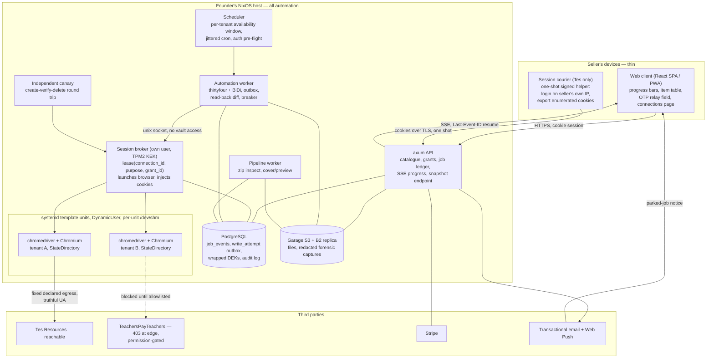

# Server-side architecture for the cross-marketplace listing sync engine

Synthesis of five design lanes, two of them adversarially verified, 2026-08-25.
Supersedes the architecture section of `feasibility-report.md` where the two conflict.
Where a verifier contradicted a lane on a checkable fact, the verifier is followed and the disagreement is named in place.

## What this document decides, and what it assumes

This document designs the server-side automation plane, its session custody model, its compliance floor, and the thin client that reports on it.
It takes the following as settled by the founder and does not reopen them.
Automation runs server-side on infrastructure we operate, not on the seller's machine.
The client is thin, and its entire job around sync is detailed progress reporting.
Rust is the language for the engine, all I/O, batch processing and the automation layer; TypeScript is acceptable for the UI only.
Sync is deterministic and cron-scheduled, never agent-driven, with large language models confined to listing-copy generation and to rediscovering a selector after a markup change.
Deployment is self-hosted on the founder's NixOS machine, built with a Nix flake and crane, in a private repository under a proprietary licence.

The server-side decision carries three risks a local-first design would not, and they should be held in view rather than argued about.
It reinstates credential custody: the platform must hold live authenticated marketplace sessions for every connected seller, which creates a breach-notification surface, a key-management problem and a liability the local-first design deleted outright.
It moves the traffic origin from the seller's residential connection to our datacentre or home egress, which is the single variable that decides whether TeachersPayTeachers serves us at all, and on current evidence it does not.
And it makes the operator, rather than the seller, the party performing the act under both marketplaces' terms, which converts a grey area about what a seller may automate for themselves into a sharper question about what a vendor may do on their behalf.

Two structural consequences follow immediately and shape everything below.
Tes is the only Phase-1 marketplace that is technically reachable from server infrastructure today, so the product's near-term value has to stand up on Tes alone.
And because the seller carries the loss for our errors under both marketplaces' terms while the marketplaces' own liability is negligible, write correctness is a larger engineering problem than write access.

## Session acquisition and custody

### The model, and why the interactive remote browser is not the answer

A server-hosted browser that the seller logs into live, streamed to their own browser as video, is technically real and shipped by at least four vendors.
Its central privacy claim is false, and the falsity is verifiable in open source rather than inferred.
Steel's cast handler receives `{type:"keyEvent", event:{type, text, code, key, keyCode, modifiers}}` over the operator's WebSocket and replays it into the target page via `Input.dispatchKeyEvent`, where the `text` field is the literal character typed (`/home/sernl/ghq/github.com/steel-dev/steel-browser/api/src/plugins/browser-socket/casting.handler.ts` lines 314-329).
Paste is no safer: the session viewer intercepts Ctrl/Cmd+V at document level, calls `navigator.clipboard.readText()`, and posts the text into the viewer iframe (`ui/src/components/sessions/session-viewer/session-viewer.tsx` lines 109-128).
Even if the input transport were opaque, the same CDP session that dispatches keys can call `Runtime.evaluate`, `Network.getResponseBody` or `Network.getAllCookies`, so non-capture is a policy promise and never a technical guarantee.

The decisive liability is unfalsifiability.
After any unrelated compromise of a seller's marketplace account, no log, attestation or policy we hold can demonstrate that we did not capture their password, because the plaintext provably transited our code.
Two further defects rule it out as a default.
The live view is served from our origin, not the marketplace's, so password managers, autofill and WebAuthn do not work, and the flow trains sellers to type marketplace credentials into a non-marketplace origin — the exact behaviour phishing depends on ([Browserbase live view](https://docs.browserbase.com/features/session-live-view), [Steel human-in-the-loop](https://docs.steel.dev/overview/sessions-api/human-in-the-loop)).
And the reference implementations put no authentication on the live-view channel at all; Steel's docs state plainly that "debug URLs are unauthenticated" and "anyone with the debug URL can view or interact with that session".

Therefore the ordering is by exculpability, not by cryptography.
Prefer delegated identity where the password never exists on our side; then session acquisition on the seller's own device; and only then, as a mobile-only fallback with an unambiguous consent line stating that keystrokes pass through our servers, an interactive server-hosted login.
If that fallback ever ships, implement it in Rust as a thin CDP client over `tokio-tungstenite` 0.30.0 — the server-side surface is five commands (`Page.startScreencast`, `Page.screencastFrameAck`, `Input.dispatchKeyEvent`, `Input.dispatchMouseEvent`, `Page.stopScreencast`) — and front the socket with a single-use, short-TTL, tenant-bound token issued by the axum API.

### Tier one, TeachersPayTeachers: Virtual Assistant Login

TPT operates a sanctioned delegated-access product whose permission set is almost exactly this product's write surface.
A Virtual Assistant signs in with their own TPT account and can "create new resources, update your product listings, and make any changes related to a product", including descriptions, titles, previews and file uploads, while they "cannot view Earnings data from the Traffic tab" ([TPT help 4412826604820](https://help.teacherspayteachers.com/hc/en-us/articles/4412826604820)).
One VA account can support up to 100 sellers, the seller invites by email from inside their own account, and the seller can set status to "No access" or remove the VA at will.
This deletes seller credential custody entirely, produces a marketplace-side record of the grant that we could never mint ourselves, and enforces least privilege at TPT rather than in our code.

It is not, however, a licence to automate.
The VA Login User Agreement re-incorporates the Community Guidelines, and those Guidelines contain both the identifier-disguise clause and a separate prohibition: "Don't use any automated means such as bots, spiders, or crawlers to download or otherwise obtain data from our services" ([TPT Guidelines 360043018571](https://help.teacherspayteachers.com/hc/en-us/articles/360043018571--Guidelines-for-All-TPT-ers)).
The session-acquisition lane treated VA Login as substantially solving the TPT problem; the compliance lane and the detection verifier both found it solves who acts and not how they act, and they are right.
Use VA Login as the correct account-access mechanism if and when TPT permission is obtained, and never as the legal basis for automating.

### Tier two, Tes: a session courier on the seller's own machine

Tes has no delegated-access product, and its Author Code states that "One account is permitted per author unless there has been express permission granted in writing by the Tes Resources team" ([Tes Author Code](https://www.tes.com/teaching-resources/author-code)).
So any Tes automation must hold the author's own session, and the only question is where that session is minted.
Mint it on the seller's machine.
A small signed helper opens a system webview, the seller logs in to Tes on their own connection, the helper extracts only an enumerated allow-list of `tes.com` session cookies, posts them to our API over TLS authenticated by the seller's product token, and exits.
This is not client-side automation and does not touch the founder's architecture: all automation still runs server-side and the web client remains a progress reporter.
Its decisive advantage is that the Tes password provably never reaches our infrastructure, which restores exculpability; its cost is an install step during onboarding, and it does not exist on Android.

Cookie relocation is comparatively safe on Tes specifically because an unauthenticated fetch of `https://www.tes.com/` sets only `geoCountry`, `siteCountry`, `siteInternational`, `geoCurrency`, `siteCurrency`, a session-scoped `csrf` and a one-year `__tese`, with no `__cf_bm`, `cf_clearance`, `_abck`, `datadome` or `_px` present.
There is no observed bot-management vendor for the IP and fingerprint change to trip.
That confidence is medium, because a single unauthenticated homepage request does not prove absence behind the login gate.

### What the operator ends up holding

Under tier one, zero seller secrets, permanently: our own TPT VA account password and our own domain mailbox, both of which we are the account holder for.
Under tier two, a live Tes session for each connected author, which means a compromise of our box is a Tes account takeover for the life of those cookies.
Under the interactive fallback, additionally the fact that a seller's password transited our servers.
We never request IMAP, Gmail OAuth or any mailbox scope from a seller under any tier; one-time-password relay is always a human step, because mailbox access confers password reset on every service the seller uses.

Persist a minimal enumerated cookie allow-list per marketplace origin and never a whole browser profile directory, which accumulates form autofill and third-party state we never wanted and cannot audit.
Encrypt each connection under its own data-encryption key using XChaCha20-Poly1305 from `chacha20poly1305` 0.11.0, with AAD bound to `tenant_id || marketplace || connection_id || key_version` so a row replayed into another tenant fails authentication.
Ciphertext, AAD context, key id and version live in PostgreSQL via `sqlx` 0.9.0; the DEK exists in the database only wrapped.
Hold the key-encryption key in a systemd credential encrypted with `systemd-creds encrypt --with-key=tpm2` and delivered through `LoadCredentialEncrypted=`, so a stolen `pg_dump` or disk image without that TPM yields ciphertext only.

Do not run OpenBao on the same box.
The session-acquisition lane recommended moving the KEK into OpenBao transit at the first non-founder tenant; the compliance lane found that a single self-hosted machine cannot auto-unseal without either storing the unseal key on the same disk, which makes OpenBao no better than LUKS, or blocking every reboot until the founder is awake.
The compliance lane is right and this design follows it: `sops-nix` for deploy-time secrets, systemd-creds TPM2 for the KEK, and OpenBao only once a second machine or a hosted KMS exists to unseal against.
TPM binding ties the deployment to hardware, so a tested KEK escrow and recovery procedure must exist before any customer data does, or the first motherboard failure destroys every stored session.

Split the process so that decryption is not ambient.
A session-broker unit is the only component that can reach the KEK; it runs as its own user under `ProtectSystem=strict`, `NoNewPrivileges`, `PrivateTmp` and a syscall filter, and exposes one narrow unix-socket call: `lease(connection_id, purpose, grant_id)` returns a CDP or WebDriver endpoint for a browser the broker itself launched and injected cookies into.
It never exposes `get_session()`.
A compromised automation worker can misuse the connections it has leased and cannot exfiltrate the vault.
Be honest about the ceiling: root on the box, or a bug in the broker, gets everything currently unsealed, and that is exactly why tier one holding nothing beats any amount of tier-two cryptography.

### The park-and-notify state machine

A live browser cannot be parked waiting for a human.
Cloudflare's `__cf_bm` "expires after 30 minutes of continuous inactivity" and `cf_clearance` defaults to a 30-minute lifetime, so holding a browser open past that window achieves nothing ([Cloudflare cookies](https://developers.cloudflare.com/fundamentals/reference/policies-compliances/cloudflare-cookies/), [challenge passage](https://developers.cloudflare.com/waf/tools/challenge-passage/)).
Park the durable job, not the browser.

Two independent lifecycles, deliberately not collapsed into one.
A connection moves `Unlinked -> Linking -> Linked -> NeedsReauth -> Revoked`.
A work item moves `Queued -> Leased -> Running -> Blocked(challenge) -> ParkedLive -> ParkedCold -> Verifying -> Committed | Rejected | Ambiguous | Failed`.

On a challenge the worker screenshots and classifies it, transitions the connection to `NeedsReauth`, requeues every item for that connection with its idempotency key intact behind a `blocked_on=reauth` gate, and notifies the seller.
`ParkedLive` holds the browser context only when the seller demonstrably pressed Sync and their tab is open, with a visible countdown capped at ten to fifteen minutes pending measurement of the real OTP validity window.
`ParkedCold` is the default: the browser is torn down, completed items stay completed, and resuming requires a full re-link.
The client must show these as different states, because offering an inline six-digit field for a cold park wastes the seller's code and their patience.

Give every parked item a heartbeat expiry so nothing waits unbounded, following the AWS Step Functions callback-token pattern where "a task might need to wait for a human approval" and `HeartbeatSeconds` exists specifically "to avoid stuck executions" ([Step Functions](https://docs.aws.amazon.com/step-functions/latest/dg/connect-to-resource.html)).
Resumption carries a single-use token and drains from where it stopped, because every item carries a deterministic idempotency key and every write is preceded by reconciliation.

One crash-recovery hazard the fleet verifier surfaced and the lanes did not: an `Ambiguous` item requires a live authenticated session to reconcile, and if that session died in the same crash, the item cannot be resolved until the seller completes a re-link.
Composing "ambiguous escalates to human" with "needs-reauth pauses the tenant" means one crash at three in the morning halts that seller until they read an email.
That is the correct behaviour and it is also the real ceiling on how unattended this product can honestly claim to be.

Schedule inside a per-tenant availability window — timezone plus weekday hours — rather than at 03:00 UTC.
Deterministic cron scheduling is entirely preserved; the cron simply fires at an hour when the seller can answer a challenge.
Jitter across the window rather than firing every tenant at the same minute, because a synchronised fleet-wide burst is the most machine-shaped traffic profile obtainable against a host that publishes no backpressure signal.
Reserve unattended overnight windows for read-only reconciliation that can fail harmlessly.

## The automation plane

### The prior question nobody asked

Before choosing a browser crate, establish whether Tes needs a browser at all.
The detection lane's own evidence — bare Fastly (`fastly-drupal-html: YES`), Drupal, no challenge platform, no CAPTCHA vendor, no fingerprinting script — makes a plain multipart form POST plausible for the Tes uploader.
If the upload is a classic form POST, a `reqwest` driver costs roughly 30 MB resident, carries no version treadmill, and the entire Chromium dependency evaporates.
If it is a JavaScript-mediated chunked or XHR uploader, the browser is mandatory and the memory budget, concurrency ceiling and maintenance load all change by an order of magnitude.
This is one devtools session on the founder's own Tes account and it is the single highest-leverage hour in the entire plan, because it decides a 30x difference in the dominant infrastructure cost line.
Answer it before any automation code is written.

### Rust-only: achievable, on one path, with named caveats

The honest verdict is that Rust-only is achievable for this layer, but the margin is thinner than the founder would like and the reasons are specific.

`thirtyfour` 0.37.5 (published 2026-08-12) driving nixpkgs `chromedriver` over WebDriver Classic, with WebDriver BiDi negotiated on the same session via the `webSocketUrl` capability, is the recommended path.
The decisive structural property is that WebDriver Classic is request/response over HTTP, so `thirtyfour` bounds every command at the `reqwest` client level (`src/session/http.rs:123`, with `WebDriverConfig::request_timeout` defaulting to 120 seconds at `src/common/config.rs:91`), whereas CDP is a persistent WebSocket where a command that never receives a response simply waits.
File upload has three independent mechanisms — Classic `send_keys(path)` against an `<input type=file>`, BiDi `input.setFiles`, and raw CDP `DOM.setFileInputFiles` via `Cdp::send_raw` — which is three fallbacks for the highest-risk step.
The nixpkgs integration is genuinely hermetic: `chromedriver` is built from the chromium source tree (`pkgs/development/tools/selenium/chromedriver/source.nix` is `chromium.mkDerivation` with `buildTargets = [ "chromedriver.unstripped" ]`), so version skew cannot arise from a channel bump, and `WebDriverManagerBuilder::driver_binary(BrowserKind::Chrome, path)` accepts the Nix-pinned binary with no download path at runtime.

`chromiumoxide` is rejected, but not on the grounds its lane originally gave.
The lane claimed an 8h20m default timeout from `TargetConfig::default()` using `Duration::from_secs(REQUEST_TIMEOUT)` where the constant is 30,000 milliseconds; the verifier traced callers and found `TargetConfig::default()` has none, so that default is a latent trap in a public struct rather than the operative behaviour.
The real defect is `src/handler/commandfuture.rs:51`, which hardcodes the crate constant and ignores configured values, together with a cluster of ten open hang and timeout issues running from #13 (2020-12-28) to #333 (2026-08-20).
The corrected grounds are weaker than the lane's headline and still sufficient: a six-year-old unresolved hang class is the exact failure mode that wedges an unattended fleet.
`headless_chrome` leaks processes and threads across 142 open issues; `rustwright` is seven weeks old, self-described alpha, and its own CI flakes on navigation timeouts; `playwright-rust` last shipped in 2022; `fantoccini` 0.22.1 is healthy but has no BiDi module and therefore no network event stream.

Three caveats on `thirtyfour` are load-bearing and were found by adversarial review of the crate's source, not by reading its issue tracker.
BiDi commands are not bounded: `grep -rn "timeout" thirtyfour/src/bidi/` returns nothing, and `src/bidi/transport/ws.rs:135` awaits a oneshot with no deadline, so a wedged browser that keeps its socket open hangs `network.addIntercept` or `input.setFiles` forever — every BiDi call must be wrapped in `tokio::time::timeout` at the call site, and a caller timeout leaks the pending entry.
The BiDi event fan-out is a `tokio::sync::broadcast` with a global 1024-slot buffer whose stream adapters discard `Lagged` silently (`src/bidi/stream.rs:109` and `:179`), so under load the `ResponseCompleted` for a submit can be dropped with no error and the write scores ambiguous — which means concurrency does not degrade throughput here, it manufactures three-in-the-morning pages.
And `impl From<reqwest::Error> for WebDriverError` at `src/error.rs:410` flattens the error into a string, erasing `is_timeout()` versus `is_connect()` — the two failure classes that decide whether a write is ambiguous or safe to retry.
Patch or wrap that conversion before writing any outcome logic.

Maintenance posture is honest but not comfortable.
`thirtyfour` is bus factor one (507 contributions from the maintainer, 79 from the next human), and the entire BiDi surface landed in self-authored, self-merged pull requests on a single day — #314 merged nine minutes after opening, #318 twenty-one minutes.
A green CI matrix authored in the same twenty-one minutes as the code it tests is weak maturity evidence.
Treat BiDi as viable pending an M0 soak against a real marketplace, not as production-proven.

### Browser fleet design

Start at concurrency one to two, not a pool.
At the feasibility report's own parameters — 50 listings per seller per month at roughly three minutes wall-clock — one seller consumes 2.5 browser-hours a month, so a single serialised browser at a 20 percent duty cycle serves about 58 sellers and at 50 percent about 146.
Measured on the founder's own hardware (Intel i7-10700F, 8C/16T, 31 GiB), an isolated Chromium session costs roughly 400 MB marginal with a heavy SPA loaded and about 4.3 CPU-seconds for launch plus one page load, which puts the hardware ceiling near 30 concurrent sessions and makes CPU rather than RAM the binding constraint.
Those numbers matter only as an upper bound to design against; the practical operating point is set by marketplace pacing, which is an order of magnitude below the hardware ceiling.
Serialising also deletes problems rather than managing them: no `/dev/shm` contention, no broadcast-lag ambiguity, no pool health-checking, and exactly one in-flight write to reconcile after a crash.

Isolation is per session, and it is one mechanism.
Run each browser session as a templated systemd unit with `DynamicUser=yes` and the profile in `StateDirectory=browser/%i`, never `ReadWritePaths=` — systemd recycles DynamicUser UIDs from 61184-65519 and its own manual warns that processes must not "leave files or directories owned by these users/groups around", so a leftover profile holding a seller's marketplace cookie is a cross-tenant credential leak waiting for a UID collision.
The cgroup gives orphan reaping that process bookkeeping cannot: killing chromedriver does not reliably reap Chromium's zygote and renderers, but stopping the unit does.
Leave `MemoryDenyWriteExecute` unset because it is documented as "incompatible with programs and libraries that generate program code dynamically at runtime" and V8 is one, and do not restrict the user, pid or net namespaces, because `DynamicUser` forces `NoNewPrivileges` and therefore forecloses the SUID sandbox helper, leaving the unprivileged user-namespace sandbox as Chromium's only remaining layer-one isolation.
Never reach for `--no-sandbox` to make a hardened unit work.

Two gaps the fleet lane missed, both real.
`PrivateTmp=` covers `/tmp` and `/var/tmp` only, so `/dev/shm` is shared, is not bounded predictably by `MemoryMax=`, and exhausts as SIGBUS and tab crashes rather than a clean OOM — mount a per-unit `/dev/shm` via `TemporaryFileSystem=/dev/shm:size=...`.
And `thirtyfour`'s driver manager holds a single refcounted chromedriver shared across sessions (`src/manager/manager.rs:133`), which is incompatible with one-systemd-unit-per-session; run one manager per unit and accept N chromedrivers, because a shared driver would put every browser in one cgroup under one UID and dissolve the isolation the units exist to provide.

Set `fonts.packages` to include DejaVu, Liberation, Noto and Noto CJK and colour emoji.
The fleet lane overstated this — nixpkgs' `make-fonts-conf.nix:49` unconditionally appends `dejavu_fonts.minimal`, so Latin text renders and the tofu claim is wrong — but element interactability checks depend on layout and post-write screenshot evidence of a CJK or emoji-bearing title is worthless as an audit record without the fonts.

The nixpkgs chromium lockstep cuts both ways and the recurring cost belongs in the budget.
Version skew is impossible, and equally you cannot pin: Chromium moves on a security cadence, so staying put means running known vulnerabilities in a process that loads hostile third-party markup with seller session cookies resident.
That is roughly fifteen to twenty-five forced browser upgrades a year, each an unreviewed change to how someone else's form renders, each requiring re-verification against the marketplace before it reaches production.
Make "never override chromium" a hard rule, add a flake check asserting both store paths are substitutable, and gate deploys behind a staging re-verification run.

### Per-job resource limits

Enforce three independent deadlines with deliberately different roles.
`thirtyfour`'s `request_timeout` bounds each WebDriver command at roughly thirty seconds and is fixed when the HTTP client is constructed, so it must be set at construction rather than mutated later.
A `tokio::sync::CancellationToken` with a wall-clock budget bounds the whole job in-process, so the normal path is a clean cancellation that records an outcome.
`RuntimeMaxSec=` on the systemd unit, set strictly longer than the tokio deadline, is the operating-system backstop that produces an ambiguous outcome when the process itself is wedged.
Set the W3C `pageLoad` and `script` session timeouts explicitly and never set the `implicit` timeout, which `thirtyfour`'s own documentation warns interferes with its `query()` polling framework.
Add `MemoryHigh=`, `MemoryMax=`, `CPUQuota=` and `TasksMax=` per unit, and treat any `reqwest` timeout as session-poisoning: the command was not cancelled server-side, chromedriver serialises commands per session, and the next command will queue behind the abandoned one.

A durable per-tenant mutex is mandatory.
Two workers on one tenant will race session-bound form tokens and produce sporadic 403s that look exactly like bot detection and will trip the circuit breaker.
Parallelism is inter-tenant only, always.

### The ambiguous-write problem

This is the engineering centrepiece, and the framing that matters is that a submit has three outcomes, not two, and that the third is not a kind of failure.
The brief carries as an established fact that the best fully-automated web agent on WebBench completes only 46.6 percent of non-read tasks with hallucinated success as the top failure mode.
The source verifier could not find the 46.6 figure at the cited Skyvern page and found the two named failure modes presented as co-equal rather than ranked, so the number should be re-sourced to the primary paper before it appears in any customer-facing material.
The design consequence stands regardless of the figure, because it also follows from first principles: a driver's own success signal is unverified, and a marketplace form offers no idempotency key.

The commit boundary is intent recorded, not response received.
Before the click, write a `write_attempt` row in PostgreSQL — UUID, job id, tenant, marketplace, intent, canonical content hash, `state=IN_FLIGHT` — as a fencing token and outbox record.
Then resolve the attempt from ranked evidence.
Observed BiDi `ResponseCompleted` tells you what the server answered, and no more than that: a marketplace returning HTTP 200 with a JSON error body would score committed if status alone were treated as authoritative, and Puppeteer documents that `HTTPResponse.buffer()`, `content()` and `text()` are unsupported over BiDi, so the body is not readable through the ordinary response API.
`thirtyfour` exposes `network.getData` at `src/bidi/modules/network.rs:479` to fetch retained body data, and the design must use it rather than trusting the status line.
A read-back of the listing by durable identifier is the only thing that settles genuine ambiguity, and DOM success banners are never terminal.

An ambiguous attempt is never retried.
It is reconciled, and if reconciliation cannot decide, it goes to human review.
A duplicate listing is a customer-visible defect and a policy problem — the Tes Author Code says "Please do not upload duplicate copies of your resources" — so the bias resolves toward stalling, always.
The governing axiom, worth writing into the design record verbatim: a stalled queue is recoverable, a duplicate-upload storm is not.

The create path has no durable identifier, and that is the largest hole in the naive design.
Both stable keys — TPT's numeric product id, Tes's title-anchored URL — are assigned by the server at creation, so on an ambiguous create you do not have the key, which is precisely what ambiguity means.
Reconciliation then means listing the author's recent resources and matching on title plus content fingerprint, and the fingerprint will not match because marketplaces sanitise HTML, trim whitespace, transcode images and rewrite descriptions.
Three responses, in preference order.
First, establish whether either marketplace supports save-as-draft, because a draft create plus a publish transition splits one dangerous write into a harmless one and an idempotent one — publishing an already-published draft is a no-op — and this is a larger correctness win than network observation at a fraction of the cost.
Second, if drafts do not exist, embed a correlation marker in a seller-visible field and accept the pollution, documented to the seller.
Third, accept irreducible ambiguity and escalate, with the tenant halted.

Verification must be a field-by-field diff against declared intent, not an existence check.
Three-valued outcome answers "did a write land"; it never asks "did the right write land", and after a markup change a 200 can mean price typed into quantity and the wrong licence radio selected, published to a real storefront.
So the read-back compares each intended field against the observed value through an explicit per-field normaliser that handles entity re-encoding, Unicode normalisation, curly quotes, whitespace collapse, description truncation, tag reordering, slug generation and price rounding.
Without that normaliser the control emits mismatch alerts continuously, the founder learns to ignore them within a week, and the control is then worse than absent because it is believed to exist.
Map each mismatch class to an action: truncation means degraded and do not resend, a missing field means halt the marketplace, a value in the wrong field means halt immediately and page.

Add a pre-flight form-schema assertion, which is cheaper and more severe than any post-hoc diff.
Before filling, enumerate the form's input names and hard-fail if the set differs from a pinned fixture.
That fails closed before any write, costs one request, and catches the overnight-redeploy case that a post-write diff only catches after N corrupted listings exist.
Pair it with an independently scheduled canary doing a full create-verify-delete round trip against a throwaway or founder account, decoupled from customer work, so a marketplace change at 02:00 halts the morning batch before it starts — and confirm that Tes permits deleting an author's own resource, because if it does not, the canary permanently pollutes the store and consumes the author's own fair-usage budget on every run.

Build a substitute for Playwright's trace viewer, because staying in Rust forfeits it and it is the best post-mortem artefact in this problem class.
On every non-green outcome, capture the BiDi network log, page HTML, a screenshot and the console log into object storage keyed by `write_attempt` UUID.
Redact credential headers in the capture path from the first commit: `BeforeRequestSent` and `ResponseStarted` carry `Cookie`, `Set-Cookie` and `Authorization`, and an unredacted artefact store is a persistent credential dump that also contradicts the custody argument for self-hosting.
Set a retention policy at the same time, since HTML plus a full network log per capture reaches single-digit gigabytes a month with no bound.

Two more failure classes need positive assertions rather than absence checks.
A seller enabling multi-factor authentication yields a login page where a dashboard was expected, and a session that expires mid-upload yields a 302 to sign-in whose landing page is a cached Fastly 200 — both parse as success unless every post-authentication step asserts positively on an authenticated-only element.
The rule the detection lane wrote for TPT applies with full force on Tes: never interpret an interstitial as a successful write.

Finally, the 429 handler will never execute in development and will first execute in production during the incident it exists to contain.
Build a transport-layer fault-injection seam so 429, 403, HTML interstitial, truncated body, connection reset mid-body and 302-to-signin are all exercised in CI, and run a scheduled synthetic that walks the error path on purpose.

## Detection reality, per marketplace

### The experiment, and how much weight it bears

A controlled two-egress comparison on 2026-08-24 found that `https://www.teacherspayteachers.com/` returned HTTP 200 and a 378 KB body to a bare `curl/8.x` user agent from a consumer ISP (AS9500, One New Zealand), while Anthropic datacentre infrastructure received 403 on `/`, `/Browse`, `/Signup/Seller/Publisher` and the help centre.
The source verifier independently replicated the datacentre half four times over, so the 403 is established.
The consumer-ISP half is an unreproducible self-report, and the causal conclusion that network origin is the discriminator comes from a two-cell comparison in which ASN, geography, TLS stack and client software all varied at once.
That is not an isolation of network origin, so this finding is carried at medium confidence rather than the lane's high, and its own risk register agrees: the datacentre ASN belongs to an AI company, and TPT's robots.txt blocks `GPTBot`, `CCBot`, `meta-externalagent` and `ImagesiftBot` by name, so it may be blocked as an AI vendor rather than generically.

One internal contradiction needs recording rather than smoothing over.
The lane reported HTTP 200 for `/Signup/Seller/Publisher` in one finding and 403 in another; the verifier got 403 from datacentre egress, so the 200 must have come from the consumer connection and the finding was missing its egress qualifier.
Related, the lane's explanation for `robots.txt` returning 200 while HTML paths 403 — a Cloudflare static-resource exemption — does not survive, because the help centre's Zendesk JSON API also returned 200 to datacentre egress and a dynamic JSON endpoint is not a static resource under any reading.
The observation holds; the mechanism is unknown.

A premise underlying the whole Cloudflare analysis is unverified and should be flagged: `cf.bot_management.*` fields and the bot score require a Cloudflare Enterprise plan with Bot Management enabled, and nothing establishes that TPT is such a customer.

### Verdict: Tes

Viable, high confidence, and the only Phase-1 marketplace that is buildable as specified today.

Response headers show `fastly-drupal-html: YES` with no bot-management vendor markers; grepping the homepage and the sign-in page for datadome, perimeterx, akamai, incapsula, imperva, kasada, `cdn-cgi`, recaptcha, turnstile, hcaptcha and fingerprintjs returned zero matches; and there is no CAPTCHA on sign-in.
Tes serves datacentre egress identically to consumer egress, which the verifier replicated directly.
Fifteen sequential requests at roughly three per second drew no challenge and no degradation, though fifteen requests is below any plausible commercial threshold and establishes only that no low-water rate limit exists.
Neither the Author Code nor the en-gb General Terms of Business contains any anti-automation, anti-bot or anti-scraping clause; the only volume restriction is "Tes reserves the right to limit the number of uploads by an author where we consider there has been a breach in fair usage".
The Additional Terms expressly contemplate content "uploaded by you or on your behalf" and warrant the case where "you are acting as an agent for those who do", which is not a permission slip for software but does mean a Tes enquiry asks about a mechanism the terms already anticipate.

Two caveats attach.
Everything verified was unauthenticated; the upload path sits behind sign-in and is the one that matters.
And the policy pages are geo-served — these were fetched from New Zealand, and a clause the earlier feasibility report relied on did not appear in the en-gb variant — so any Tes contractual conclusion should be re-checked from a GB egress before it is relied on.
A "Fake and Incentivised Consumer Reviews Policy" banning content "submitted using bots, AI tools" was cited without a URL and could not be located; if it exists it qualifies the no-anti-automation-clause finding and needs a source before the Tes verdict is final.

Tes's lighter detection stack is paired with a heavier contractual consequence.
It may "at its sole discretion, without notice" terminate an account or limit access, and the indemnity attaches specifically to authors who are VAT-registered, earned over £10,000 in twelve months, or act for a corporation — which is exactly the target cohort, and it routes the product's own sync errors onto the customer.
On Tes, correctness of writes matters more than getting in.

### Verdict: TeachersPayTeachers

Not viable for compliant server-side automation from the intended egress without TPT's affirmative cooperation, medium confidence.

The block lands before authentication, so it is not something a better session model or a politer client can reach around, and it also blocks the founder's own infrastructure from TPT's Publisher signup page.
The three ways past it are a residential proxy, TLS or JavaScript fingerprint manipulation, or an allowlist from TPT.
The first two are foreclosed by name: TPT's Community Guidelines prohibit using "a misleading email address or IP address or otherwise manipulate identifiers in order to disguise your location or the origin of information you're providing to us".
That clause is purpose-qualified, and the qualification is the useful part — it separates concealing origin, which is forbidden, from disclosing it, which is untouched.
Encode it as a design rule: the engine may never present a value about itself that it does not believe to be true.

The compliant envelope on TPT is therefore narrow, and narrower than the detection lane concluded.
The lane read the identifier clause in isolation and concluded that an honest posture is "not reached at all"; the verifier found the same Guidelines article contains a sibling prohibition under "Don't interfere with our Services" — "Don't use any automated means such as bots, spiders, or crawlers to download or otherwise obtain data from our services".
The verifier is right and this matters more than the access question, because the design's own correctness discipline — read-back, field diff, reachability probing, lifecycle polling — is automated means obtaining data from TPT's services.
On TPT, compliance is in tension not only with access but with verification, and no engineering choice resolves that.
It needs written permission.

Cloudflare Web Bot Auth is the one constructive door, and it works by making the automation more identifiable rather than less.
The operator generates an Ed25519 key pair, publishes a JWKS at `/.well-known/http-message-signatures-directory`, registers through Cloudflare's Bot Submission Form selecting "Request Signature", and attaches `Signature-Input`, `Signature` and `Signature-Agent` headers, which populates `cf.bot_management.signed_agent` ([Cloudflare](https://developers.cloudflare.com/bots/reference/bot-verification/web-bot-auth/)).
Three corrections to the lane's framing.
The "intermediary" class definition — "the operator runs the software, but each action is initiated by a different end user" — lives at `/bots/concepts/bot/verified-bots/categories/`, not at either URL the lane cited, and it fits interactive operations better than a scheduled unattended sync initiated by our own cron.
The protocol is not a standard: `draft-meunier-web-bot-auth-architecture` is expired and archived on the IETF datatracker, replaced by `draft-meunier-webbotauth-httpsig-protocol` at revision 05, so this is a single-vendor implementation of an expired individual draft.
And verification confers no entitlement — an unallowlisted verified bot may be blocked faster, which is the system working correctly.

The ask to TPT is small and specific, which is why it is worth making.
Cloudflare's own guidance is to "create additional Skip rules for their IP addresses or user agents before deploying blocking rules", so the request is not "build us a write API" but "add a Skip rule for our declared static egress IP and User-Agent".
That makes a fixed, declared, non-rotating egress dedicated to this service an architectural requirement rather than hygiene.
Send the enquiry from a consumer connection, lead with the fact that TPT's edge blocks our infrastructure from TPT's own Publisher signup page, and supply the egress IP and UA string in the first email.
Do not build the Web Bot Auth signing component before either the neutral-VPS probe reopens TPT or TPT replies, because the crate that implements it went 0.0.1 to 0.7.0 in eleven months tracking a moving draft, and the first email needs nothing from it.

### The compliant envelope, stated once

Fixed declared egress, never rotating and never shared with another workload.
A truthful `User-Agent` naming the product with a contact URL, never a spoofed Chrome-on-macOS string.
A real browser engine that is not disguised as a human-driven one: `navigator.webdriver` stays true, `--disable-blink-features=AutomationControlled` is off the table, and headless Chromium's own `HeadlessChrome/151.0.0.0` UA token is either left alone or removed by genuinely running headful under Xvfb, which spoofs nothing.
No CAPTCHA-solving integration under any circumstances, which also forecloses two managed browser providers that meter CAPTCHA solves as a billable feature.
Seller consent recorded per connection, conservative self-imposed pacing, and a hard stop on any 429 or `Retry-After`.
Robots.txt honoured on unauthenticated read paths, with an explicit decision recorded about authenticated paths — the engine acts as the seller's agent inside the seller's own session there, robots.txt governs crawlers, and the fetch-failure branch must fail one way deliberately rather than accidentally.

### Failure-mode ladder

| Rung | Tes | TPT |
|---|---|---|
| 1 | No signal; fair-usage counted silently | Bot score computed per request |
| 2 | No published rate limit, no 429 | Edge 403 or JS challenge |
| 3 | Upload limit applied at Tes's discretion | Application step-up: reCAPTCHA v3, email OTP |
| 4 | Access limited, sole discretion, no notice | Account suspended pending investigation |
| 5 | Account terminated, amounts still due | Store closed on repeated violation |

TPT's rungs one through four are recoverable through a documented remediation-and-email path, and its published enforcement sequence for security events is suspend, investigate, restore on remediation, with earnings clawed back only against refunds rather than forfeited wholesale.
Store closure on repetition is not recoverable.
TPT publishes no bot-specific enforcement policy anywhere in its 415-article help corpus — "automated means" and "bots, spiders" each appear in exactly one article — so there is no rung between silence and a discretionary closure, and the founder cannot rely on a warning arriving before an action.
Tes's ladder is shorter and blunter: no gradient to descend, no HTTP error to react to, and the first signal is an account restriction that has already reached a customer.
That absence of a gradient is the strongest argument for the independently scheduled canary being the detection mechanism rather than the marketplace's correspondence.

### Blast-radius containment

Be honest about what containment can and cannot do here, because the lane was and it is the right posture.
Under server-side automation every tenant's traffic carries the same binary's TLS fingerprint, the same user agent and the same timing signature, because it is the same program.
Per-tenant egress IPs therefore partition the IP-reputation input and nothing else, and varying fingerprints per tenant to partition the rest is exactly the identifier manipulation TPT forbids.
A fingerprint-keyed or behaviour-keyed detection is a single fleet-wide event by construction, and the compensating control is not technical: it is keeping per-tenant volumes low and write correctness high enough that no detection is triggered.

What does work, and should be built.
A marketplace-scoped circuit breaker with a specified trip predicate — consecutive-failure counts and error-class weights over a rolling window — that distinguishes tenant-local failure, such as one expired credential, from marketplace-wide failure, and never lets the former take the whole product offline.
Its state must be durable, or a crash-restart supervisor loop re-arms it every restart and machine-guns a host with no published rate limit.
It needs a half-open probe, an auto-reset policy and a maximum hold, because a breaker with no reset policy and a sleeping solo founder is an unbounded outage.
Canary-first ordering, staged cohort ramp, and both per-tenant and global budgets.

Meter authenticated requests per author, not uploads.
Lifecycle polling and read-back verification will generate read traffic exceeding write traffic by an order of magnitude against an unquantified fair-usage norm, so metering uploads produces a number the founder trusts and that does not describe the exposure.

At the account layer, the one genuine lever on TPT is the choice of VA identity.
A single platform-owned VA account serving many sellers makes a VA ban a fleet-wide event; the seller's own named operator acting as VA makes an enforcement action account-local.
The 100-sellers-per-VA cap is a real ceiling, and minting synthetic VA identities to farm it is the exposed design, because TPT contemplates real individuals whose identity it may verify.

## The compliance floor

The organising principle is to minimise what a held session can reach, marketplace by marketplace, and to make that minimisation mechanical rather than procedural.
An allow-list enforced in Rust at the driver layer is worth more than any policy document, because it converts scope decisions from discretionary into evidenced — which is the difference that matters under a statutory tort requiring intention or recklessness rather than negligence.

The severity ranking inverts the technical build order and this is the lane's sharpest finding.
A TPT VA session cannot reach earnings, and all banking and tax identity lives in Hyperwallet behind a separate login, so a TPT incident can honestly report that no financial account data was exposed.
Tes holds the seller's bank account details in-account, reachable from the same Author Dashboard the automation traverses via the Withdraw flow.
Tes is the easier technical target and the higher-severity compliance target.

The brief's assumption that a seller session broadly exposes buyer data is only partly right, and the correction is favourable.
TPT withholds buyer contact details from sellers by design and routes seller-to-buyer contact through its own support team; Tes approximates buyer location "for data protection purposes" and exposes country plus a transaction identifier rather than a name.
The sharpest third-party personal data is elsewhere: the seller's own bank details on Tes, and TPT school rosters carrying teacher first name, last name and email address.
Deny-list the roster and account-administration routes alongside the payout routes, and do not persist Q&A page content at all.

### Stage A, before the founder's own first use

| Item | Owner | Cost | Timing |
|---|---|---|---|
| Navigation allow-list enforced in code | Founder | Nil | Week 1 |
| Per-connection DEK envelope encryption | Founder | Nil | Week 1 |
| KEK escrow and recovery procedure, tested | Founder | Nil | Week 1 |
| Global revocation command plus timed drill | Founder | Nil | Week 2 |
| Per-field audit log shipped off-box | Founder | Nil | Week 2 |
| Restic restore verified from backup | Founder | Nil | Week 2 |
| Written enquiry to Stripe under SSA 1.2(a)(ix) | Founder | Nil | Week 1 |
| Written enquiry to TPT Publisher Membership | Founder | Nil | Week 1 |
| Written enquiry to partnerships@tes.com | Founder | Nil | Week 1 |

The allow-list needs a test that fails on any route outside it, not a code review that notices one.
The revocation command must clear every session ciphertext, destroy every tenant DEK, halt the scheduler, kill in-flight leases within seconds and notify every seller; drill it and record the wall-clock time, because that number is the honest containment window.
The audit log records intended mutation, observed post-write state and the diff — the same read-back correctness already requires, so the marginal cost is storage — and it matters because TPT gives the seller no usable record of delegated edits ("You can see when the latest edit by your Virtual Assistant was made, but aren't able to see detailed changes"), which makes our log the only record either party will hold.
Ship audit events continuously off-box via `services.vector` to an append-only sink, because an attacker with root on the only box can rewrite any local log regardless of hash chaining.
The three enquiries cost nothing but time and each one gates a whole branch of the roadmap; the Tes one is a four-question form to `partnerships@tes.com` and should go first.

### Stage B, before the first external customer

| Item | Owner | Cost | Timing |
|---|---|---|---|
| Jurisdiction decision, NZ versus AU versus UK | Founder plus adviser | Advice fee | Before drafting |
| Customer terms and DPA | Technology lawyer | Part of AUD 8-15k | 4-6 weeks |
| Privacy Act s6EA opt-in registered | Founder | Registration fee | 1 week |
| EU and UK Article 27 representatives | External providers | Quote required | 2 weeks |
| IT Liability plus Cyber cover placed | Broker | AUD 2,500-5,000 est. | 3-4 weeks |
| Self-serve connections page with revoke and delete | Founder | Nil | 1 week |
| Incident plan to the 72-hour clock | Founder plus lawyer | Part of legal | 1 week |
| systemd confinement of driver units | Founder | Nil | 1 week |
| Stripe billing, second processor onboarded dormant | Founder | Processing fees | 2 weeks |

Jurisdiction is the largest single cost lever and it is a choice, not an engineering outcome.
New Zealand holds an EU adequacy decision and Australia does not, so an NZ entity serving the UK and EU Tes cohort avoids the entire SCC and UK IDTA apparatus and the transfer risk assessments that must be maintained alongside it.
That axis favours New Zealand strongly; tax residency, the founder's actual residence, and which consumer-guarantee regime applies were not researched and belong to an adviser.
The Article 27 representative obligation attaches regardless of adequacy, because the exemption requires processing that "is occasional" and a continuous subscription service is not.

Payment processing is a genuine kill risk and two of five providers are excluded by name.
Paddle prohibits "Any product or service that infringes upon, or enables the infringement upon copyrights, trademarks, terms and conditions, or trade secrets of another party", and Polar prohibits "Services to circumvent the rules, paywalls or terms of other services".
Stripe's restricted-business list contains no equivalent clause and its Services Agreement provides written pre-approval at 1.2(a)(ix), so approach Stripe first and in writing before writing billing code.
Lemon Squeezy sits on Stripe and inherits its restrictions, so a Stripe approval probably carries and a Stripe refusal probably does not; FastSpring pairs an open-ended termination right with a 180-day balance hold for no compliance gain.
Stripe retains discretionary suspension hooks this business will sit near for its entire life, which is why a second processor stays onboarded and dormant and why at least one month of operating cost stays outside the processor's balance.
Asking Stripe creates a written record and a refusal is harder to work around than silence; ask anyway, because discovering the answer after launch is worse.

Draft the customer terms to Australian Consumer Law s64A(2) resupply limits rather than a blanket exclusion, which s64 voids and which is itself exposure under the unfair-contract-terms regime.
Every customer will be a "consumer" regardless of business use, because the prescribed threshold is $100,000 and the price is a monthly subscription.
Assume s64A(3) will be argued when a sync error costs a seller their storefront, and price that risk rather than drafting around it.
Give sellers no broad indemnity, because both relevant insurance wordings exclude "any obligation assumed by an insured under any agreement".
Put the prior-known-facts exclusion to the broker in writing — it reaches "any fact or matter referred to in the proposal" — and disclose the automation model fully, because non-disclosure risks the whole policy and the automated underwriting path will not have a category for this business.
Note that a TPT "Site Assets" claim would be pleaded as intellectual property infringement, which the cyber policy excludes, so the IT Liability policy is the one that must respond.

The self-serve connections page is the transferable lesson from the closest regulated precedent.
The Plaid settlement turned on over-collection and on a login screen with "the look and feel of the user's own bank account login screen", and the relief included retention limits, deletion, and a portal where consumers manage linked accounts.
Build that portal before the complaint, not after: every held session, when it was last used, and seller-initiated revoke and delete.
Encryption is also a statutory off-ramp — GDPR Article 34(3)(a) removes the individual-notification duty where measures render the data unintelligible — which is the concrete return on per-tenant DEKs, and it helps only for the stolen-dump case and not for a compromised running process.

### Stage C, before general availability

| Item | Owner | Cost | Timing |
|---|---|---|---|
| CrowdSec and auditd with alerting to phone | Founder | Nil | 2 weeks |
| Annual revocation and restore drill, documented | Founder | Nil | Ongoing |
| Severity routing so not every alert wakes one person | Founder | Nil | 2 weeks |
| Connected-seller cap decided and enforced | Founder | Nil | Before GA |

The last row is the real ceiling and no technical control substitutes for it.
The security floor scales; the single human on call does not, and a breach discovered on a Friday evening with the founder unreachable is a compliance failure regardless of the engineering.
A design that can generate a fleet-wide alert storm at three in the morning for a solo operator is a design whose notifications get muted in month two, so severity routing and batching are a compliance control, not polish.
One infrastructure detail belongs here: if `system.autoUpgrade` with `allowReboot` is enabled on the host, the machine can reboot mid-upload on a schedule and manufacture ambiguous writes forever — disable it or gate the reboot on a drained queue.

## The client

### Progress model

Progress is a job to item to step tree, with an outcome type that has ambiguity as a peer of failure rather than a variant of it: `Succeeded | Failed | Ambiguous | Skipped | Blocked`.
Job status is an aggregate roll-up over item outcomes and never gates on the first bad item, following Shopify's bulk-import shape where "the bulk operation only fails entirely (with status: FAILED) for critical system errors" and every row's outcome is reported independently.
Every non-success node carries a closed-enum `reason_code` crosswalked to UI copy so wording changes are not migrations, a free-text `reason_detail` from the adapter, an `attempt` count, and an `evidence_ref` into the redacted forensic capture.
Free-text-only reasons make a failure list unfilterable at two hundred items, which is exactly the scale that matters.
Ship a downloadable per-item result file from day one, because that is what a seller with twelve failures out of two hundred actually acts on.

The UI is three surfaces and no more.
A per-marketplace stacked bar segmented by outcome with raw counts beside it, because a single fill reaching 100 percent is indistinguishable from a run where twelve items failed.
A virtualised item table defaulting to a non-success filter.
A per-item step timeline on row expand.
Blocked-on-seller gets its own visual state and a call to action rather than a stalled bar, because a bar that stops moving reads as a hang.

### Real-time transport

Server-Sent Events, over HTTP/2, one stream per tab multiplexing every job the user is watching.
axum 0.8.9 ships SSE first-party in `axum::response::sse`, so this adds no crate; the client never sends anything on this channel, so a WebSocket buys nothing and would require hand-rolling the resumption that SSE gets from the specification.
The event id is the BIGINT primary key of a `job_events` table, allocated in the same transaction as the state change it records, and the browser replays it in a `Last-Event-ID` header on reconnect — so resumption is a `SELECT ... WHERE id > $1` rather than bespoke protocol code.

`LISTEN/NOTIFY` carries only `{job_id, max_event_id}` and is treated as a hint to read the table.
PostgreSQL forces this: `sqlx`'s `PgListener` documents that notifications received while the connection was lost "will not be returned", the payload caps at 8000 bytes, and identical payloads within one transaction fold to a single delivery, so a constant payload would silently lose wakeups.
One `PgListener` task feeds one `tokio::sync::broadcast` hub per process; on `RecvError::Lagged` the handler re-reads the snapshot and resumes from the newest id, which is byte-for-byte the reconnect path, so backpressure and disconnection share one recovery routine.
Keep a plain `GET /jobs/:id` snapshot endpoint as the non-stream fallback.

Three operational details are the difference between working and mysteriously not.
Over HTTP/1.1 browsers cap at six connections per origin across all tabs, which a one-stream-per-job design blows through immediately, so terminate TLS with HTTP/2 and multiplex.
A failed or wrong-content-type SSE response permanently stops the browser reconnecting, so authenticate before opening the stream and never return 401 as the stream response; return 204 to tell a client to stop.
Set `X-Accel-Buffering: no` and keep axum's default fifteen-second keepalive inside nginx's sixty-second `proxy_read_timeout`, and if `CompressionLayer`'s default predicate is ever replaced, re-add `NotForContentType::SSE` or every stream silently buffers.
Use an HttpOnly SameSite cookie session so the native `EventSource`, which cannot send an Authorization header, works untouched.

### The re-authentication interruption

The client shows two distinct states, matching the two parking tiers.
`ParkedLive` offers an inline six-digit field with a visible countdown, shown only when the seller pressed Sync themselves.
`ParkedCold` says "needs sign-in" and links to the re-link flow, with completed work explicitly preserved on screen.
The seller reads the code from their own inbox and types it into one narrow field labelled with the exact challenge the marketplace presented; one POST relays it into the parked form, and the event is written to the audit log as an explicit seller act with a timestamp.
We never read the seller's mailbox.

Notify by transactional email through a relay plus VAPID Web Push, sent together and deduped by resume token, because they have different latencies and different failure modes.
Push API has been Baseline widely available since March 2023 and reaches Chrome for Android and Samsung Internet.
Do not send SMTP directly from the self-hosted box: a small self-hosted MTA is the single most likely reason a parked-job notification never arrives, and the failure is invisible from our side.

The cheapest real mitigation is upstream of all of this and it is the highest-leverage client work in the product.
Give the seller a nominated sync window and run an authentication pre-flight as step zero of every batch, so a challenge fires at a known moment with no items in flight rather than at item 137 of 200.
Add a per-marketplace session-health indicator — fresh, expiring, needs attention — and surface "sign in now" as a daytime nudge before the scheduled run.
That converts most parked jobs into a five-second action the seller takes while awake.

### Web stack and Android

Vite 8.2.2, React 19.2.8, TanStack Router 1.170.32 and Query 5.102.2, shadcn/ui on Tailwind 4.3.3 with `sonner` rather than the deprecated `toast`, headless TanStack Table 9.1.2 with TanStack Virtual 3.14.10 for the product-by-marketplace matrix.
Query fetches the snapshot and a single effect-owned `EventSource` merges deltas via `queryClient.setQueryData`; do not use the experimental `streamedQuery`, whose chunk-accumulation semantics model a token stream rather than a mutable projection.
Forms are few, so react-hook-form 7.86.0 with zod 4.4.3 — a deliberate, stated deviation from the house TanStack Form preference, taken because shadcn's `Form` is wired to react-hook-form.
Build with npm and `importNpmLock`, which needs no hash because it relies on the integrity hashes already in `package-lock.json`, making it the structural twin of crane's `vendorCargoDeps`.
Serve the built UI from a runtime path via `ServeDir(...).not_found_service(...)` rather than embedding it, so a UI change never invalidates crane's `cargoArtifacts`.

Android is an installable PWA with a service worker and Web Push.
Tauri v2 has no first-party push at all — its notification plugin documents only local notifications with no FCM or APNs path — which disqualifies the otherwise natural Rust-shaped option, because push is the one capability that justifies a mobile client for this product.
The cost of that recommendation is no Play Store listing, no reliable iOS push, and an Add-to-Home-Screen step that must be taught in onboarding rather than assumed.
If a listing is later forced, the ranked fallbacks are a Trusted Web Activity over the same PWA, then Capacitor, then React Native, then Kotlin with Compose; all four inherit Google Play's API-36 target requirement, which took effect 31 August 2026, and a week a year of target-SDK maintenance.

No Rust or WebAssembly in the client.
Generate TypeScript from the shared `tam-types` crate with `ts-rs` 12.0.1 and enforce freshness in `nix flake check`, and let `openapi-typescript` 7.13.0 over utoipa's OpenAPI 3.1 document cover routes and status codes that `ts-rs` cannot see.

## The system as now designed

Three things the diagram is making explicit.
The seller's password never crosses into the host under either tier: the courier runs on the seller's machine, and TPT access, if it is ever granted, runs under our own Virtual Assistant account.
The broker is the only component that can decrypt, and the worker drives a browser it was handed rather than holding session material.
The TPT edge is drawn as a dashed, blocked link because that is the current measured state and no code path changes it.

## Revised milestone plan

The spike is unchanged in substance: prove one upload works, Tes first, then TPT.
What changes is that two probes now precede the spike, the desktop agent disappears, and TPT moves from an engineering milestone to a permission gate.

| Milestone | Local-first plan | Server-side plan |
|---|---|---|
| M-1 | Did not exist | Two probes: egress reachability and request shape |
| M0 | Tauri app, one Tes listing | Server-side one Tes listing, plus outbox from day one |
| M1 | TPT spike through Cloudflare | TPT reachability and permission gate, no build |
| M2 | Catalogue, bulk create, desktop agent leases | Catalogue, bulk create, broker/worker split, canary |
| M3 | Tes GB-to-US duplication | Unchanged, and now the primary wedge |
| M4 | TPT connector | Gated on written permission; may never ship |
| M5 | AI listing copy | Unchanged |
| M6 | Billing | Moves earlier in part: Stripe pre-approval before code |
| M7 | Drift detection, deliberately last | Tes-only; TPT reads blocked by the automated-means clause |

### M-1, the probes, one week

Three questions, each cheap, each gating a large decision.
Curl `https://www.teacherspayteachers.com/` from a neutral non-AI datacentre ASN — a five-dollar VPS at Hetzner, OVH or Vultr — and from the founder's own NixOS host, and record the status codes.
Open the Tes upload form in devtools on the founder's own author account and record whether the submit is a plain multipart POST or a JavaScript-mediated chunked upload, and whether a real `<input type=file>` exists in the DOM.
Establish whether Tes or TPT supports save-as-draft, because a draft-then-publish split is a larger correctness win than anything in the automation plane.
Kill gate: if the founder's own host receives 403 from TPT and the neutral VPS also does, TPT is permission-gated and no TPT engineering is scheduled until a written reply arrives.

### M0, walking skeleton, two to three weeks

One Tes listing, created from one file, by the server, on the founder's own account, verified by read-back and field diff.
What it must prove, and all of it must go green: a courier-acquired Tes session survives relocation to the server and completes an authenticated upload; the driver pushes a real file into the form; the submission survives Tes's up-to-three-working-day moderation gate and reaches live; the resulting resource id binds to a durable record; and the outbox plus read-back correctly classifies a deliberately interrupted write as ambiguous rather than as success or failure.
The last of those is new and non-negotiable, because the ambiguous path is the one that will be exercised in production and never in development.
Build the fault-injection seam here, not later.
Kill gate: if a relocated Tes session is challenged or invalidated on the server, the courier model fails and the custody question reopens before anything else is built.

### M1, TPT permission gate and session-longevity study, four to six weeks elapsed, mostly waiting

Not a build.
Send the three written enquiries, run an instrumented longevity probe on the founder's own Tes account logging every challenge with elapsed-since-login, source IP and user agent, and if TPT is reachable from any compliant egress, do the same there.
Session longevity is undocumented on both marketplaces — TPT's help centre states only that a six-digit code is emailed when one-time password verification "is required", with no trigger, frequency or validity window — so it must be measured and cannot be designed against.
Until that data exists the product describes sync as scheduled and supervised, never unattended.
Kill gate: if a Tes session cannot survive a week without an interactive re-challenge and the founder is unwilling to make sync explicitly seller-present, the value proposition changes shape and should be re-tested with customers before M2.

### M2, catalogue and bulk create on Tes, six to eight weeks

The first chargeable thing, and larger than the local-first version because the server now owns custody, isolation and correctness.
It carries the catalogue with per-org tenancy from the first migration, the file pipeline, the durable job ledger with per-job leases, the broker and worker split as separate systemd units, per-tenant DEK encryption, the durable circuit breaker, the per-tenant mutex, the independently scheduled canary, the pre-flight form-schema assertion, and the redacted forensic capture.
Concurrency is one to two, not a pool; demand justifies a pool later or never.
Charge the first cohort by manual Stripe payment link after the pre-approval reply lands.
Kill gate: if adapter maintenance plus correctness plumbing is consuming more than about a third of engineering time by the end of this milestone, the treadmill is already outrunning a solo founder.

### M3, Tes GB-to-US inventory duplication, three to four weeks

Unchanged in content and more important than before, because it is entirely within one marketplace with no TPT exposure and it is the sharpest wedge the product has if TPT never opens.
Settle the Author Code's duplicate-copies language against Tes's own FAQ treatment of dual-inventory authors in writing before building.

### M4, TPT connector, five to seven weeks, gated

Scheduled only after TPT replies affirmatively or a neutral-egress probe shows the block was AI-ASN-specific.
If it proceeds it runs under Virtual Assistant Login with per-seller VA identities held by named humans where possible, a fixed declared egress, and Web Bot Auth signing.
Kill gate, and it is a hard one: absent written permission, the automated-means clause reaches the read-back verification this product's correctness depends on, so a TPT connector built without permission is one that either breaks its own correctness discipline or breaches the Guidelines.

### M5 to M7

AI listing copy is unchanged: extract once, render per marketplace, length as a deterministic Rust predicate rather than a model's judgement, every output a proposal with a field-level diff.
Billing splits — the Stripe pre-approval enquiry moves to M-1 and the implementation stays at M6, with a second processor onboarded dormant.
Drift detection ships Tes-side only and is write-log-only on TPT, because pulling current listing state back from TPT is squarely inside the clause TPT unambiguously has.

## Open questions for the founder

Ranked by how much downstream work each unblocks.

Does TPT return 403 to a neutral, non-AI datacentre ASN, and what does it return to the founder's own host right now?
One five-dollar VPS and two curl commands settle whether the entire TPT branch is permission-gated or merely misdiagnosed, and every TPT-motivated engineering decision waits on it.

Is the Tes upload a plain multipart form POST, or a JavaScript-mediated uploader?
This decides browser versus `reqwest`, and therefore the memory budget, the concurrency ceiling, the systemd isolation design and the fifteen-to-twenty-five-forced-upgrades-a-year maintenance line.

Does either marketplace support save-as-draft?
A draft create plus a publish transition converts the create path from irreducibly ambiguous into idempotent by construction, which is a larger correctness win than the entire network-observation design.

Will TPT confirm in writing that a Virtual Assistant may use software to drive their own VA session, and will Tes grant written permission for delegated agency access?
Two emails, and between them they decide whether the product has one marketplace or two.

Where will the founder incorporate, and where does he reside?
EU adequacy, the applicable consumer-guarantee regime, the privacy regulator and the insurance market all fork here, and the fork is cheapest to take before any customer terms are drafted.

How long does an authenticated Tes session live, and does Tes have any step-up re-challenge at all?
This sets the parking TTL, the pre-flight cadence, and whether scheduled sync can be described as unattended to a customer.

Is the seller-visible correlation marker acceptable, if drafts do not exist?
Embedding a token in a listing field is the only remaining way to reconcile an ambiguous create, and it is a product decision about pollution rather than an engineering one.

What is the intended cap on connected sellers before incident-response capacity binds?
The security floor scales and the single operator does not, and this number should be chosen deliberately rather than discovered.

Do target customers actually require a Play Store listing, or is an installable PWA sufficient?
Worth asking three Tes authors before spending anything on Android.

## What would change this design

A written allowlist from TPT, or a neutral-ASN probe showing the 403 was AI-vendor-specific, reopens TPT as an engineering problem rather than a permission problem and restores the two-marketplace product.
A written refusal from either marketplace is equally decision-relevant in the other direction and converts a grey area into a binary that should stop the relevant connector.

A finding that the Tes upload is a plain form POST deletes the browser fleet, the systemd isolation design, the `/dev/shm` and font work, and most of the maintenance line, and makes the Rust-only mandate trivially satisfied.
A finding that drafts exist on either marketplace collapses the ambiguous-create problem and simplifies the reconciliation design substantially.

Passkeys or WebAuthn on either marketplace break the interactive server-hosted fallback outright with no workaround, because the platform authenticator lives on the seller's device; the courier survives.
Tes adopting a bot-management vendor would remove the only currently viable connector, which is why a product resting on Tes alone is one procurement decision away from zero.

If `thirtyfour` stalls or its BiDi surface proves unreliable under a real soak, the fallback is `fantoccini` plus read-back-only verification, losing the network event stream; if that is insufficient, a polyglot Rust-plus-Playwright worker is cheap and pre-solved in nixpkgs, and it does not violate the spirit of the Rust mandate, because `thirtyfour` already shells out to a C++ chromedriver binary.
If `chromey` gains a second maintainer and a BiDi layer, the CDP rejection should be revisited rather than treated as settled.

And if measured demand ever justifies it, concurrency moves from one or two to a pool — but the hardware ceiling of roughly thirty concurrent sessions on this box will not be the binding constraint, marketplace pacing will, and buying cores rather than RAM is the correct response if it ever binds at all.
